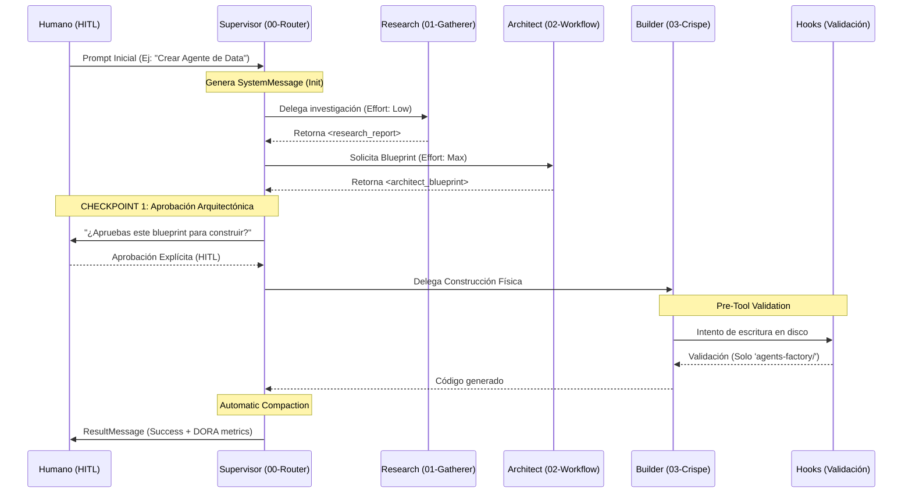

# Manual de Uso: Interacción Human-In-The-Loop (HITL)

Bienvenido a la **Fábrica de Ecosistemas Agénticos de Antigravity**. Este manual define el flujo estricto de interacción humana requerido para operar el sistema bajo estándares de producción de nivel corporativo (ISO 25010, 42001, 27001, SOC 2 y métricas DORA/SPACE).

Nuestra arquitectura opera con un alto grado de autonomía, pero emplea **Puntos de Control HITL (Human-In-The-Loop)** obligatorios para garantizar la seguridad (*Zero Trust*), evitar alucinaciones, y prevenir el desperdicio computacional (optimización de tokenomics).

---

## 1. Arquitectura y Diagrama de Flujo (Agent Loop)

El sistema utiliza un pipeline jerárquico determinista. El Orquestador evalúa tu *prompt*, lanza a los subagentes, e invoca *hooks* de seguridad antes de cada ejecución.

---

## 2. Iniciar el Pipeline: Uso de Comandos y Skills

Para interactuar de manera pulcra, debes invocar al sistema proveyendo contexto explícito y dirigiendo tu petición al **Supervisor**, quien rutea la ejecución.

### Invocar la Fábrica
El flujo estándar se inicia simplemente pidiendo el ecosistema y mencionando el dominio.
> *"Diseña y construye un ecosistema agéntico para análisis de cohortes. Usa las mejores prácticas documentadas en [DOMAIN.md](file:///c:/Users/Nomack/Documents/workspace/agents/antigravity/dev/prompt-generator/implicit/DOMAIN.md)."*

### Uso de Slash Commands Recomendados
- `/goal`: Úsalo cuando necesites que el *Loop* itere de manera agresiva buscando resolver un *bug* durante la fase de *Test* del ecosistema, sin detenerse hasta agotar el `max_turns`.
- `/grill-me`: Empléalo al inicio para forzar al Supervisor a interrogarte exhaustivamente sobre requerimientos técnicos y de negocio *antes* de lanzar el `01-research-gatherer`.

### Llamadas Específicas a Skills (Modo Experto)
Si deseas saltarte el flujo estándar y trabajar solo con un nodo, puedes forzarlo:
- **Investigación cruda:** *"Invoca el skill `01-research-gatherer` para buscar documentación sobre la API de Stripe y guárdalo en un artefacto."*
- **Generación directa:** Si ya tienes un blueprint aprobado, *"Pasa este blueprint directamente al `03-crispe-generator` para materializar el ecosistema en `agents-factory/billing-agent/`."*

---

## 3. Puntos de Control HITL (Checkpoints)

Tal como rige nuestra política [human-in-the-loop.md](file:///c:/Users/Nomack/Documents/workspace/agents/antigravity/dev/prompt-generator/workflows/human-in-the-loop.md), el Agente se detendrá asíncronamente y solicitará tu permiso en los siguientes escenarios:

1. **Aprobación del Blueprint:** 
   Tras la respuesta del `02-workflow-architect`, el modelo te presentará un `implementation_plan.md` o un `<architect_blueprint>`. **No procederá** a generar archivos físicos sin tu OK.
2. **Bash Execution & Instalación de Dependencias:** 
   Comandos destructivos, manipulaciones de red, o instalaciones (e.g., `npm install`, `uv add`) pausan el loop requiriendo el botón de confirmación en terminal.
3. **Validación de Hooks de Seguridad:**
   Basado en [pre-tool-validation.json](file:///c:/Users/Nomack/Documents/workspace/agents/antigravity/dev/prompt-generator/hooks/pre-tool-validation.json), cualquier intento del agente de alterar archivos en la raíz (ej. `C:/Users/Nomack/`) o fuera de `agents-factory/` será bloqueado. Se te notificará de una infracción de sandbox.

---

## 4. Estándares de Interacción y Calidad

Para mantener las métricas **DORA** saludables (bajo *Lead Time for Changes* y *Change Failure Rate* 0% por alucinación), sigue estas reglas al conversar con la fábrica:

- **Determinismo:** Siempre pide salidas estructuradas si extraes data.
- **Compaction Activa:** Si la conversación se vuelve muy larga, el sistema gatillará el [auditing-loop.md](file:///c:/Users/Nomack/Documents/workspace/agents/antigravity/dev/prompt-generator/workflows/auditing-loop.md) (Context Window Management) para comprimir el historial en `session-persistence.json` y vaciar tu ventana de chat.
- **Cero Tolerancia al Hardcoding:** Nunca pases tokens o contraseñas en texto plano por el chat. La regla [security-and-compliance.md](file:///c:/Users/Nomack/Documents/workspace/agents/antigravity/dev/prompt-generator/rules/security-and-compliance.md) bloquea activamente estas inyecciones. 

> [!CAUTION]
> **Modificaciones Manuales al Core:** Evita alterar manualmente los archivos en `implicit/` o `rules/` mientras la Fábrica está corriendo un ciclo `/goal`. Esto puede causar desincronización en la lectura del estado (Race conditions) durante la fase de Evaluación del Supervisor.
