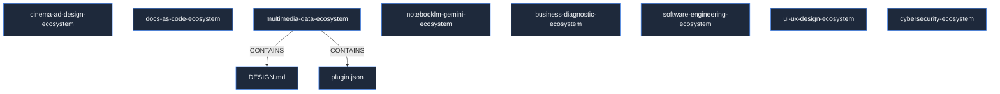

# Agent Factory Ecosystem

**Workspace para la Construcción de Stacks de IA Empresariales.**

Este archivo mantiene el registro de la arquitectura de alto nivel. La fuente de verdad estricta para la memoria y navegación de los agentes está indexada relacionalmente vía **Codebase-Memory-MCP** (SQLite), garantizando precisión absoluta y máxima economía de tokens al evitar alucinaciones. Por su parte, la herramienta **graphify** opera como un ejecutable portable en la matriz de la fábrica, encargado del renderizado bidireccional de diagramas (C4/Mermaid) para el ecosistema humano (Docs-as-Code).

## Arquitectura (Universal Antigravity Template)

- `bin/`: Scripts ejecutables de validación e inicialización.
- `brain/`: Toma de decisiones del supervisor (`routing-matrix.json`, `models.yml`).
- `implicit/`: Reglas y contexto de negocio (NIST CSF 2.0, ISO 42001, ISO 27001, DORA, `GEMINI.md`).
- `knowledge/`: Base de datos vectorial y bibliografía base para prompts de alto nivel.
- `mcp/`: Servidores de extracción de datos y actuadores.
- `plugins/`: Skills de ingeniería encapsulados (Supervisor, Gatherer, Architect, Crispe-Generator).
- `agents-factory/`: Catálogo exclusivo de Ecosistemas Agénticos reutilizables (.agents/).
- `projects/`: Directorio de SALIDA de Proyectos Corporativos e instancias individuales (Repos Git independientes).
- `scratch/`: Archivos temporales y artefactos de sesión.

## Registro de Cambios (Change Log)

- **Fase 1 MVP:** Establecimiento de la arquitectura Universal Antigravity Template (sin Docker). Inicialización del enrutador y componentes implícitos.
- **Fase 2 MVP:** Integración del Motor de Prompts de Alto Rendimiento (Neo-CRISPE) en `03-crispe-generator`. Incorporación de heurísticas de *Token Economy* (Google 2025) y envoltura semántica XML (Claude).
- **Fase 3 Ecosystems:** Despliegue de arquitecturas RAG estandarizadas (`docs-as-code-ecosystem`, `cinema-ad-design-ecosystem`, `multimedia-data-ecosystem`) integrando NotebookLM. Implementación de guardián de calidad QA (`workflow-auditor-agent`) y motor estricto de JSON paramétrico para Gemini Flash Image y Nano Banana Pro.
- **Fase 4 Cyber:** Integración estricta de `cybersecurity-ecosystem` alineado al estándar Antigravity 2.0 B2B, encapsulando 817 skills en formato Neo-CRISPE dentro de `.agents/skills/` y estructurado en Guilds Defensivos y Ofensivos.
- **Fase 5 Core Refinement & Multi-Project Isolation:** Integración de la suite **Google Gemini 3.6 Flash** (thinking levels: minimal, low, medium, high), arquitectura Hermes (3 niveles de memoria), controles de cumplimiento **NIST CSF 2.0 / ISO 42001 / ISO 27001**, y desacoplamiento estricto entre el Core de la Fábrica (`agents-factory/`) y las Instancias de Proyecto (`projects/`).

## Topología y Flujo de Datos Global (Graphify ASCII Map)



## El Motor Interno de la Fábrica (Core Plugins Engine)

El núcleo constructor de *Antigravity Agent Factory* opera mediante un flujo de orquestación multi-agente (`plugins/`). El **patrón óptimo para la creación de ecosistemas** exige que ninguna arquitectura se levante de forma manual; todo debe atravesar la siguiente cadena de montaje (Hook-Chain) para garantizar el acoplamiento ISO, DORA y la taxonomía *kebab-case*.

### Flujo de Construcción de Ecosistemas (ASCII Build Pattern)

```text
 [ USUARIO / REQUERIMIENTO ]
             |
             v
 +-------------------------+     [ routing-matrix.json ]
 | 00-supervisor-router    | <== (Valida y Enruta)
 | (Puerta de Enlace)      |
 +-------------------------+
             |
      [ JSON Payload ] ======> (Handoff-Validator.py hook)
             |
             v
 +-------------------------+     [ vector-store local ]
 | 01-research-gatherer    | <== (Extracción de papers / manuales de prompting)
 | (Data Exegética)        |
 +-------------------------+
             |
             v
 +-------------------------+     [ brain/models.yml ]
 | 02-workflow-architect   | <== (Asignación de roles y métricas SPACE/DORA)
 | (Topología y Nodos)     |
 +-------------------------+
             |
             v
 +-------------------------+     [ Output a agents-factory/ ]
 | 03-crispe-generator     | ==> - SKILL.md (Neo-CRISPE XML)
 | (The Builder Agent)     |     - rules/ y workflows/
 +-------------------------+     - notebooklm-templates/
```

### Roles y Hooks del Sistema

1. **`00-supervisor-router`**: Analiza el requerimiento base y encapsula las directivas en un `JSON Payload`. Este payload actúa como un "contrato estricto" (verificado por `bin/handoff-validator.py`) que previene inyecciones o desvíos del marco de trabajo a lo largo del pipeline.
2. **`01-research-gatherer`**: Ingiere el payload y se conecta a `knowledge/` para fundamentar empíricamente la construcción. Por ejemplo, si se va a crear un agente de *Data Science*, este nodo extrae metodologías estadísticas comprobadas antes de que el agente siquiera sea diseñado.
3. **`02-workflow-architect`**: Diseña la estructura lógica (incluyendo diagramas Mermaid y flujos de estado). Si el usuario requiere usar **NotebookLM**, el Arquitecto reserva el espacio para la carpeta `notebooklm-playbooks/` o `notebooklm-templates/` y selecciona el LLM adecuado según `models.yml`.
4. **`03-crispe-generator`**: Es el eslabón final y físico. Transforma el plano arquitectónico en archivos `.md` utilizando el framework **Neo-CRISPE** (Capacity, Role, Instruction, Schema, Personality, Examples). Al escribir directamente en `agents-factory/`, sella el componente con las variables inmutables del sistema (ISO 25010, regla de los 5 interrogantes).
