# Agent Factory Ecosystem - Arquitectura Core

Este documento detalla exhaustivamente el funcionamiento del motor de creación de ecosistemas agénticos (*Universal Antigravity Template*), desglosando todas sus capas, la topología secuencial, el funcionamiento de la memoria persistente y el árbol de ecosistemas.

---

## 1. Capas de la Arquitectura

### Capa de Identidad

Define "quién" es el agente, sus límites, normativas y forma de razonar.

* **Componentes:** Directorio `implicit/`.
* **Reglas de Negocio:** Integración de estándares internacionales (ISO 25010, SOC 2, DORA).
* **Framework:** **Neo-CRISPE** (Capacity, Role, Instruction, Schema, Personality, Examples). Define de forma estricta los roles mediante archivos `SKILL.md` inyectados en `.agents/skills/`.
* **Archivos clave:** `GEMINI.md`, reglas de comportamiento inyectadas en `.agents/rules/`.

### Capa de Entrada

Recibe, valida y normaliza el "User Prompt" y los requerimientos ambiguos.

* **Componentes:** Directorio `bin/` y nodo `00-supervisor-router`.
* **Puerta de Enlace:** El *Orquestador (Global/System)* recibe el caso de uso y crea un track en Conductor.
* **Validación:** El requerimiento se encapsula en un `JSON Payload` (contrato estricto) que es validado por el hook `bin/handoff-validator.py` para prevenir inyecciones de prompts o desvíos.

### Capa de Ejecución

El motor interno de la fábrica (*Core Plugins Engine*) encargado de ensamblar y crear a los subagentes.

* **Componentes:** Directorio `plugins/` (Hook-Chain de orquestación multi-agente).
* **Nodos de Trabajo:**
  * `01-research-gatherer` (Data Exegética): Conexión a `knowledge/` (vector store) para extraer papers y manuales de prompting que fundamenten la construcción empíricamente.
  * `02-workflow-architect` (Topología y Nodos): Diseña la estructura lógica, selecciona LLMs y reserva espacios para integraciones (ej. `notebooklm-templates/`).
  * `03-crispe-generator` (The Builder Agent): El eslabón físico. Escribe el código Markdown/YAML para configurar a los agentes hijos dentro de `agents-factory/`.

### Capa de Control

Toma de decisiones, enrutamiento y selección de modelos.

* **Componentes:** Directorio `brain/`.
* **Archivos clave:** `routing-matrix.json` (valida y enruta) y `models.yml` (asignación de recursos LLM según la tarea).
* **Guardián de Calidad:** `workflow-auditor-agent` (QA) asegura que los componentes cumplan con el estándar Antigravity 2.0 B2B.

### Observabilidad

Monitoreo, pruebas y renderizado del estado del sistema.

* **QA & TDD:** Directorio `tests/factory-ab-testing/`. Se corren pruebas estáticas y A/B sobre los nuevos agentes para asegurar estabilidad y resiliencia.
* **Renderizado:** La herramienta `graphify` (en `bin/`) opera como ejecutable portable para el renderizado bidireccional de diagramas (C4/Mermaid) hacia un ecosistema *Docs-as-Code*.

---

## 2. Topología de las Fases Secuenciales

El patrón óptimo exige que todo ecosistema atraviese esta cadena de montaje estricta:

1. **Ideación y Setup:** Recepción del caso de uso en el Orquestador y creación del track.
2. **Blueprint:** El Planificador diseña la topología de directorios.
3. **Validación de Handoff:** Verificación del JSON Payload vía `handoff-validator.py`.
4. **Research Exegético:** El `01-research-gatherer` extrae metodologías base.
5. **Arquitectura de Workflows:** El `02-workflow-architect` diseña diagramas y nodos.
6. **Construcción CRISPE:** El `03-crispe-generator` escribe los `SKILL.md`, `workflows/` y `rules/`.
7. **QA & TDD:** Validación de métricas de estabilidad y resiliencia.
8. **Empaquetado:** Inyección de plantillas desde `agents-factory/templates/` para aislamiento en Docker.

---

## 3. Funcionamiento de la Memoria Persistente (SQLite)

El sistema integra un mecanismo de memoria persistente avanzado y altamente eficiente:

* **Codebase-Memory-MCP:** Es la fuente de verdad estricta. Utiliza **SQLite** indexado relacionalmente.
* **Token Economy:** Para orientarse, realizar consultas arquitectónicas o buscar skills, los agentes **NUNCA** deben leer salidas masivas en texto plano (como el output de `graphify`). Todo se realiza iterando sobre la base de datos SQLite.
* **Prevención de Alucinaciones:** Al estar indexado y estructurado, garantiza precisión absoluta en la recuperación del contexto histórico del chat y el System Prompt, reduciendo el consumo de tokens (heurísticas de Google 2025).

---

## 4. Árbol de Ecosistemas Agénticos y Subagentes

La fábrica (`agents-factory/`) ha generado múltiples ecosistemas especializados, acatando el estándar Antigravity 2.0 B2B (uso exclusivo de `.agents/` y taxonomía *kebab-case*):

* `agents-factory/` (Catálogo exclusivo de Ecosistemas Agénticos reutilizables)
  * `cinema-ad-design-ecosystem/`
  * `docs-as-code-ecosystem/`
  * `multimedia-data-ecosystem/`
  * `notebooklm-gemini-ecosystem/`
  * `business-diagnostic-ecosystem/`
  * `software-engineering-ecosystem/`
  * `ui-ux-design-ecosystem/`
  * `cybersecurity-ecosystem/`
    * Estructurado en **Guilds Defensivos y Ofensivos**.
    * Encapsula **817 skills** en formato Neo-CRISPE (`.agents/skills/`).
  * `templates/` (Plantillas de infraestructura Docker).

* `projects/` (Directorio de Salida de Proyectos Corporativos - Repos Git Independientes)
  * `personal-brand-ghost-cap/` (Entregables de proyecto, BRDs, Master Documents y Playbooks)
  * `<client-project-name>/` (Instancia aislada con su propia memoria SQLite y versión Git)

---

## 5. Diagrama Arquitectónico Completo

```mermaid
flowchart TD
    %% Estilos
    classDef layer stroke:#333,stroke-width:2px,fill:#f9f9f9,color:#000
    classDef node stroke:#3b82f6,stroke-width:1px,fill:#eef2ff,color:#000
    classDef memory stroke:#10b981,stroke-width:2px,fill:#ecfdf5,color:#000
    classDef ecosystem fill:#1E293B,stroke:#3B82F6,stroke-width:1px,color:#F8FAFC

    subgraph Arquitectura Global [Agent Factory - Universal Antigravity Template]
        
        %% Capa de Entrada
        subgraph Capa_Entrada [Capa de Entrada]
            UserReq([User Prompt / Requerimiento]) --> Router[00-supervisor-router]:::node
            Router --> |Encapsula| JSONPayload[JSON Payload]
            JSONPayload --> Validator{bin/handoff-validator.py}
        end

        %% Capa de Control & Identidad
        subgraph Capa_Control [Capa de Control e Identidad]
            BrainMatrix[brain/routing-matrix.json]:::node
            BrainModels[brain/models.yml]:::node
            ImplicitRules[implicit/ GEMINI.md, ISO, SOC 2, DORA]:::node
            Auditor[workflow-auditor-agent]:::node
        end

        Validator -->|Validado| Gatherer
        Router -.-> BrainMatrix

        %% Memoria Persistente
        subgraph Memoria [Memoria Persistente & Knowledge]
            DB[(Codebase-Memory-MCP<br/>SQLite)]:::memory
            VectorStore[(knowledge/<br/>Vector Store)]:::memory
            DB -.-> |Token Economy / Cero Alucinaciones| Constructor
        end

        %% Capa de Ejecución
        subgraph Capa_Ejecucion [Capa de Ejecución - Core Plugins Engine]
            Gatherer[01-research-gatherer]:::node --> |Extrae data| Architect
            Architect[02-workflow-architect]:::node --> |Diseña Topología| Constructor
            Constructor[03-crispe-generator]:::node
            
            Gatherer -.-> VectorStore
            Architect -.-> BrainModels
        end

        %% Observabilidad
        subgraph Observabilidad [Observabilidad & QA]
            Constructor --> QA_TDD[tests/factory-ab-testing/]:::node
            Graphify[bin/graphify - C4/Mermaid]:::node
            QA_TDD -.-> Auditor
        end

        %% Árbol de Ecosistemas
        subgraph Ecosistemas [Árbol de Ecosistemas - agents-factory/]
            QA_TDD --> |Despliega| Cyber[cybersecurity-ecosystem]:::ecosystem
            QA_TDD --> |Despliega| Docs[docs-as-code-ecosystem]:::ecosystem
            QA_TDD --> |Despliega| Cinema[cinema-ad-design-ecosystem]:::ecosystem
            QA_TDD --> |Despliega| NBLM[notebooklm-gemini-ecosystem]:::ecosystem
            QA_TDD --> |Despliega| SWE[software-engineering-ecosystem]:::ecosystem
            
            Cyber --> |Contiene| CyberSkills(817 Skills Neo-CRISPE<br/>Guilds Defensivos/Ofensivos)
        end

        ImplicitRules -.-> Constructor
    end
```

