# Arquitectura Empresarial por Dominios Funcionales: Antigravity Multi-Agent Factory

**Autoría:** Nomack Studio & Antigravity Enterprise Architecture  
**Propósito:** Definir el modelo de gobernanza por áreas corporativas, orquestación jerárquica y enrutamiento semántico de los ecosistemas agénticos sin fricción ni regresión operativa ($100\%$ de rendimiento y modularidad).  
**Cumplimiento Normativo:** ISO 9001:2015 (SGC), ISO/IEC 27001:2022 (ISMS), ISO/IEC 42001:2023 (AIMS), ISO 25010 (Calidad de Software), TOGAF 10.

---

## 1. Topología Organizacional (5 Macro-Divisiones)

```mermaid
graph TD
    %% Dominios
    D1["🏢 01. STRATEGY & EXECUTIVE GOVERNANCE (CEO / Dirección General)"]
    D2["⚙️ 02. ENGINEERING, AI RESEARCH & SEC (CTO / Ingeniería e I+D)"]
    D3["🎨 03. CREATIVE SUITE, 3D & DIGITAL MEDIA (CCO / Producción Digital)"]
    D4["📋 04. OPERATIONS, WORKSPACE & QUALITY (COO / Operaciones & SGC)"]
    D5["📈 05. COMMERCIAL, GROWTH & BRAND (CMO & CRO / Crecimiento)"]

    %% 1. Strategy
    D1 --> S1["agent-factory-core-ecosystem (Gobernanza de Fábrica)"]
    D1 --> S2["business-diagnostic-ecosystem (Diagnóstico Estratégico)"]
    D1 --> S3["docs-as-code-executive-ecosystem (Memos & Actas de Directorio)"]

    %% 2. Engineering
    D2 --> E1["software-engineering-ecosystem (Arquitectura & Clean Code)"]
    D2 --> E2["frontend-angular-ecosystem (Angular 19/20 SSR & Signals)"]
    D2 --> E3["cybersecurity-ecosystem (Model Armor & DevSecOps)"]
    D2 --> E4["sapiens-human-vision-ecosystem (Vision AI & 3D Pose)"]
    D2 --> E5["notebooklm-gemini-ecosystem (Investigación RAG Profunda)"]
    D2 --> E6["minimal-coding-ecosystem (Scripts & Prototipado Ágil)"]

    %% 3. Creative & 3D
    D3 --> C1["ui-ux-design-ecosystem (Taste Skill & Diseño Suizo)"]
    D3 --> C2["cgi-web-ecosystem (WebGL/WebGPU & Pretext Typography)"]
    D3 --> C3["webgl-sculpt-geometry-ecosystem (Escultura Dyntopo)"]
    D3 --> C4["cadam-parametric-cad-ecosystem (OpenSCAD & Impresión 3D)"]
    D3 --> C5["arnis-geospatial-voxel-ecosystem (Gemelos Digitales OSM 1:1)"]
    D3 --> C6["blender-ecosystem (Cycles/Eevee Next & Cinemática)"]
    D3 --> C7["open-montage-ecosystem (Video Programático & Motion)"]
    D3 --> C8["cinema-ad-design-ecosystem (Storytelling Comercial)"]
    D3 --> C9["multimedia-data-ecosystem (Gestión de Activos)"]
    D3 --> C10["neural-motion-webgpu-ecosystem (AI4Animation WebGPU)"]
    D3 --> C11["archify-diagrams-ecosystem (Arquitectura Visual & JSON IR)"]

    %% 4. Operations
    D4 --> O1["google-workspace-ecosystem (Suite de Productividad & GA4)"]
    D4 --> O2["docs-as-code-ecosystem (ISO 9001 SGC & SOPs)"]

    %% 5. Commercial & Career Growth
    D5 --> G1["personal-brand-ecosystem (Autoridad de Marca & Liderazgo)"]
    D5 --> G2["remote-jobs-career-ecosystem (Inteligencia de Empleo & CV Reactivo)"]

    %% Styling
    classDef domain fill:#07283d,stroke:#ffd231,stroke-width:2px,color:#ffffff
    classDef eco fill:#1a3a5c,stroke:#cccccc,stroke-width:1px,color:#ffffff
    class D1,D2,D3,D4,D5 domain
    class S1,S2,S3,E1,E2,E3,E4,E5,E6,C1,C2,C3,C4,C5,C6,C7,C8,C9,C10,C11,O1,O2,G1,G2 eco
```

---

## 2. Matriz de Roles y Responsabilidades por División

| División | Líder de Área (Rol) | Ecosistemas Integrados | Misión Principal |
| :--- | :--- | :--- | :--- |
| **`01_executive_governance`** | CEO / Chief AI Strategy Officer | 3 Ecosistemas | Supervisión global, gobernanza de fábrica agéntica, diagnóstico de negocio y decisiones ejecutivas. |
| **`02_engineering_and_ai_research`** | CTO / Head of AI & Security | 6 Ecosistemas | Arquitectura de software, aplicaciones Angular 19/20, seguridad Model Armor, visión por computador e investigación RAG. |
| **`03_creative_production_and_3d`** | CCO / Creative & 3D Director | 11 Ecosistemas | Diseño UI/UX, gráficos WebGPU, escultura 3D, CAD paramétrico, gemelos digitales OSM, animación neuronal AI4Animation, diagramación arquitectónica Archify, render en Blender y video. |
| **`04_operations_and_quality`** | COO / Quality & Operations Director | 2 Ecosistemas | Automatización integral de Google Workspace (Gmail, Calendar, Drive, Sheets, Slides, Vids, GA4) y Sistema de Gestión de Calidad (ISO 9001). |
| **`05_commercial_and_growth`** | CMO / CRO / Head of Growth | 2 Ecosistemas | Posicionamiento de marca ejecutiva, liderazgo intelectual, inteligencia de empleo remoto, CVs reactivos optimizados para ATS y gestión de pipeline con HITL. |

---

## 3. Principio de Desacoplamiento Lógico y Físico (*Zero-Regression Protocol*)

Para evitar roturas de rutas relativas en archivos markdown, scripts y llamadas MCP:

1. **Rutas Físicas Estables:** Las carpetas conservan su ubicación física en `agents-factory/[ecosistema]/`, garantizando retrocompatibilidad al $100\%$.
2. **Enrutamiento Lógico en Memoria SQLite (`domain_id`):** Cada componente indexado almacena su `domain_id` y `domain_name`, permitiendo a los orquestadores consultar capacidades por área funcional en $O(1)$.
3. **Gobierno de IA Transparente (ISO 42001):** Todo agente conoce su jerarquía de mando, a qué área corporativa pertenece y con qué áreas hermanas colabora bajo la política de *Cero Sobrelapamiento (Zero-Overlap)*.
