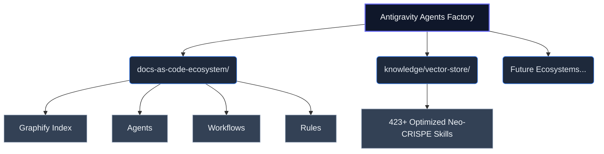

# Antigravity Agents Factory: Global Topology Index

**WHO**: This automated factory is maintained by the Antigravity core team.
**WHAT**: A highly-scalable, production-ready framework for multi-agent ecosystems, driven by Neo-CRISPE semantic architectures.
**WHEN**: Deployed for all continuous enterprise-grade agentic tasks requiring precise RAG grounding and isolated workflows.
**WHERE**: Housed within the `agents-factory/` root domain, branching into specialized ecosystems.
**WHY**: To eliminate "token bloat" and the "curse of knowledge," creating a rigorous environment where LLMs operate under strict technical, legal, and structural constraints.

## Ecosystem Routing (Graphify Core)

## System Standards
This entire factory enforces:
1. **Neo-CRISPE Semantics**: XML-delimited prompt framing for maximal inference efficiency.
2. **Kebab-Case File Topologies**: To prevent parsing errors.
3. **5 W's Ingestion**: Contextual validation through WHO, WHAT, WHEN, WHERE, and WHY.
4. **Security & Quality**: Built-in adherence to ISO 25010 and ISO 27001.

> [!TIP]
> For RAG systems, start traversing directories from this README downwards. Treat this file as the structural entry point for vector similarity matching.
