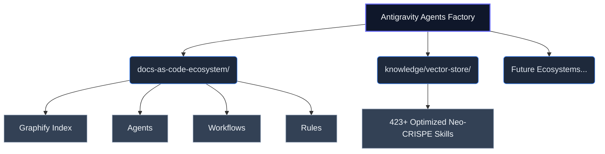

# Antigravity Agents Factory: Global Topology Index

**WHO**: This automated factory is maintained by the Antigravity core team.
**WHAT**: A highly-scalable, production-ready framework for multi-agent ecosystems, driven by Neo-CRISPE semantic architectures.
**WHEN**: Deployed for all continuous enterprise-grade agentic tasks requiring precise RAG grounding and isolated workflows.
**WHERE**: Housed within the `agents-factory/` root domain, branching into specialized ecosystems.
**WHY**: To eliminate "token bloat" and the "curse of knowledge," creating a rigorous environment where LLMs operate under strict technical, legal, and structural constraints.

## Ecosystem Routing (Graphify Core)

## Active Ecosystems Registry
- `agent-factory-core-ecosystem`: Meta-orquestación, arquitectura de agentes, gestión de workflows (Google ADK) y evaluación continua.
- `blender-ecosystem`: Modelado 3D, rigging, L-Systems y automatización MCP en Blender.
- `cgi-web-ecosystem`: Gráficos 3D Web inmersivos, WebGPU, TSL, Three.js, GPGPU fluidos y WebXR.
- `webgl-sculpt-geometry-ecosystem`: Escultura digital 3D, Dyntopo, Voxel Remeshing (Dual Contouring), Octrees y Compute Shaders en WebGL/WebGPU.
- `sapiens-human-vision-ecosystem`: Modelos fundacionales Meta Sapiens (Pose 308 keypoints, Depth 3D, Normales 1K, Segmentación 28 clases y MoCap).
- `frontend-angular-ecosystem`: Desarrollo frontend Angular Standalone, Signals y arquitectura MEAN.
- `ui-ux-design-ecosystem`: Sistemas de diseño, tokens corporativos y guías de estilos.
- `docs-as-code-ecosystem`: Documentación técnica estructurada, estándares ISO y Graphify.
- `cybersecurity-ecosystem`: Auditoría de seguridad, normativas DORA, ISO 27001 y pentesting.
- `software-engineering-ecosystem`: Arquitectura backend, microservicios y pipelines CI/CD.
- `minimal-coding-ecosystem`: Refactorización de código limpio y optimización de líneas de código.

## System Standards
This entire factory enforces:
1. **Neo-CRISPE Semantics**: XML-delimited prompt framing for maximal inference efficiency.
2. **Kebab-Case File Topologies**: To prevent parsing errors.
3. **5 W's Ingestion**: Contextual validation through WHO, WHAT, WHEN, WHERE, and WHY.
4. **Security & Quality**: Built-in adherence to ISO 25010, ISO 42001 and ISO 27001.

> [!TIP]
> For RAG systems, start traversing directories from this README downwards. Treat this file as the structural entry point for vector similarity matching.
