# Antigravity Agents Factory: Global Enterprise Topology & Domain Architecture

**WHO**: Maintained by Nomack Studio Enterprise Architecture & Antigravity Core AI Team.  
**WHAT**: Marco empresarial de producción para sistemas multiagente de alta escala, organizado en **5 Divisiones Corporativas** y gobernado bajo estándares **Neo-CRISPE v2.0, ISO 9001, ISO 27001, ISO 42001 e ISO 25010**.  
**WHEN**: Operativo de forma continua para tareas empresariales, I+D, ingeniería, producción multimedia y gobierno de datos.  
**WHERE**: Alojado en `agents-factory/`, indexado relacionalmente en SQLite (`Codebase-Memory-MCP`) con resolución $O(1)$.  
**WHY**: Eliminar la dispersión de contexto y la duplicación de código (*Zero-Overlap Policy*), garantizando una eficiencia operativa del $100.0\%$.

---

## 1. Topología Organizacional por Dominios Corporativos

```mermaid
graph TD
    %% Dominios Principales
    D1["🏢 01. Strategy & Executive Governance (CEO)"]
    D2["⚙️ 02. Engineering, AI Research & Sec (CTO)"]
    D3["🎨 03. Creative Suite, 3D & Digital Media (CCO)"]
    D4["📋 04. Operations, Workspace & Quality (COO)"]
    D5["📈 05. Commercial, Growth & Brand (CMO/CRO)"]

    %% 1. Strategy
    D1 --> S1["agent-factory-core-ecosystem"]
    D1 --> S2["business-diagnostic-ecosystem"]
    D1 --> S3["docs-as-code-executive-ecosystem"]

    %% 2. Engineering
    D2 --> E1["software-engineering-ecosystem"]
    D2 --> E2["frontend-angular-ecosystem"]
    D2 --> E3["cybersecurity-ecosystem"]
    D2 --> E4["sapiens-human-vision-ecosystem"]
    D2 --> E5["notebooklm-gemini-ecosystem"]
    D2 --> E6["minimal-coding-ecosystem"]

    %% 3. Creative & 3D
    D3 --> C1["ui-ux-design-ecosystem"]
    D3 --> C2["cgi-web-ecosystem"]
    D3 --> C3["webgl-sculpt-geometry-ecosystem"]
    D3 --> C4["cadam-parametric-cad-ecosystem"]
    D3 --> C5["arnis-geospatial-voxel-ecosystem"]
    D3 --> C6["blender-ecosystem"]
    D3 --> C7["open-montage-ecosystem"]
    D3 --> C8["cinema-ad-design-ecosystem"]
    D3 --> C9["multimedia-data-ecosystem"]
    D3 --> C10["neural-motion-webgpu-ecosystem"]
    D3 --> C11["archify-diagrams-ecosystem"]
    D3 --> C12["img2threejs-ecosystem"]

    %% 4. Operations
    D4 --> O1["google-workspace-ecosystem"]
    D4 --> O2["docs-as-code-ecosystem"]

    %% 5. Commercial & Career Growth
    D5 --> G1["personal-brand-ecosystem"]
    D5 --> G2["remote-jobs-career-ecosystem"]
```

---

## 2. Directorio Maestro de Ecosistemas por División

### 🏢 División 1: Strategy & Executive Governance (CEO / Dirección)
- **[`agent-factory-core-ecosystem`](file:///c:/Users/Nomack/Documents/workspace/agents/antigravity/dev/prompt-generator/agents-factory/agent-factory-core-ecosystem):** Meta-orquestación, arquitectura agéntica, gestión de workflows (Google ADK) y evaluación de calidad.
- **[`business-diagnostic-ecosystem`](file:///c:/Users/Nomack/Documents/workspace/agents/antigravity/dev/prompt-generator/agents-factory/business-diagnostic-ecosystem):** Inteligencia de negocios, análisis DAFO/PESTEL, KPIs y diagnóstico corporativo.
- **[`docs-as-code-executive-ecosystem`](file:///c:/Users/Nomack/Documents/workspace/agents/antigravity/dev/prompt-generator/agents-factory/docs-as-code-executive-ecosystem):** Memorandos ejecutivos de alta dirección y actas de directorio.

### ⚙️ División 2: Engineering, AI Research & Cybersecurity (CTO / I+D)
- **[`software-engineering-ecosystem`](file:///c:/Users/Nomack/Documents/workspace/agents/antigravity/dev/prompt-generator/agents-factory/software-engineering-ecosystem):** Arquitectura backend, microservicios, APIs REST/gRPC y pipelines CI/CD.
- **[`frontend-angular-ecosystem`](file:///c:/Users/Nomack/Documents/workspace/agents/antigravity/dev/prompt-generator/agents-factory/frontend-angular-ecosystem):** Aplicaciones web empresariales con Angular 19/20 Standalone, Signals, Zoneless y SSR.
- **[`cybersecurity-ecosystem`](file:///c:/Users/Nomack/Documents/workspace/agents/antigravity/dev/prompt-generator/agents-factory/cybersecurity-ecosystem):** Sanitización Model Armor, escaneo de inyecciones de prompt, pentesting y cumplimiento ISO 27001 / DORA.
- **[`sapiens-human-vision-ecosystem`](file:///c:/Users/Nomack/Documents/workspace/agents/antigravity/dev/prompt-generator/agents-factory/sapiens-human-vision-ecosystem):** Modelos fundacionales Meta Sapiens (Pose 308 keypoints, Depth 3D, Normales 1K, MoCap).
- **[`notebooklm-gemini-ecosystem`](file:///c:/Users/Nomack/Documents/workspace/agents/antigravity/dev/prompt-generator/agents-factory/notebooklm-gemini-ecosystem):** Ingesta documental RAG profunda y síntesis analítica.
- **[`minimal-coding-ecosystem`](file:///c:/Users/Nomack/Documents/workspace/agents/antigravity/dev/prompt-generator/agents-factory/minimal-coding-ecosystem):** Automatizaciones de scripts ligeros y prototipado ágil sin sobrecarga.

### 🎨 División 3: Creative Suite, 3D Engineering & Digital Media (CCO / Producción)
- **[`ui-ux-design-ecosystem`](file:///c:/Users/Nomack/Documents/workspace/agents/antigravity/dev/prompt-generator/agents-factory/ui-ux-design-ecosystem):** Sistemas de diseño, tokens corporativos, jerarquía tipográfica suiza y Taste Skill v2.
- **[`cgi-web-ecosystem`](file:///c:/Users/Nomack/Documents/workspace/agents/antigravity/dev/prompt-generator/agents-factory/cgi-web-ecosystem):** Gráficos 3D en tiempo real WebGL/WebGPU, sombreadores PBR y tipografía sin reflow (Pretext).
- **[`webgl-sculpt-geometry-ecosystem`](file:///c:/Users/Nomack/Documents/workspace/agents/antigravity/dev/prompt-generator/agents-factory/webgl-sculpt-geometry-ecosystem):** Escultura digital 3D, topología dinámica (Dyntopo), remallado Dual Contouring y compute shaders.
- **[`cadam-parametric-cad-ecosystem`](file:///c:/Users/Nomack/Documents/workspace/agents/antigravity/dev/prompt-generator/agents-factory/cadam-parametric-cad-ecosystem):** Text-to-CAD paramétrico en OpenSCAD, validación DfAM para impresión 3D y WASM workers.
- **[`arnis-geospatial-voxel-ecosystem`](file:///c:/Users/Nomack/Documents/workspace/agents/antigravity/dev/prompt-generator/agents-factory/arnis-geospatial-voxel-ecosystem):** Generación de mundos voxel 1:1 a partir de OpenStreetMap y modelos digitales de elevación (DEM).
- **[`blender-ecosystem`](file:///c:/Users/Nomack/Documents/workspace/agents/antigravity/dev/prompt-generator/agents-factory/blender-ecosystem):** Automatización MCP de Blender, renderizado fotorrealista en Cycles/Eevee Next y cinemática.
- **[`open-montage-ecosystem`](file:///c:/Users/Nomack/Documents/workspace/agents/antigravity/dev/prompt-generator/agents-factory/open-montage-ecosystem):** Edición programática de video, motion graphics y transiciones tipográficas headless.
- **[`cinema-ad-design-ecosystem`](file:///c:/Users/Nomack/Documents/workspace/agents/antigravity/dev/prompt-generator/agents-factory/cinema-ad-design-ecosystem):** Dirección de arte cinematográfica, spots comerciales y narrativa visual de alto impacto.
- **[`multimedia-data-ecosystem`](file:///c:/Users/Nomack/Documents/workspace/agents/antigravity/dev/prompt-generator/agents-factory/multimedia-data-ecosystem):** Ingesta, procesamiento y catalogación de activos audiovisuales de alta fidelidad.
- **[`neural-motion-webgpu-ecosystem`](file:///c:/Users/Nomack/Documents/workspace/agents/antigravity/dev/prompt-generator/agents-factory/neural-motion-webgpu-ecosystem):** Síntesis de animación y locomoción neuronal en tiempo real con WebGPU (AI4Animation / PFNN / MANN / Two-Bone IK).
- **[`archify-diagrams-ecosystem`](file:///c:/Users/Nomack/Documents/workspace/agents/antigravity/dev/prompt-generator/agents-factory/archify-diagrams-ecosystem):** Compilación y renderizado determinista de diagramas de arquitectura, secuencias, ciclos de vida y topologías de sistemas en HTML/SVG interactivo con Taste Skill.
- **[`img2threejs-ecosystem`](file:///c:/Users/Nomack/Documents/workspace/agents/antigravity/dev/prompt-generator/agents-factory/img2threejs-ecosystem):** Conversión procedural de imágenes 2D a modelos 3D Three.js en código puro (TypeScript/WebGL) mediante visión multimodal con Gemini 3.8 Flash.

### 📋 División 4: Operations, Workspace & Quality Management (COO / Operaciones)
- **[`google-workspace-ecosystem`](file:///c:/Users/Nomack/Documents/workspace/agents/antigravity/dev/prompt-generator/agents-factory/google-workspace-ecosystem):** Automatización integral de Gmail, Calendar, Drive, Sheets, Slides, Vids y Google Analytics 4 (GA4).
- **[`docs-as-code-ecosystem`](file:///c:/Users/Nomack/Documents/workspace/agents/antigravity/dev/prompt-generator/agents-factory/docs-as-code-ecosystem):** Sistema de Gestión de Calidad (ISO 9001 SGC), documentación técnica estructurada y procedimientos operativos estándar (SOPs).

### 📈 División 5: Commercial, Growth & Executive Brand (CMO/CRO / Crecimiento)
- **[`personal-brand-ecosystem`](file:///c:/Users/Nomack/Documents/workspace/agents/antigravity/dev/prompt-generator/agents-factory/personal-brand-ecosystem):** Posicionamiento de marca ejecutiva, liderazgo de opinión y estrategias de crecimiento orgánico.
- **[`remote-jobs-career-ecosystem`](file:///c:/Users/Nomack/Documents/workspace/agents/antigravity/dev/prompt-generator/agents-factory/remote-jobs-career-ecosystem):** Inteligencia de vacantes remotas, generación reactiva de currículums ATS a medida, cartas de presentación y gestión de candidaturas con HITL obligatorio.

---

## 3. Manifiesto y Gobernanza
* **Manifiesto Declarativo:** [`domain_manifest.json`](file:///c:/Users/Nomack/Documents/workspace/agents/antigravity/dev/prompt-generator/agents-factory/domain_manifest.json)
* **Guía Arquitectónica:** [`DOMAINS_ARCHITECTURE.md`](file:///c:/Users/Nomack/Documents/workspace/agents/antigravity/dev/prompt-generator/agents-factory/DOMAINS_ARCHITECTURE.md)
