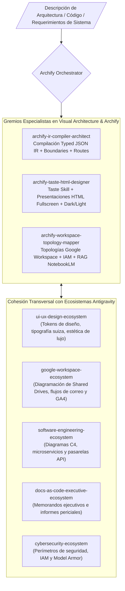

# Archify Diagrams & Visual Architecture Ecosystem — Universal Antigravity Architecture

**Autoría Oficial:** Antigravity AI & Archify Framework (`tt-a1i/archify`)  
**WHAT:** Ecosistema Agéntico de Generación, Compilación y Renderizado de **Diagramas de Arquitectura, Flujo de Datos, Secuencias, Ciclos de Vida y Workflows** mediante especificaciones JSON IR fuertemente tipadas, compiladas a entregables HTML/SVG autocontenidos e interactivos con soporte de *Taste Skill* (Tipografía Suiza, Modo Presentación Fullscreen, selector de tema Dark/Light y trazado de rutas de ejecución).  
**División Corporativa:** `03_creative_production_and_3d` (Creative Suite, 3D Engineering & Digital Media).  
**Cumplimiento Normativo:** TOGAF 10 (Arquitectura Empresarial), ISO 25010 (Calidad de Software), ISO 9001:2015 (Documentación Técnica Verificable).

---

## 1. Topología del Ecosistema Agéntico (Graphify Map)

---

## 2. Catálogo de Subagentes Especialistas (Neo-CRISPE v2.0)

| Subagente | Responsabilidad Principal | Herramientas & Ámbitos |
| :--- | :--- | :--- |
| **[`archify-ir-compiler-architect`](file:///c:/Users/Nomack/Documents/workspace/agents/antigravity/dev/prompt-generator/agents-factory/archify-diagrams-ecosystem/.agents/skills/archify-ir-compiler-architect/SKILL.md)** | Modelado topológico y compilación determinista de especificaciones JSON IR (Architecture, Data-Flow, Sequence, Lifecycle, Workflow). | `archify.compiler` `json_ir.validator` |
| **[`archify-taste-html-designer`](file:///c:/Users/Nomack/Documents/workspace/agents/antigravity/dev/prompt-generator/agents-factory/archify-diagrams-ecosystem/.agents/skills/archify-taste-html-designer/SKILL.md)** | Integración de diagramas interactivos en presentaciones HTML de alta gama con Taste Skill (Diseño Suizo, Fullscreen, Dark/Light, Share Cards). | `taste_skill.html` `svg.interactive` |
| **[`archify-workspace-topology-mapper`](file:///c:/Users/Nomack/Documents/workspace/agents/antigravity/dev/prompt-generator/agents-factory/archify-diagrams-ecosystem/.agents/skills/archify-workspace-topology-mapper/SKILL.md)** | Diagramación especializada de topologías de Google Workspace Enterprise (Shared Drives, IAM/2FA, flujos de correo, Gemini y NotebookLM). | `workspace.topology` `iam.mapper` |

---

## 3. Matriz de Cohesión Transversal Soberana (Zero-Overlap Policy)

1. **`ui-ux-design-ecosystem`:** Provee el sistema de tokens de marca, fuentes tipográficas suizas y guías cromáticas; Archify compila los diagramas vectoriales interactivos.
2. **`google-workspace-ecosystem`:** Define la configuración operativa y APIs de Workspace; Archify genera la arquitectura visual interactiva y los planos de topología.
3. **`software-engineering-ecosystem`:** Define el código, APIs y arquitectura de backend; Archify produce los diagramas de C4, secuencias y ciclos de vida.
4. **`docs-as-code-executive-ecosystem`:** Incrusta los diagramas visuales en reportes ejecutivos para juntas directivas y auditorías de calidad ISO 9001.

---

## 4. Base de Conocimiento Especializada (`knowledge/`)

- [`archify_architecture_and_json_ir_mastery.md`](file:///c:/Users/Nomack/Documents/workspace/agents/antigravity/dev/prompt-generator/agents-factory/archify-diagrams-ecosystem/knowledge/archify_architecture_and_json_ir_mastery.md) ➔ Tipos de diagramas, esquema JSON IR v2 y compilación determinista.
- [`taste_skill_archify_visual_synthesis.md`](file:///c:/Users/Nomack/Documents/workspace/agents/antigravity/dev/prompt-generator/agents-factory/archify-diagrams-ecosystem/knowledge/taste_skill_archify_visual_synthesis.md) ➔ Integración con Taste Skill, tipografía suiza, atajos de teclado y fullscreen.
- [`google_workspace_topology_architecture_mastery.md`](file:///c:/Users/Nomack/Documents/workspace/agents/antigravity/dev/prompt-generator/agents-factory/archify-diagrams-ecosystem/knowledge/google_workspace_topology_architecture_mastery.md) ➔ Capas arquitectónicas de Google Workspace (IAM, Shared Drives, Gemini In-App, NotebookLM).
