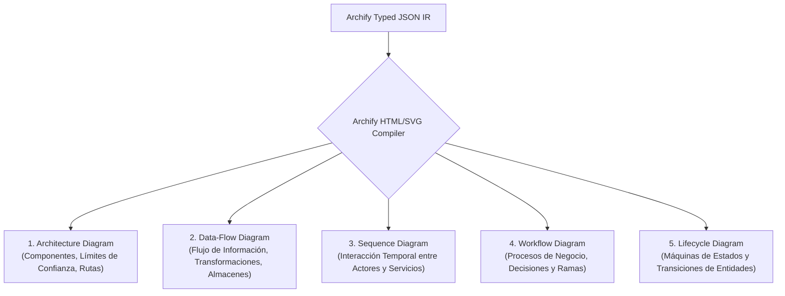

# Archify Architecture & JSON IR Mastery

**Propósito:** Guía técnica para la especificación del Intermediate Representation (JSON IR) de Archify (`tt-a1i/archify`), tipología de diagramas (Arquitectura, Flujo de Datos, Secuencia, Ciclo de Vida, Workflow) y compilación determinista en HTML/SVG.  
**Cumplimiento Normativo:** TOGAF 10, ISO 25010 (Calidad y Robustez de Software).

---

## 1. Los 5 Tipos de Diagramas en Archify



---

## 2. Estructura Canónica de un Archivo JSON IR (`architecture.json`)

```json
{
  "$schema": "https://tt-a1i.github.io/archify/schemas/v2/architecture.json",
  "title": "Google Workspace Enterprise Topology - Génesis Legal",
  "version": "1.0.0",
  "summary": "Arquitectura de seguridad, almacenamiento en Shared Drives y flujos de IA con Gemini y RAG.",
  "theme": "dark",
  "boundaries": [
    {
      "id": "perimeter_google_cloud",
      "label": "Google Cloud & Workspace Security Perimeter",
      "variant": "secure",
      "style": "dashed"
    },
    {
      "id": "perimeter_local_endpoints",
      "label": "Dispositivos & Clientes Periciales (9 Roles)",
      "variant": "internal"
    }
  ],
  "nodes": [
    {
      "id": "client_endpoint",
      "label": "Endpoints Periciales (Web/App)",
      "role": "Client Surface",
      "boundary": "perimeter_local_endpoints",
      "icon": "desktop"
    },
    {
      "id": "auth_identity",
      "label": "Google Identity & 2FA SSO",
      "role": "Identity Provider / IAM",
      "boundary": "perimeter_google_cloud",
      "icon": "shield-check"
    },
    {
      "id": "gmail_routing",
      "label": "Gmail Gateway & Anti-Phishing",
      "role": "Mail Routing & Filtering",
      "boundary": "perimeter_google_cloud",
      "icon": "mail"
    },
    {
      "id": "drive_shared_matrix",
      "label": "7 Shared Drives (Matriz Segura)",
      "role": "Confidential Storage & DLP",
      "boundary": "perimeter_google_cloud",
      "icon": "folder-lock"
    },
    {
      "id": "gemini_inapp",
      "label": "Gemini In-App (Docs/Sheets/Gmail)",
      "role": "Micro-Assistance AI",
      "boundary": "perimeter_google_cloud",
      "icon": "sparkles"
    },
    {
      "id": "notebooklm_rag",
      "label": "NotebookLM (RAG Soberano)",
      "role": "Forense Deep Grounding",
      "boundary": "perimeter_google_cloud",
      "icon": "book-open"
    }
  ],
  "edges": [
    {
      "from": "client_endpoint",
      "to": "auth_identity",
      "label": "HTTPS TLS 1.3 / MFA",
      "route": "primary_auth"
    },
    {
      "from": "auth_identity",
      "to": "gmail_routing",
      "label": "Acceso Autorizado",
      "route": "primary_flow"
    },
    {
      "from": "auth_identity",
      "to": "drive_shared_matrix",
      "label": "ACLs Basadas en Roles",
      "route": "primary_flow"
    },
    {
      "from": "drive_shared_matrix",
      "to": "notebooklm_rag",
      "label": "Indexación RAG Estricta (Cero Alucinación)",
      "route": "rag_pipeline"
    },
    {
      "from": "gemini_inapp",
      "to": "drive_shared_matrix",
      "label": "Lectura/Escritura Contextual",
      "route": "ai_context"
    }
  ],
  "routes": [
    {
      "id": "forensic_inquiry_path",
      "label": "Ruta de Análisis Forense Soberano",
      "path": ["client_endpoint", "auth_identity", "drive_shared_matrix", "notebooklm_rag"]
    }
  ]
}
```
