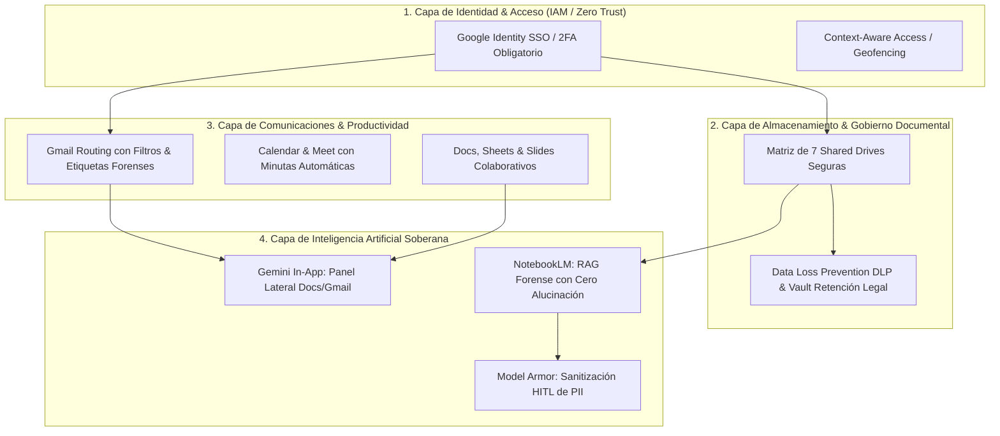

# Google Workspace Topology & Architecture Mastery: Enterprise Blueprints

**Propósito:** Especificación técnica para el modelado arquitectónico de topologías completas de Google Workspace Standard/Enterprise, matrices de Shared Drives, perímetros de seguridad IAM/2FA, extensiones de Gemini AI, canales de soporte pericial y trazabilidad de datos para organizaciones como Génesis Legal S.A.S.  
**Cumplimiento Normativo:** ISO 27001:2022 (Seguridad de la Información), ISO 9001 (SGC), ISO 42001 (AIMS).

---

## 1. Capas Arquitectónicas de Google Workspace Enterprise

---

## 2. Topología Específica para Génesis Legal S.A.S.

1. **Dominio Principal & Alias:** `genesislegal.co` + alias de compatibilidad `gscg.com.co`.
2. **Matriz de 7 Shared Drives:**
   - `01_Direccion_Ejecutiva`
   - `02_Forense_Digital_y_Evidencias`
   - `03_Juridico_y_Litigios`
   - `04_Psicologia_y_Poligrafia`
   - `05_Cobranzas_e_Investigaciones`
   - `06_Licitaciones_y_Contratos`
   - `07_Capacitacion_y_SGC`
3. **Flujos de IA Gemini & RAG:**
   - Panel lateral de Gmail/Docs para redacción y síntesis rápida.
   - 7 Cuadernos Maestros en NotebookLM con indexación profunda y citas al $100\%$.
   - Sanitización de PII con Gema Model Armor antes de procesar dictámenes periciales.
