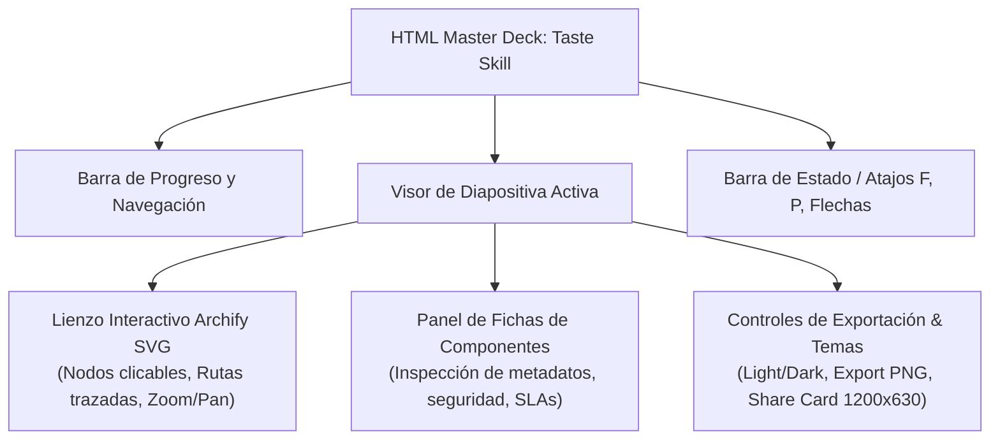

# Taste Skill & Archify Visual Synthesis: Luxury Presentation Decks

**Propósito:** Especificación de la integración visual entre los diagramas vectoriales interactivos de Archify y los estándares de diseño editorial de alta gama (*Taste Skill v2.0*), tipografía suiza, microanimaciones aceleradas por GPU y navegación fluida para presentaciones ejecutivas.  
**Cumplimiento Normativo:** ISO 25010 (Usabilidad y Estética Visual), ISO 9001 (Calidad de Presentación).

---

## 1. Sistema de Tokens Visuales & Tipografía Suiza

1. **Jerarquía Tipográfica (Google Fonts):**
   - **Títulos & Encabezados Display:** `Archivo` o `Outfit` (Grotesk de alto impacto, peso 700/800, tracking ajustado).
   - **Cuerpo de Texto Editorial:** `Spectral` o `Inter` (Legibilidad óptima en fondos oscuros y claros).
   - **Metadatos, Identificadores de Nodos & JSON IR:** `Chivo Mono` o `JetBrains Mono`.

2. **Paleta de Color Semántica:**
   - **Fondos Ejecutivos:** `#07283d` (Deep Navy), `#031621` (Void Dark), `#0d1f2d` (Slate Card).
   - **Acentos de Interacción:** `#ffd231` (Gold Glow), `#3fbfa8` (Teal Active), `#38bdf8` (Cyan Route).
   - **Límites de Seguridad (Boundaries):** `rgba(63, 191, 168, 0.15)` con bordes discontinuos de 1.5px.

---

## 2. Componentes Interactivos en Presentaciones HTML Autocontenidas

---

## 3. Modo Presentación Fullscreen y Accesibilidad

* **Atajos de Teclado Universales:**
  - `F` o `P`: Activar/Desactivar pantalla completa.
  - `ArrowRight` / `Space`: Avanzar a la siguiente vista/diapositiva.
  - `ArrowLeft`: Retroceder a la vista anterior.
  - `T`: Alternar entre modo oscuro y claro (*Theme Toggle*).
* **Transiciones Fluidas:** Animación de nodos y conexiones usando CSS `transform: translate3d()` y `opacity` a 60 FPS sin reflow de layout.
