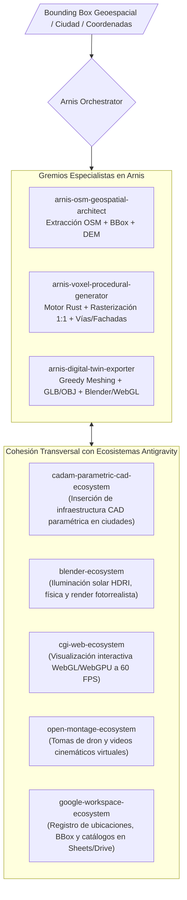

# Arnis Geospatial Voxel & Digital Twin Ecosystem — Universal Antigravity Architecture

**Autoría Oficial:** Antigravity AI & Arnis Framework (`louis-e/arnis`)  
**WHAT:** Ecosistema Agéntico Geoespacial para la Generación de Mundos Voxel 3D a Escala 1:1 ($1\text{ bloque} = 1\text{ metro}$) a partir de datos vectoriales de OpenStreetMap (OSM) y Modelos Digitales de Elevación (DEM), con exportación multiformato (Minecraft Anvil MCA, Schematics, OBJ, GLTF/GLB) para simulación, gemelos digitales urbanos, videojuegos y producción virtual.  
**Cumplimiento Normativo:** OGC Geospatial Standards, ISO 19115 (Metadatos Geográficos), ISO 25010 (Calidad y Eficiencia de Software), ISO 9001:2015.

---

## 1. Topología del Ecosistema Agéntico (Graphify Map)

---

## 2. Catálogo de Subagentes Especialistas (Neo-CRISPE v2.0)

| Subagente | Responsabilidad Principal | Herramientas & Ámbitos |
| :--- | :--- | :--- |
| **[`arnis-osm-geospatial-architect`](file:///c:/Users/Nomack/Documents/workspace/agents/antigravity/dev/prompt-generator/agents-factory/arnis-geospatial-voxel-ecosystem/.agents/skills/arnis-osm-geospatial-architect/SKILL.md)** | Definición de cuadros delimitadores (BBox), consultas Overpass QL, extracción de huellas de edificios y calibración de cotas altimétricas (DEM). | `overpass.api` `copernicus.dem` |
| **[`arnis-voxel-procedural-generator`](file:///c:/Users/Nomack/Documents/workspace/agents/antigravity/dev/prompt-generator/agents-factory/arnis-geospatial-voxel-ecosystem/.agents/skills/arnis-voxel-procedural-generator/SKILL.md)** | Operación del binario en Rust de Arnis, rasterización a escala 1:1, generación de redes viales, techos y asignación de materiales contextuales. | `arnis.cli` `rayon.engine` |
| **[`arnis-digital-twin-exporter`](file:///c:/Users/Nomack/Documents/workspace/agents/antigravity/dev/prompt-generator/agents-factory/arnis-geospatial-voxel-ecosystem/.agents/skills/arnis-digital-twin-exporter/SKILL.md)** | Conversión de mundos voxel hacia mallas poligonales optimizadas (GLTF/GLB, OBJ) mediante *Greedy Meshing* para Blender, WebGL y producción virtual. | `greedy.mesher` `gltf.draco` |

---

## 3. Matriz de Cohesión Transversal Soberana (Zero-Overlap Policy)

1. **`cadam-parametric-cad-ecosystem`:** Provee modelos paramétricos (puentes, farolas, piezas de ingeniería) para insertarse en las coordenadas geográficas exactas de la ciudad virtual.
2. **`blender-ecosystem`:** Carga las mallas urbanas generadas para crear cinematográficas con iluminación realista en Cycles/Eevee Next y simulaciones de cámara.
3. **`cgi-web-ecosystem`:** Transmite el gemelo digital en tiempo real mediante Three.js/WebGPU para navegadores web.
4. **`open-montage-ecosystem`:** Utiliza los vuelos de cámara sobre el gemelo digital como metraje de fondo para spots publicitarios y documentales.
5. **`google-workspace-ecosystem`:** Almacena los registros de coordenadas de proyectos, metadatos y fichas técnicas en Google Sheets y Drive.

---

## 4. Base de Conocimiento Especializada (`knowledge/`)

- [`arnis_rust_engine_architecture_mastery.md`](file:///c:/Users/Nomack/Documents/workspace/agents/antigravity/dev/prompt-generator/agents-factory/arnis-geospatial-voxel-ecosystem/knowledge/arnis_rust_engine_architecture_mastery.md) ➔ Arquitectura del motor Rust, multithreading con Rayon y ejecución CLI.
- [`osm_geospatial_tagging_and_elevation_mastery.md`](file:///c:/Users/Nomack/Documents/workspace/agents/antigravity/dev/prompt-generator/agents-factory/arnis-geospatial-voxel-ecosystem/knowledge/osm_geospatial_tagging_and_elevation_mastery.md) ➔ Mapeo de etiquetas OSM a bloques voxel y modelos de elevación Copernicus/SRTM.
- [`voxel_mesh_interoperability_and_digital_twins.md`](file:///c:/Users/Nomack/Documents/workspace/agents/antigravity/dev/prompt-generator/agents-factory/arnis-geospatial-voxel-ecosystem/knowledge/voxel_mesh_interoperability_and_digital_twins.md) ➔ Algoritmo Greedy Meshing, exportación GLB/OBJ y flujos de gemelos digitales.
