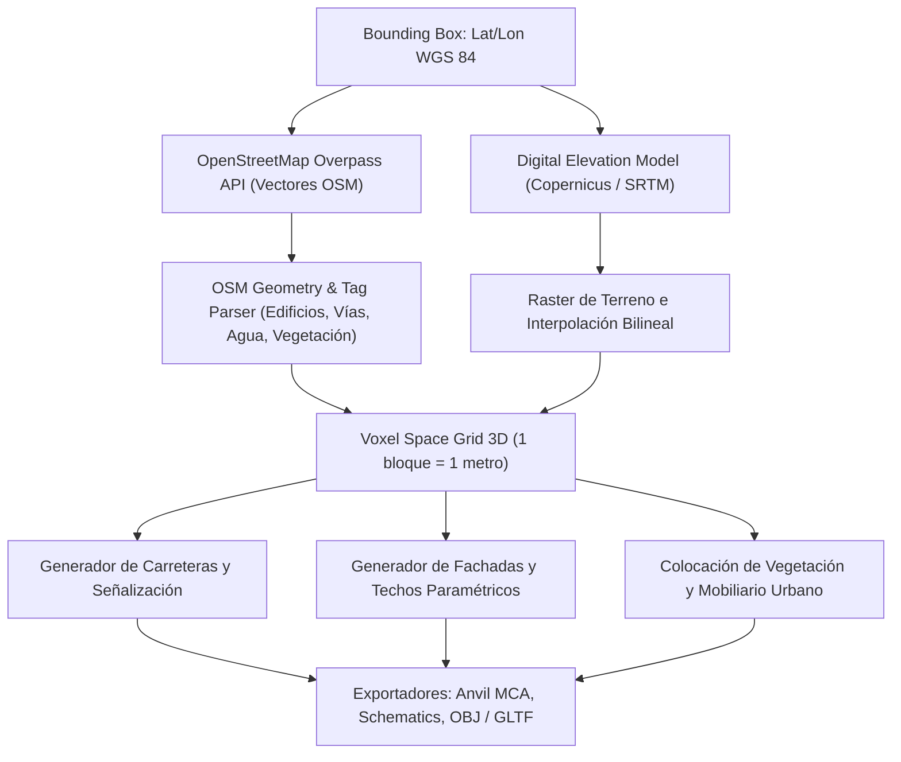

# Arnis Engine: Arquitectura Rust, Ingesta Geoespacial y Generación Voxel 3D

**Propósito:** Guía técnica de arquitectura para el motor de generación procedural **Arnis** (`louis-e/arnis`), compilación en Rust de alto rendimiento, consulta a la API de Overpass y rasterización voxel.  
**Cumplimiento Normativo:** OGC Standards, ISO 25010 (Eficiencia de Rendimiento y Manejo de Concurrencia en Rust).

---

## 1. Topología del Pipeline de Generación

Arnis procesa los datos vectoriales geoespaciales y elevación a través de un flujo concurrente en Rust:



---

## 2. Invocación CLI y Automatización Agéntica

El binario de Arnis permite ejecución por línea de comandos para pipelines automatizados desatendidos:

```bash
# Generación de una zona urbana específica indicando Bounding Box y ruta de salida
arnis \
  --bbox "4.60971,-74.08175,4.61500,-74.07500" \
  --output-dir "./output_worlds/bogota_historic_center" \
  --edition "java" \
  --resolution "high" \
  --include-trees \
  --include-roads \
  --elevation-source "copernicus"
```

---

## 3. Optimización de Memoria y Concurrencia con Rayon / Tokio

1. **Paralelismo de Chunks:** La generación de regiones de $16 \times 16 \times 384$ bloques se distribuye entre los núcleos de la CPU utilizando iteradores paralelos de Rust (`rayon`).
2. **Streaming de Descarga Asíncrono:** Las llamadas a la API de Overpass y mosaicos de elevación se ejecutan de forma no bloqueante con `tokio` y `reqwest`.
3. **Representación Compacta de Bloques:** Cada voxel se codifica como un entero de 16 bits (*Block State ID*), minimizando la huella en memoria RAM durante la rasterización de cuadrículas masivas.
