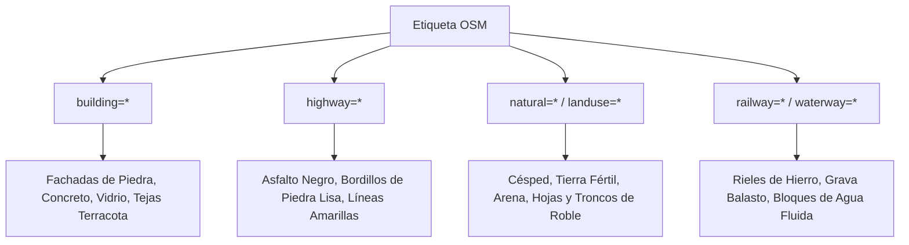

# OpenStreetMap Geospatial Tagging & Elevation Models (DEM)

**Propósito:** Guía de referencia para la extracción, filtrado y mapeo de etiquetas (*tags*) de OpenStreetMap y datasets de elevación digital para la reconstrucción procedural de ciudades en 3D.  
**Cumplimiento Normativo:** OpenStreetMap Tagging Guidelines, OGC Web Map Service (WMS).

---

## 1. Mapeo de Etiquetas OSM a Bloques Voxel

| Categoría OSM | Tags Clave | Bloques Voxel Mapeados (Minecraft / Luanti) |
| :--- | :--- | :--- |
| **Edificios Residenciales** | `building=residential`, `roof:shape=gabled` | Ladrillo de arcilla, madera pulida, escaleras de teja, paneles de vidrio. |
| **Rascacielos Corporativos** | `building=commercial`, `building:levels>=15` | Vidrio tintado cian, concreto gris claro, bloques de hierro pulido. |
| **Vías Principales** | `highway=primary`, `lanes=4` | Concreto gris oscuro (asfalto), lana/concreto amarillo para líneas centrales. |
| **Caminos Peatonales** | `highway=pedestrian`, `footway=sidewalk` | Baldosas de piedra lisa, granito pulido, farolas de hierro forjado. |
| **Zonas Verdes** | `leisure=park`, `landuse=grass` | Bloques de pasto, flores silvestres, hojas de roble y abedul. |
| **Ríos y Canales** | `waterway=river`, `natural=water` | Bloques de agua con lecho de arena y arcilla. |

---

## 2. Modelos Digitales de Elevación (DEM)

1. **Copernicus GLO-30 (Resolución de 30m):**
   - Cobertura global de alta precisión para topografía continental y relieves montañosos.
2. **SRTM (Shuttle Radar Topography Mission):**
   - Dataset estándar para perfiles de elevación globales.
3. **Mapeo de Zonas Costeras e Islas:**
   - Fijación automática de nivel de mar a cota $Y = 62$ (Minecraft standard sea level), asegurando que los muelles y playas se ubiquen en el horizonte hídrico exacto.
