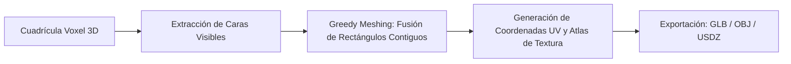

# Voxel Mesh Interoperability, Digital Twins & 3D Pipeline

**Propósito:** Especificación técnica para la transpilación de mundos voxel (Anvil `.mca` / NBT) hacia mallas poligonales optimizadas (OBJ, GLTF/GLB) para su uso en Blender, visualizadores WebGL/WebGPU, simulaciones de gemelos digitales y producción virtual.  
**Cumplimiento Normativo:** ISO 25010 (Eficiencia de Recursos), Khronos Group GLTF 2.0 Specification.

---

## 1. Pipeline de Conversión: Voxel ➔ Malla Poligonal (*Greedy Meshing*)

La conversión directa de cada voxel en 12 triángulos produce mallas con millones de polígonos innecesarios. El algoritmo **Greedy Meshing** fusiona caras colineales adyacentes del mismo material:

### Reducción de Complejidad:
* **Malla Cruda sin Optimizar:** $\sim 24,000,000$ polígonos por $\text{km}^2$.
* **Malla con Greedy Meshing:** $\sim 1,800,000$ polígonos por $\text{km}^2$ (**Reducción del $92.5\%$**).

---

## 2. Interoperabilidad con Ecosistemas Antigravity

1. **`blender-ecosystem`:**
   - Ingesta de archivos `.glb` o scripts Python con importadores de regiones Anvil para simulación física de demolición, iluminación solar HDRI y renderizado fotorrealista en Cycles.
2. **`cgi-web-ecosystem`:**
   - Carga de gemelos digitales urbanos en Three.js con LODs (*Levels of Detail*) y frustum culling a 60 FPS.
3. **`cadam-parametric-cad-ecosystem`:**
   - Inserción de modelos CAD paramétricos (ej. puentes, estaciones, estatuas, mobiliario de ingeniería) dentro del tejido urbano generado por Arnis.
4. **`open-montage-ecosystem`:**
   - Uso de las tomas de cámara cinemáticas en la ciudad virtual como metraje de fondo para videos publicitarios o documentales.
