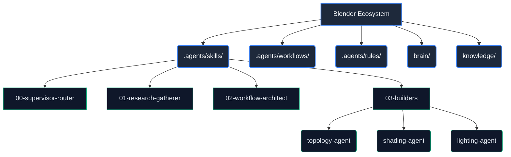

# Blender Ecosystem (VFX & 3D Automation)

**WHO**: Operado por los equipos de Arte Técnico y Automatización 3D.
**WHAT**: Este ecosistema gestiona y automatiza flujos de trabajo en Blender 3D (Renderizado, Topología, Procedural, Shading) mediante el uso de la API Python (`bpy`).
**WHEN**: Se utiliza para tareas de generación de activos, iluminación automatizada e integración de pipelines de render continuo (CI/CD para 3D).
**WHERE**: Dominio exclusivo `agents-factory/blender-ecosystem/`.
**WHY**: Eliminar tareas repetitivas en la línea de ensamble de VFX y garantizar precisión topológica y de sombreado mediante código determinista, bajo estándares estrictos ISO y DORA.

## Topología del Ecosistema

