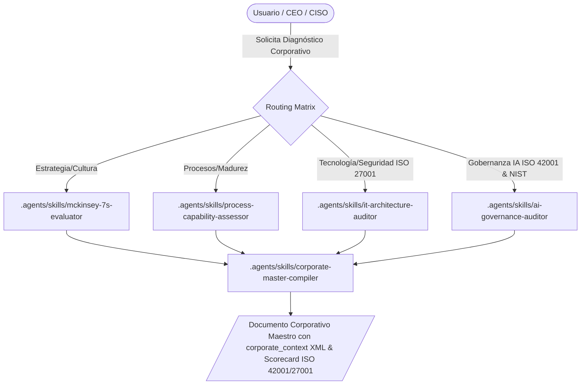

# Business Diagnostic Ecosystem (BDI & Governance Core)

**WHAT**: Este ecosistema se encarga del Diagnóstico de Negocio (BDI - Business Diagnostic Intelligence) y la Gobernanza Corporativa de IA. Ejecuta el levantamiento exegético de requerimientos bajo metodologías científicas (McKinsey 7S, COBIT 2019, PuMP, APQC PCF, TOGAF ACMM) y los checklists de implementación de los estándares internacionales **ISO 42001 (AIMS), ISO 27001 (ISMS) y NIST CSF 2.0**, extraídos del Gemini Notebook `NIST CSF 2.0 and ISO 42001, 27001: Cybersecurity and AI Management`.

## Ecosystem Routing & ISO Checklists (Graphify Core)

1. `mckinsey-7s-evaluator`: Diagnostica la alineación estratégica, cultural y organizacional.
2. `process-capability-assessor`: Evalúa la madurez de procesos e indicadores DORA / COBIT.
3. `it-architecture-auditor`: Diagnostica la deuda técnica, arquitectura cloud/on-prem y controles **ISO 27001** (A.5 Políticas, A.8 Protección de Datos, A.9 Control de Acceso, A.10 Criptografía, A.12/A.14 Seguridad Operativa).
4. `ai-governance-auditor`: Evalúa riesgos de IA, sesgos algorítmicos, linaje de prompts y control de impacto según **ISO 42001** (Cláusulas 6.1 Evaluación de Riesgos de IA, 7.5 Gobernanza de Datos, 8.2 Transparencia Algorítmica y 8.4 Supervisión Humana HITL).
5. `corporate-master-compiler`: Compila y genera el Documento Corporativo Maestro unificado integrando el contrato XML `<corporate_context>` y el Scorecard Normativo de [implicit/NIST_ISO_CHECKLISTS.md](file:///c:/Users/Nomack/Documents/workspace/agents/antigravity/dev/prompt-generator/implicit/NIST_ISO_CHECKLISTS.md).

> [!IMPORTANT]
> A partir de la versión 3.0 del *Core*, este ecosistema constituye la **Fase 1 (Search & Requirements Gathering)** del *Iterative Retrieval Pattern* del `00-supervisor-router`. Se utiliza para realizar un levantamiento estricto de *Ground Truth* consultando el Gemini Notebook antes de autorizar el diseño de soluciones de software o agentes.

## Tubería de Diagnóstico BDI & Compliance (Graphify Map)

