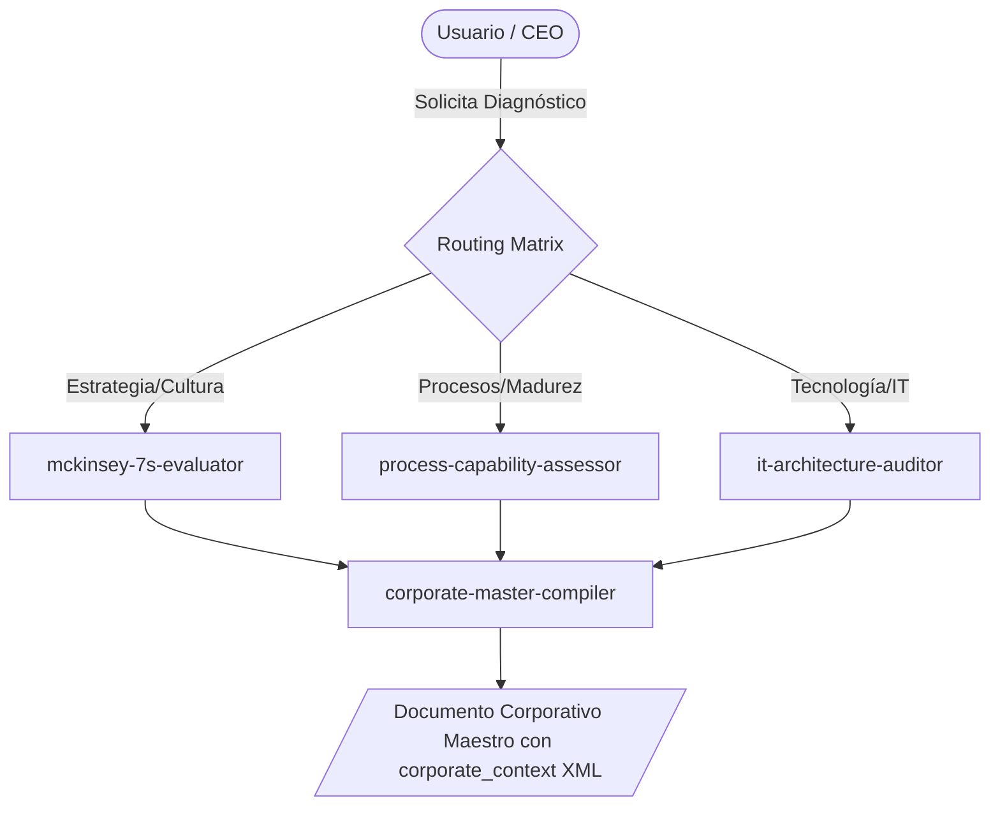

# Business Diagnostic Ecosystem

**WHAT**: Este ecosistema se encarga del Diagnóstico de Negocio (BDI - Business Diagnostic Intelligence), utilizando metodologías científicas (McKinsey 7S, COBIT 2019, PuMP, APQC PCF, TOGAF ACMM) y escalas conductuales ancladas (BARS). Consolida toda la información en un Documento Corporativo Maestro con el contrato de datos XML `<corporate_context>`.

## Ecosystem Routing (Graphify Core)

1. `mckinsey-7s-evaluator`: Diagnostica la alineación estratégica, cultural y organizacional.
2. `process-capability-assessor`: Evalúa la madurez y estabilidad de procesos.
3. `it-architecture-auditor`: Diagnostica la deuda técnica y arquitectura de TI.
4. `corporate-master-compiler`: Compila y genera el Documento Corporativo Maestro unificado.

## Architectural Topology (Graphify Map)

