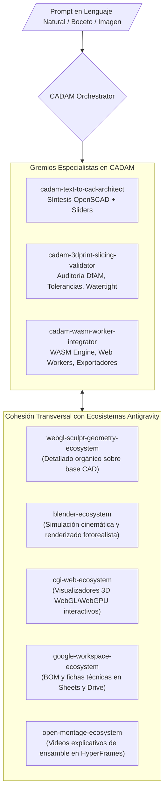

# CADAM Parametric CAD & 3D Print Ecosystem — Universal Antigravity Architecture

**Autoría Oficial:** Antigravity AI & CADAM Engineering Framework (`Adam-CAD/CADAM`)  
**WHAT:** Ecosistema Agéntico de Ingeniería y Modelado CAD Paramétrico para la Web y Fabricación Aditiva (Impresión 3D): síntesis de código OpenSCAD mediante lenguaje natural e imágenes (Text-to-CAD / Image-to-CAD), compilación acelerada en WebAssembly (WASM) con Web Workers, auditoría de tolerancias de manufactura (DfAM) y exportación multiformato (STL, 3MF, STEP, GLB, SCAD).  
**Cumplimiento Normativo:** ISO/ASTM 52900 (Fabricación Aditiva), ISO 17296 (Principios de Impresión 3D), ISO 25010 (Calidad y Rendimiento de Software), ISO 9001:2015.

---

## 1. Topología del Ecosistema Agéntico (Graphify Map)

---

## 2. Catálogo de Subagentes Especialistas (Neo-CRISPE v2.0)

| Subagente | Responsabilidad Principal | Herramientas & Ámbitos |
| :--- | :--- | :--- |
| **[`cadam-text-to-cad-architect`](file:///c:/Users/Nomack/Documents/workspace/agents/antigravity/dev/prompt-generator/agents-factory/cadam-parametric-cad-ecosystem/.agents/skills/cadam-text-to-cad-architect/SKILL.md)** | Síntesis de código OpenSCAD paramétrico modular, constructivo y con variables expuestas para sliders interactivos. | `openscad.csg` `text-to-cad.engine` |
| **[`cadam-3dprint-slicing-validator`](file:///c:/Users/Nomack/Documents/workspace/agents/antigravity/dev/prompt-generator/agents-factory/cadam-parametric-cad-ecosystem/.agents/skills/cadam-3dprint-slicing-validator/SKILL.md)** | Auditoría DfAM para impresión 3D: verificación de mallas manifold/estancas, voladizos $\le 45^\circ$, espesores de pared y tolerancias mecánicas. | `dfam.validator` `slicing.analyzer` |
| **[`cadam-wasm-worker-integrator`](file:///c:/Users/Nomack/Documents/workspace/agents/antigravity/dev/prompt-generator/agents-factory/cadam-parametric-cad-ecosystem/.agents/skills/cadam-wasm-worker-integrator/SKILL.md)** | Compilación asíncrona de OpenSCAD en WebAssembly (WASM), Web Workers y exportación multiformato (STL, 3MF, STEP, GLB). | `wasm.worker` `three.buffergeometry` |

---

## 3. Matriz de Cohesión Transversal Soberana (Zero-Overlap Policy)

1. **`webgl-sculpt-geometry-ecosystem`:** Recibe la base CAD estanca para esculpir micro-texturas o detalles orgánicos con pinceles Dyntopo.
2. **`blender-ecosystem`:** Ensambla mecanismos multicomponente, anima piezas móviles y renderiza tomas de producto fotorrealistas con Eevee Next / Cycles.
3. **`cgi-web-ecosystem`:** Integra visualizadores 3D en tiempo real con materiales PBR y controles deslizantes de personalización en la web a 60 FPS.
4. **`google-workspace-ecosystem`:** Genera hojas de cálculo con la Lista de Materiales (*Bill of Materials - BOM*), costos de filamento/resina y almacenamiento en Drive.
5. **`open-montage-ecosystem`:** Produce animaciones de despiece (*exploded views*) y videos instructivos paso a paso para el armado de las piezas.

---

## 4. Base de Conocimiento Especializada (`knowledge/`)

- [`cadam_openscad_parametric_mastery.md`](file:///c:/Users/Nomack/Documents/workspace/agents/antigravity/dev/prompt-generator/agents-factory/cadam-parametric-cad-ecosystem/knowledge/cadam_openscad_parametric_mastery.md) ➔ Síntesis de OpenSCAD paramétrico y operaciones booleanas CSG.
- [`3d_printing_tolerances_and_slicing_mastery.md`](file:///c:/Users/Nomack/Documents/workspace/agents/antigravity/dev/prompt-generator/agents-factory/cadam-parametric-cad-ecosystem/knowledge/3d_printing_tolerances_and_slicing_mastery.md) ➔ Matriz de tolerancias para FDM, SLA, SLS y laminado 3D.
- [`cadam_wasm_worker_engine_architecture.md`](file:///c:/Users/Nomack/Documents/workspace/agents/antigravity/dev/prompt-generator/agents-factory/cadam-parametric-cad-ecosystem/knowledge/cadam_wasm_worker_engine_architecture.md) ➔ Arquitectura WebAssembly y Web Workers para compilación en navegador.
