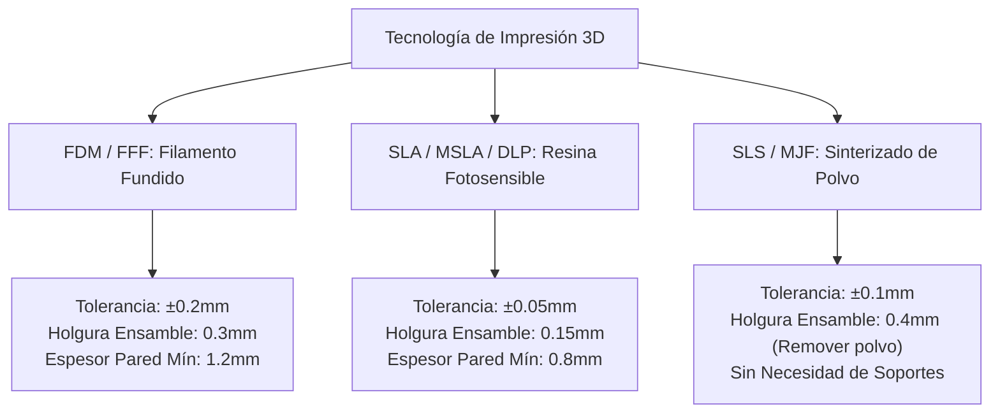

# Diseño para Fabricación Aditiva (DfAM): Tolerancias, Holguras y Slicing para Impresión 3D

**Propósito:** Guía técnica para garantizar que los modelos generados por CADAM sean 100% imprimibles en impresoras 3D (FDM, SLA, SLS), cumplan con las tolerancias dimensionales estándar y se laminen sin errores en Cura, PrusaSlicer, Bambu Studio o OrcaSlicer.  
**Cumplimiento Normativo:** ISO/ASTM 52900 / ISO 17296 (Terminología y Principios de Fabricación Aditiva).

---

## 1. Matriz de Tolerancias según Tecnología de Impresión

| Parámetro Geométrico | FDM (PLA / PETG / ABS) | SLA (Resina Estándar / Tough) | SLS (Nylon PA12) |
| :--- | :---: | :---: | :---: |
| **Espesor de Pared Mínimo Soportado** | $1.2\text{ mm}$ (3 perímetros) | $0.8\text{ mm}$ | $0.8\text{ mm}$ |
| **Espesor de Pared No Soportado** | $2.0\text{ mm}$ | $1.5\text{ mm}$ | $1.2\text{ mm}$ |
| **Ángulo de Voladizo sin Soporte** | $\le 45^\circ$ | $\le 40^\circ$ | N/A (Auto-soportado por polvo) |
| **Diámetro Mínimo de Agujero Vertical** | $2.0\text{ mm}$ | $0.5\text{ mm}$ | $1.0\text{ mm}$ |
| **Puente sin Soporte (*Bridging*)** | Hasta $15\text{ mm}$ | N/A (Requiere soportes) | N/A |
| **Holgura para Ensambles Móviles (*Print-in-Place*)** | $0.4\text{ mm}$ | $0.2\text{ mm}$ | $0.5\text{ mm}$ |

---

## 2. Prevención de Errores Críticos de Laminación (*Slicing*)

1. **Mallas No-Manifold (Bordes Abiertos o Caras Compartidas):**
   - El motor CSG de OpenSCAD produce mallas cerradas por definición matemática, evitando los errores de geometría hueca que sufren los generadores basados en nubes de puntos o mallas poligonales libres.
2. **Pandeo Térmico (*Warping*):**
   - En piezas grandes de esquinas vivas, incorporar chaflanes o bordes redondeados (`r >= 3mm`) en la base para distribuir la tensión térmica y evitar que la pieza se despegue de la cama de impresión.
3. **Orientación de Capas y Resistencia Mecánica:**
   - En impresión FDM, la resistencia a la tracción en el eje Z (entre capas) es entre un $30\%$ y $50\%$ menor que en el plano X-Y. Las características de sujeción o clips deben diseñarse para orientarse en el plano X-Y durante la impresión.
