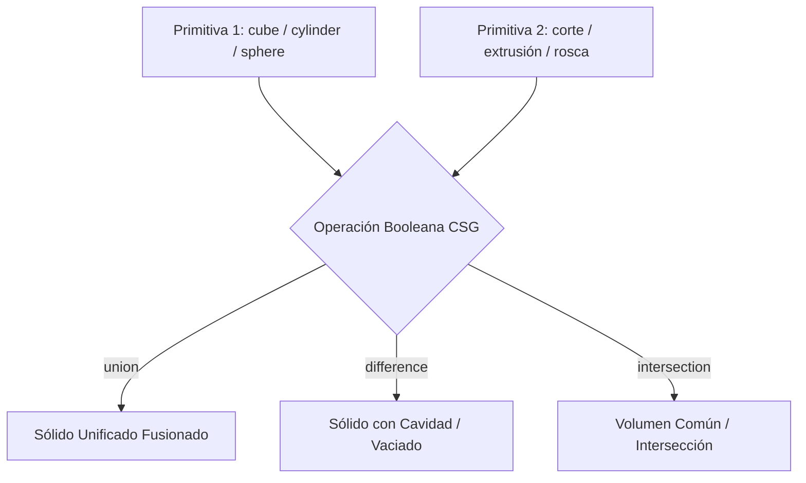

# CADAM & OpenSCAD Parametric Mastery: Text-to-CAD Synthesis

**Propósito:** Guía maestra de ingeniería para la síntesis determinista de código OpenSCAD a partir de lenguaje natural e imágenes, parametrización de variables, operaciones CSG avanzadas y matemáticas de superficies 3D.  
**Cumplimiento Normativo:** ISO 17296 (Fabricación Aditiva), ISO 25010 (Calidad y Robustez de Software).

---

## 1. Fundamentos de Geometría Sólida Constructiva (CSG)

OpenSCAD construye modelos 3D mediante operaciones booleanas matemáticas entre primitivas sólidas:



### Operaciones CSG Esenciales:
1. **`union()`:** Combina dos o más sólidos en una sola malla contigua.
2. **`difference()`:** Sustrae los sólidos subsecuentes del primer sólido declarado.
3. **`intersection()`:** Mantiene exclusivamente el volumen donde todos los sólidos coinciden.
4. **`hull()`:** Genera la envolvente convexa alrededor de un conjunto de geometrías (ideal para transiciones suaves y brazos mecánicos).
5. **`minkowski()`:** Realiza la suma de Minkowski entre dos geometrías (ideal para redondear bordes y biselar aristas complejas).

---

## 2. Sintaxis Paramétrica y Compatibilidad con Sliders

Para que el motor de **CADAM** interprete los parámetros y exponga controles deslizantes en la interfaz de usuario:

```openscad
// ==========================================
// PARÁMETROS PARAMÉTRICOS EXPOSITIVOS (CADAM)
// ==========================================

/* [Dimensiones de la Caja] */
box_length = 80;       // [40:1:200]
box_width = 50;        // [30:1:150]
box_height = 35;       // [15:1:100]
wall_thickness = 2.0;  // [1.2:0.2:4.0]
corner_radius = 4;     // [0:0.5:10]

/* [Configuración de Tapa y Tornillos] */
screw_diameter = 3.2;  // [2.0:0.2:5.0] (M3 Standard)
lip_height = 3.0;      // [1.5:0.5:6.0]

$fn = 48; // Resolución angular

// Módulo principal de caja con esquinas redondeadas
module rounded_box(l, w, h, r) {
    hull() {
        for (x = [-l/2 + r, l/2 - r]) {
            for (y = [-w/2 + r, w/2 - r]) {
                translate([x, y, 0])
                    cylinder(r=r, h=h);
            }
        }
    }
}

// Ensamble de caja con vaciado interior
difference() {
    rounded_box(box_length, box_width, box_height, corner_radius);
    
    // Vaciado interior (sobrepasa en Z para corte limpio sin caras coincidentes)
    translate([0, 0, wall_thickness])
        rounded_box(box_length - 2*wall_thickness, box_width - 2*wall_thickness, box_height, max(0.1, corner_radius - wall_thickness));
}
```

---

## 3. Extrusión 2D a 3D (`linear_extrude` y `rotate_extrude`)

1. **`linear_extrude(height, twist, scale)`:**
   - Proyecta un polígono 2D a lo largo del eje Z con opción de torsión (*twist*) y escalado cónico.
2. **`rotate_extrude(angle, $fn)`:**
   - Rota un perfil 2D alrededor del eje Z (ideal para poleas, jarrones, botellas y roscas toroidales).
