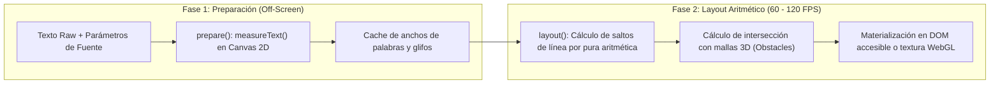

# Pretext: Zero-Reflow Text Layout & 3D Obstacle-Aware Typography

**Referencia Oficial:** Pretext Engine (*Cheng Lou*)  
**Propósito:** Arquitectura para renderizado y diagramación tipográfica en tiempo real a 60–120 FPS sin provocar bloqueos síncronos del hilo principal (*DOM Reflow / Layout Thrashing*), permitiendo que el texto fluya de forma dinámica alrededor de mallas 3D interactivas, partículas y elementos cinemáticos en entornos WebGL/WebGPU.  
**Cumplimiento Normativo:** ISO 25010 (Eficiencia de Rendimiento), ISO 9241-112 (Ergonomía Visual), WCAG 2.1 AA/AAA.

---

## 1. El Paradigma de Medición sin Reflow (*Two-Phase Layout*)

Pretext desacopla la medición tipográfica del ciclo de vida del DOM del navegador mediante dos fases matemáticas:



### A. Medición Inicial (`prepare`):
```typescript
import { prepare } from 'pretext';

// Precalcula anchos de palabras una sola vez sin tocar el DOM
const preparedText = prepare(
  "Lorem ipsum dolor sit amet, consectetur adipiscing elit...",
  "18px 'Inter', sans-serif"
);
```

### B. Cálculo Dinámico de Líneas (`layout`):
```typescript
import { layout } from 'pretext';

// Se ejecuta en cada frame de animación (requestAnimationFrame) a ~0.05ms
const lines = layout(preparedText, {
  maxWidth: containerWidth,
  obstacles: [
    // Proyección 2D de una esfera o modelo 3D en la pantalla
    { x: meshScreenX - 50, y: meshScreenY - 50, width: 100, height: 100 }
  ]
});
```

---

## 2. Integración con Three.js / WebGPU y Experiencias 3D Inmersivas

En experiencias CGI web interactivas (ej. portafolios de lujo, páginas de producto 3D), los usuarios mueven la cámara o interactúan con objetos 3D. 

1. **Evitar la trampa clásica de `getBoundingClientRect()`:**
   - La técnica tradicional de pedir la posición de cada elemento de texto al mover un objeto 3D destruye la tasa de refresco ($<20\text{ FPS}$).
2. **El Enfoque Pretext en Three.js:**
   - Se proyecta el Bounding Sphere / Box 3D a coordenadas de pantalla 2D mediante `Vector3.project(camera)`.
   - Se pasa el obstáculo al método `layout()` de Pretext.
   - El texto se reacomoda instantáneamente a **60–120 FPS** sin un solo reflow.
   - El texto permanece en el DOM (`<p>`, `<span>`), garantizando accesibilidad nativa y selección con el mouse.

---

## 3. Beneficios de Rendimiento y Estándares ISO

| Métrica | Enfoque Tradicional (DOM Reflow) | Enfoque Pretext (Pura Aritmética) | Impacto ISO |
| :--- | :---: | :---: | :--- |
| **Tiempo de Cálculo por Bloque** | $15\text{ms} - 50\text{ms}$ | $\sim 0.05\text{ms}$ | **ISO 25010 (Time Behaviour):** Aceleración de $\approx 500\times$. |
| **Cumulative Layout Shift ($CLS$)** | $0.15 - 0.40$ (Salto visual) | **$0.00$ (Cero saltos)** | **ISO 9241-112:** Lectura ergonómica sin fatiga visual. |
| **Interaction to Next Paint ($INP$)** | $> 120\text{ms}$ (Bloqueo de UI) | **$< 16\text{ms}$ (Fluido)** | **Core Web Vitals:** Cumplimiento del rango "Bueno" de Google. |
| **Accesibilidad para Lectores de Pantalla** | N/A (o roto si se usa Canvas plano) | **100% Accesible (DOM real)** | **WCAG 2.1 AA (1.3.1 / 1.4.12):** Nodos semánticos indexables. |
