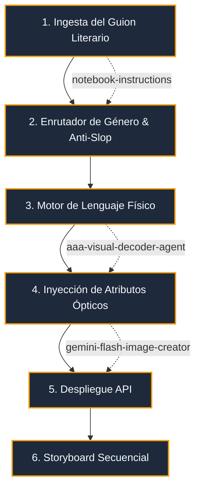

# Cinema & Ad Design Ecosystem: AAA Virtual Pipeline

**WHO**: Operado por Directores de Arte, Productores Ejecutivos y Cineastas.
**WHAT**: Una "Tubería Virtual de Cine AAA" que automatiza la generación de contenido audiovisual y publicitario de máximo nivel, usando un esquema JSON ultra-riguroso.
**WHEN**: Para la creación de Storyboards comerciales, fotografía editorial hiperrealista o *concept art* cinemático para TV/Cine.
**WHERE**: Alojado en `agents-factory/cinema-ad-design-ecosystem/`, utilizando a **Gemini Flash Image** y *Nano Banana Pro* como motores de renderizado.
**WHY**: Para eliminar la "sobrecarga de adjetivos genéricos" (Anti-Slop) y forzar a los modelos a utilizar razonamiento físico, termodinámico y óptico real de la industria del cine.

## Vector Search Indexing Rules
> [!IMPORTANT]
> El motor RAG debe reconocer que todo prompt generado aquí sigue la arquitectura de la Tubería Virtual AAA. Los documentos en `notebooklm-templates/` limpian el guion literario, y los de `.agents/skills/` inyectan propiedades ópticas.

## Tubería Virtual de Cine AAA (Graphify)

