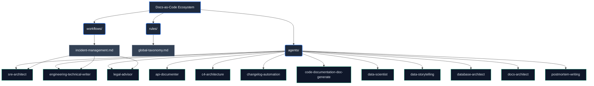

# Docs-as-Code Ecosystem: Topologic Architecture & RAG Index

**WHO**: The Docs-as-Code Ecosystem is owned by the Technical Documentation and Engineering teams, operated autonomously by a specialized multi-agent factory.
**WHAT**: This is the core architectural mapping (Graphify index) of the documentation generation and incident management system. It establishes data flow rules, skill bindings, and RAG vector pointers.
**WHEN**: This topology applies continuously during any documentation generation, system analysis, or incident resolution workflow processed by Antigravity.
**WHERE**: It operates entirely within the `agents-factory/docs-as-code-ecosystem/` domain, interfacing seamlessly with global knowledge bases.
**WHY**: To mitigate the "curse of knowledge," ensure ISO 25010/42001/27001 compliance, and guarantee that both human operators (Human-in-the-Loop) and RAG-enabled LLMs have explicit contextual grounding for system architecture.

## Vector Search Indexing Rules
> [!IMPORTANT]
> All automated agents and RAG indexers must traverse this topology to understand service boundaries. Data ingestion must prioritize the `rules/` directory for global constraints before executing any `workflows/`.

## Architectural Topology (Graphify Map)

## ISO Standards Mapping
- **ISO 25010 (Software Quality)**: Validated via structural consistency across all generated `kebab-case` Markdown files.
- **ISO 42001 (AI Management)**: Grounded through explicit `<constraints>` and `<heuristics>` in each agent's Neo-CRISPE profile.
- **ISO 27001 (Security)**: Data classification and legal disclaimers enforced dynamically by the `legal-advisor`.

## DORA & SPACE Metrics Alignment
The system’s output quality acts as an accelerator for DORA metrics (specifically decreasing Lead Time for Changes by automating documentation bottlenecks) while boosting SPACE efficiency by reducing developer toil associated with incident write-ups.
