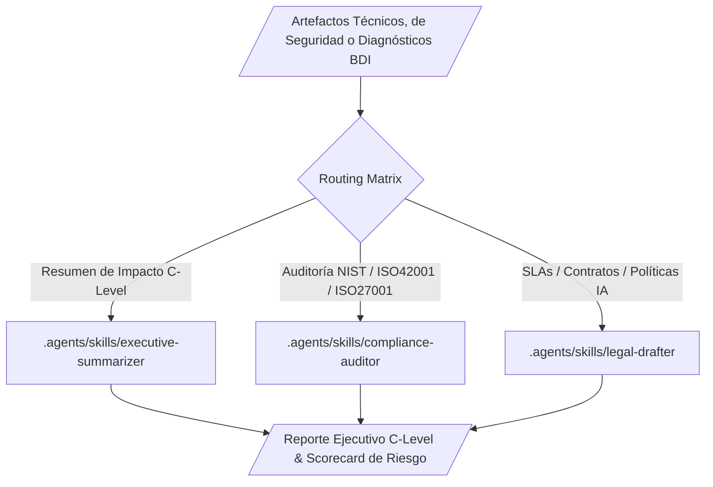

# Docs-as-Code Executive Ecosystem (Executive Compliance & Risk)

**WHO**: Operado por C-Levels (CEOs, CTOs, CFOs, CISOs) y equipos de Legal/Compliance.
**WHAT**: Un ecosistema diseñado para generar resúmenes ejecutivos, contratos legales, informes de cumplimiento normativo y reportes de auditoría corporativa (**NIST CSF 2.0, ISO 42001, ISO 27001, SOC 2, DORA**).
**WHEN**: Se utiliza para abstraer la complejidad técnica del `software-engineering-ecosystem`, `cybersecurity-ecosystem` o `business-diagnostic-ecosystem` hacia lenguaje de negocio, riesgo e inversión.
**WHERE**: Dominio `agents-factory/docs-as-code-executive-ecosystem/`.
**WHY**: Proveer documentación infalible, rigurosa y legalmente vinculante, fundamentada empíricamente en el RAG de Gemini Notebook (`NIST CSF 2.0 and ISO 42001, 27001: Cybersecurity and AI Management`) y eliminando absolutamente el riesgo de alucinación semántica.

## Ecosystem Routing (Graphify Core)

1. `executive-summarizer`: Transforma artefactos técnicos en reportes de impacto al negocio y retorno de inversión en IA.
2. `compliance-auditor`: Verifica que los sistemas y documentos cumplan con NIST CSF 2.0, ISO 42001, ISO 27001, SOC 2 y GDPR.
3. `legal-drafter`: Redacta contratos, SLAs, políticas de uso aceptable de IA y términos de servicio corporativos.

> [!IMPORTANT]
> **Rigor de Parametrización (Capa de Ejecución):** Este ecosistema opera bajo **Temperatura 0.1 o inferior y restricción estricta de Top-P**, utilizando `gemini-3.6-flash` (`thinking_level: medium`) o `gemini-3.1-pro`. No existe margen para la invención de términos. El vocabulario está atado al *Ground Truth* y a los checklists de [implicit/NIST_ISO_CHECKLISTS.md](file:///c:/Users/Nomack/Documents/workspace/agents/antigravity/dev/prompt-generator/implicit/NIST_ISO_CHECKLISTS.md).

## Architectural Topology (Graphify Map)

