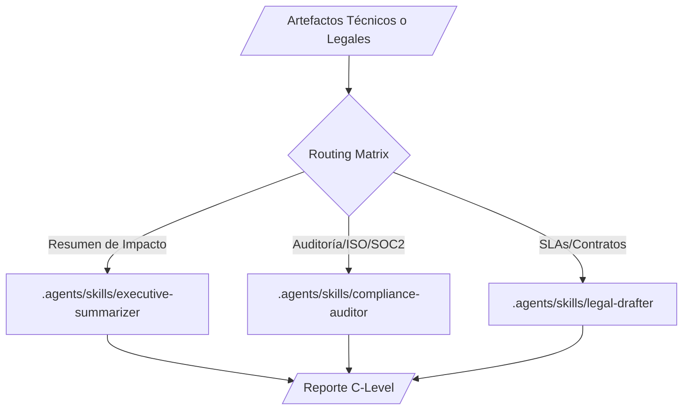

# Docs-as-Code Executive Ecosystem

**WHO**: Operado por C-Levels (CEOs, CTOs, CFOs) y equipos de Legal/Compliance.
**WHAT**: Un ecosistema diseñado para generar resúmenes ejecutivos, contratos legales, informes de cumplimiento normativo y documentos de auditoría (SOC2, ISO 27001).
**WHEN**: Se utiliza para abstraer la complejidad técnica del `software-engineering-ecosystem` o `cybersecurity-ecosystem` hacia lenguaje de negocio y riesgo.
**WHERE**: Dominio `agents-factory/docs-as-code-executive-ecosystem/`.
**WHY**: Proveer documentación infalible, rigurosa y legalmente vinculante, eliminando absolutamente el riesgo de alucinación semántica.

## Ecosystem Routing (Graphify Core)
1. `executive-summarizer`: Transforma artefactos técnicos en reportes de impacto al negocio.
2. `compliance-auditor`: Verifica que los textos generados cumplan con SOC2, ISO o GDPR.
3. `legal-drafter`: Redacta contratos y SLAs.

> [!IMPORTANT]
> **Rigor de Parametrización (Capa de Ejecución):** Este ecosistema opera bajo **Temperatura 0 y restricción estricta de Top-P**. No existe margen para la creatividad. El vocabulario está atado al *Ground Truth* corporativo.

## Architectural Topology (Graphify Map)

