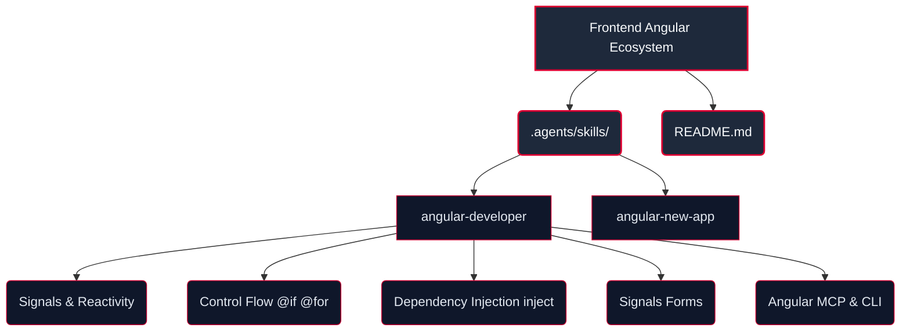

# Frontend Angular Ecosystem (Official Angular Agent Skills)

**WHO**: Operado por los equipos de Ingeniería Web Frontend y Arquitectura Angular.
**WHAT**: Este ecosistema integra las habilidades de agente oficiales de Angular (`angular-developer` y `angular-new-app`) publicadas por el equipo central de Angular en Google LLC (`https://github.com/angular/skills`).
**WHEN**: Se utiliza para el desarrollo de componentes modernos de Angular v22+, reactividad con Signals (`signal`, `computed`, `linkedSignal`, `resource`, `httpResource`), formulación con Signals Forms, inyección con `inject()`, enrutamiento SSR e integración con el servidor MCP de Angular CLI.
**WHERE**: Dominio exclusivo `agents-factory/frontend-angular-ecosystem/`.
**WHY**: Eliminar patrones obsoletos (`NgModules`, inyección por constructor, `*ngIf`) y garantizar que todo el código frontend Angular sea moderno, declarativo, libre de errores y verificado mediante `ng build`.

## Topología del Ecosistema

