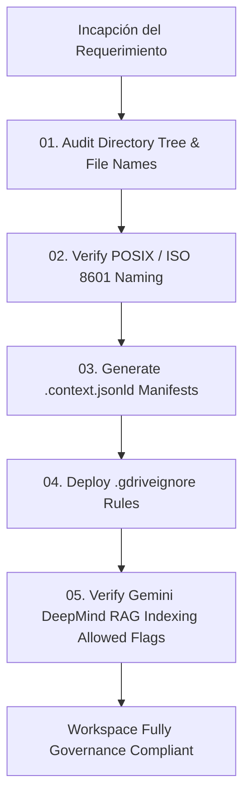

# Workflow: Google Workspace Architecture & Gemini RAG Indexing

> **Goal**: Audit, reorganize, and deploy RAG manifests across Google Drive workspace directories under Gemini DeepMind standards with Zero Data Loss.

## Step-by-Step Execution

1. **Audit & Validation**:
   - Run `bin/generate-gdrive-manifest.py --path <workspace-path> --dry-run`.
   - Log all non-compliant file names. Confirm zero file deletions.

2. **Manifest Generation**:
   - Execute `bin/generate-gdrive-manifest.py --path <workspace-path>` to write root `.context.jsonld` and `.gdriveignore`.
   - Verify `aiIndexingAllowed: false` on `00_GOVERNANCE_MY_BUSINESS` and `01_FINANCIAL_OPS`.
   - Verify `aiIndexingAllowed: true` on `02_CLIENT_SERVICE_DELIVERY/*/02_SERVICES_ENGAGEMENTS` and `03_KNOWLEDGE_BASE_RND`.

3. **Gemini DeepMind Verification**:
   - Confirm schema.org `DataCatalog` JSON-LD valid IRIs.
   - Verify node dependencies and RBAC permissions.
