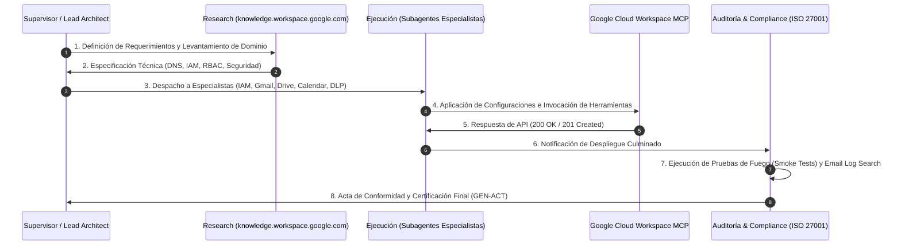

# Workflow de Despliegue, Parametrización y Auditoría Google Workspace

**PROPÓSITO**: Flujo de proceso estandarizado Top-Down (**Supervisor ➔ Research ➔ Ejecución ➔ Auditoría**) para desplegar, parametrizar y certificar entornos de Google Workspace Enterprise.

---

---

## Fases del Workflow

### Fase 1: Supervisor (Definición Top-Down)
- Levantamiento de alcance de usuarios, licencias requeridas, dominios existentes y restricciones de negocio.

### Fase 2: Research & Especificación Técnica
- Consulta de la documentación oficial en `knowledge.workspace.google.com` y generación de la especificación de arquitectura (`workspace_architecture_spec.md`).

### Fase 3: Ejecución Modular
- Delegación a los subagentes especializados (`workspace-governance-iam-specialist`, `workspace-gmail-routing-specialist`, `workspace-drive-storage-specialist`, `workspace-security-dlp-architect`).
- Invocación de herramientas a través de `workspace-mcp-bridge-integrator`.

### Fase 4: Auditoría y Certificación
- Ejecución de las 3 Pruebas de Fuego (Casilla real, Catch-All y Firma DKIM saliente).
- Extracción de evidencia factual en *Email Log Search*.
- Emisión formal del Acta Técnica de Conformidad (`GEN-ACT-XXXX`).
