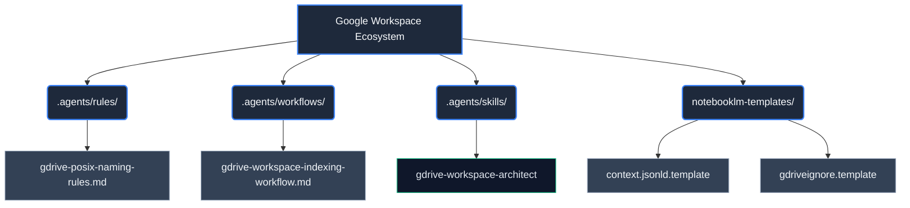

# Google Workspace Ecosystem: Topologic Architecture & RAG Index

**WHO**: Maintained by the Enterprise Architecture & AI Knowledge Engineering teams.
**WHAT**: Architectural layout for high-performance Google Workspace / Google Drive governance, deterministic file naming, `.context.jsonld` RAG graph manifests, and `.gdriveignore` security exclusion policies.
**WHEN**: Triggered during client workspace onboarding, drive folder reorganizations, and Gemini DeepMind RAG indexing workflows.
**WHERE**: Operates entirely within the `agents-factory/google-workspace-ecosystem/` domain.
**WHY**: To guarantee Gemini DeepMind RAG readability, maintain zero data loss, eliminate file ambiguity, and enforce strict ISO 25010, ISO 42001, ISO 27001, and SOC 2 compliance.

## Vector Search Indexing Rules

> [!IMPORTANT]
> All automated agents and RAG indexers must traverse this topology to understand workspace boundaries. Data ingestion must prioritize `.agents/rules/` before executing any `.agents/workflows/`.

## Architectural Topology (Rendered by Graphify CLI)

## ISO & NIST Standards Mapping

- **ISO 25010 (Software & Data Quality)**: Enforced via POSIX & ISO 8601 deterministic file naming (`YYYYMMDD_[SCOPE]_[ENTITY]_[TYPE]_[DESCRIPTION]_[VERSION]`).
- **ISO 42001 (AI Management System)**: Governed via `.context.jsonld` manifests specifying `aiIndexingAllowed: true/false` and node dependency trees for Gemini DeepMind.
- **ISO 27001 (Information Security)**: RBAC access control policies and `.gdriveignore` rules to exclude secrets, raw PII, and financial ledgers.
- **SOC 2 & Zero Data Loss Policy**: Prohibits file deletion or content mutation during workspace reorganization.
