# Google Workspace Ecosystem: Topologic Architecture & Multi-Agent Matrix

**WHO**: Maintained by the Enterprise Architecture, Google Workspace Lead Architects & AI Knowledge Engineering teams.  
**WHAT**: Ecosistema agéntico integral para la parametrización de nivel empresarial de Google Workspace (`admin.google.com`), resolución DNS autoritativa, ciberseguridad criptográfica de correo (SPF/DKIM/DMARC), gobierno de identidades (IAM), Unidades Compartidas (RBAC) e integración determinista con Google Cloud MCP.  
**METODOLOGÍA**: Top-Down (**Supervisor ➔ Research ➔ Ejecución ➔ Auditoría**) bajo estándares **Neo-CRISPE v2.0**.  
**CUMPLIMIENTO NORMATIVO**: ISO 9001:2015 (SGC), ISO/IEC 27001:2022 (ISMS), ISO/IEC 42001:2023 (AIMS), ISO 25010 (Calidad de Software), SOC 2 & NIST CSF 2.0.  

---

## 1. Topología del Ecosistema Agéntico

```mermaid
graph TD
    %% Core Ecosystem
    A["Google Workspace Ecosystem"] --> B[".agents/rules/"]
    A --> C[".agents/workflows/"]
    A --> D[".agents/skills/ (Subagentes Especialistas)"]
    A --> E["knowledge/ (Compendios Maestros)"]
    A --> F["notebooklm-templates/"]

    %% Rules
    B --> B1["workspace-enterprise-security-rules.md"]
    B --> B2["multi-tenant-iam-security-rules.md"]
    B --> B3["gdrive-posix-naming-rules.md"]

    %% Workflows
    C --> C1["workspace-deployment-and-audit-workflow.md"]
    C --> C2["gdrive-workspace-indexing-workflow.md"]

    %% Specialized Subagents (Skills)
    D --> D1["workspace-governance-iam-specialist"]
    D --> D2["workspace-security-dlp-architect"]
    D --> D3["workspace-gmail-routing-specialist"]
    D --> D4["workspace-calendar-assistant-agent"]
    D --> D5["workspace-drive-storage-specialist"]
    D --> D6["workspace-audit-compliance-analyst"]
    D --> D7["workspace-mcp-bridge-integrator"]

    %% Knowledge Bases
    E --> E1["google_workspace_enterprise_admin_mastery.md"]
    E --> E2["google_workspace_mcp_integration_matrix.md"]

    %% Styling Branding
    classDef domain fill:#07283d,stroke:#ffd231,stroke-width:2px,color:#ffffff
    classDef subagent fill:#056c5c,stroke:#ffd231,stroke-width:1px,color:#ffffff
    classDef file fill:#1a3a5c,stroke:#cccccc,stroke-width:1px,color:#ffffff
    classDef knowledge fill:#ba1650,stroke:#ffd231,stroke-width:1px,color:#ffffff

    class A domain
    class D1,D2,D3,D4,D5,D6,D7 subagent
    class B1,B2,B3,C1,C2,F file
    class E1,E2 knowledge
```

---

## 2. Catálogo de Subagentes Especialistas (Roles & Ámbitos)

| Subagente | Responsabilidad Principal | Herramientas & Ámbitos |
| :--- | :--- | :--- |
| **`workspace-governance-iam-specialist`** | Gestión de identidades, jerarquías de Unidades Organizacionales (UOs), asignación de licencias y roles de administración delegados. | `admin.directory.user` `admin.directory.orgunit` |
| **`workspace-security-dlp-architect`** | Políticas de autenticación 2FA/MFA obligatorio por UO, listas de acceso contextual (CAA), reglas DLP y control de aplicaciones OAuth/API. | `admin.directory.user.security` Security Center & DLP Engine |
| **`workspace-gmail-routing-specialist`** | Parametrización DNS (MX unificado, SPF, DKIM RSA 2048, DMARC), reglas Catch-All (*Default Routing*), Email Allowlist y SMTP Relay. | `gmail.settings.basic` DNS & Enrutamiento SMTP |
| **`workspace-calendar-assistant-agent`** | Gestión de calendarios compartidos, recursos de salas/equipos, políticas de visibilidad por UO e interoperabilidad con Exchange/Outlook. | `calendar` `calendar.events` |
| **`workspace-drive-storage-specialist`** | Arquitectura de Unidades Compartidas (*Shared Drives*), matriz RBAC, políticas de bloqueo de descarga/copia e indexación RAG. | `drive` `drive.file` `drive.metadata` |
| **`workspace-audit-compliance-analyst`** | Búsqueda forense en *Email Log Search*, auditoría de eventos de administración y reportes de conformidad ISO 27001 / ISO 9001. | `admin.reports.audit.readonly` Email Log Search |
| **`workspace-mcp-bridge-integrator`** | Interfaz determinista y tipada con el servidor MCP oficial de Google Cloud Workspace bajo política *Zero-Overlap*. | Google Cloud Workspace MCP Server |

---

## 3. Principio de Cero Sobrelapamiento (*Zero-Overlap Policy*)

Para garantizar la pureza operativa de los procesos y evitar colisiones entre el MCP oficial de Google Cloud y los subagentes:

1. **Ámbitos Estrictamente Delimitados**: Cada subagente invoca únicamente las herramientas y scopes autorizados en `knowledge/google_workspace_mcp_integration_matrix.md`.
2. **Idempotencia de Operaciones**: Toda mutación en la API de Workspace se ejecuta de forma declarativa e idempotente.
3. **Control de Modificaciones Críticas**: Toda operación destructiva (eliminación de cuentas o Shared Drives) requiere validación *Human-in-the-Loop* (HITL).
