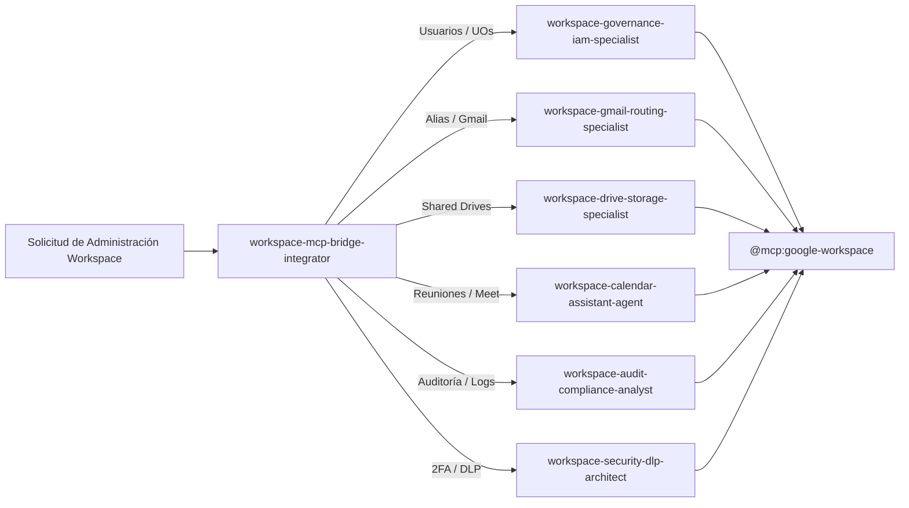

# Declaración Implícita de Herramientas MCP para Google Workspace Ecosystem

**Alcance:** Ecosistema `google-workspace-ecosystem`  
**Servidores MCP Implícitos:** `@mcp:google-workspace`, `@mcp:drive`, `@mcp:cloudrun`  
**Normativa:** ISO 27001 (Seguridad en APIs y Control de Accesos), ISO 42001 (AIMS - Gobernanza de Agentes), DORA.

---

## 1. Conexión Implícita a Google Workspace MCP (`@mcp:google-workspace`)

Todos los subagentes del gremio de administración de Workspace (`workspace-governance-iam-specialist`, `workspace-gmail-routing-specialist`, `workspace-drive-storage-specialist`, `workspace-calendar-assistant-agent`, `workspace-audit-compliance-analyst`, `workspace-security-dlp-architect`, `workspace-mcp-bridge-integrator`) tienen permiso implícito para consultar e interactuar con el servidor MCP de Google Workspace:

### Herramientas Disponibles por Dominio:

### A. Gestión de Identidades, Usuarios y Unidades Organizacionales (Directory API)
1. `mcp_workspace_users_list`: Lista usuarios activos, suspendidos o archivados por Unidad Organizacional (`orgUnitPath`).
2. `mcp_workspace_user_create`: Aprovisiona una nueva cuenta corporativa con contraseñas temporales y asignación de UO.
3. `mcp_workspace_user_update`: Actualiza datos de perfil, estado de suspensión, recuperación y alias.
4. `mcp_workspace_orgunits_list`: Lista la jerarquía completa de Unidades Organizacionales.
5. `mcp_workspace_orgunit_create`: Crea una nueva Unidad Organizacional bajo una ruta padre.

### B. Enrutamiento y Gestión de Correo (Gmail API)
1. `mcp_workspace_gmail_send`: Envío de notificaciones transaccionales y comunicados corporativos autenticados.
2. `mcp_workspace_gmail_aliases_list`: Lista y verifica alias de correo asociados a casillas corporativas.
3. `mcp_workspace_gmail_filter_create`: Configura reglas de reenvío, etiquetas y filtros de bandeja de entrada.

### C. Almacenamiento y Unidades Compartidas (Google Drive API v3)
1. `mcp_workspace_drives_list`: Lista las Unidades Compartidas (*Shared Drives*) del dominio empresarial.
2. `mcp_workspace_drive_create`: Crea una nueva Unidad Compartida departamental con políticas de restricción.
3. `mcp_workspace_permissions_create`: Otorga permisos RBAC (organizer, fileOrganizer, writer, commenter, reader).
4. `mcp_workspace_file_metadata`: Inspecciona metadatos, propietarios y árbol de permisos de carpetas y archivos.

### D. Agenda y Calendarios (Calendar API)
1. `mcp_workspace_calendar_events_list`: Consulta disponibilidad y eventos de salas y usuarios.
2. `mcp_workspace_calendar_event_create`: Programa reuniones, conferencias Google Meet y bloqueos de agenda.
3. `mcp_workspace_acl_update`: Modifica listas de control de acceso para calendarios compartidos.

### E. Auditoría Forense y Seguridad (Reports API / Token API)
1. `mcp_workspace_reports_activities_list`: Consulta logs de auditoría de inicio de sesión, Drive y Admin.
2. `mcp_workspace_email_log_search`: Rastrea la entrega y enrutamiento de correos electrónicos.
3. `mcp_workspace_token_audit`: Audita aplicaciones y tokens OAuth autorizados por los usuarios.
4. `mcp_workspace_tokens_revoke`: Revoca accesos OAuth sospechosos o no autorizados.

---

## 2. Protocolo de Enrutamiento & Zero-Overlap

