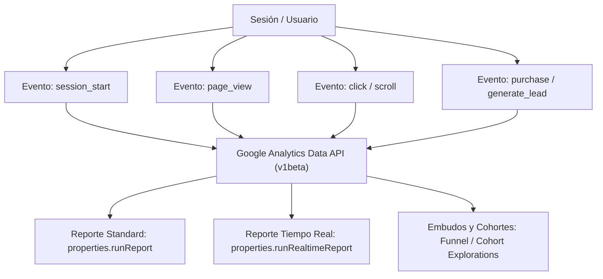

# Google Analytics 4 (GA4) Data API: Telemetría, Embudos y Reportes Ejecutivos

**Propósito:** Guía de arquitectura para la extracción de métricas, análisis de tráfico web/app, comportamiento de usuarios, atribución de conversiones y generación de reportes en tiempo real mediante la **Google Analytics Data API v1beta**.

---

## 1. Modelo de Datos Basado en Eventos (GA4)

A diferencia del Universal Analytics tradicional, GA4 opera sobre un modelo centrado exclusivamente en **Eventos**, **Parámetros de Evento** y **Propiedades de Usuario**:

### Operaciones REST Principales:
1. **`POST /v1beta/properties/{propertyId}:runReport`:**
   - Permite consultar dimensiones estándar (`city`, `browser`, `pageTitle`, `sessionSource`, `deviceCategory`) y métricas cuantitativas (`activeUsers`, `sessions`, `screenPageViews`, `conversions`, `totalRevenue`, `userEngagementDuration`).
2. **`POST /v1beta/properties/{propertyId}:runRealtimeReport`:**
   - Monitoreo en vivo de los usuarios activos en los últimos 30 minutos, eventos recientes y procedencia geográfica.
3. **`GET /v1alpha/accountSummaries`:**
   - Descubrimiento de jerarquías de cuentas y propiedades GA4.

---

## 2. Automatización Agéntica de Dashboards

Los agentes analistas pueden extraer periódicamente las métricas de GA4 e inyectarlas automáticamente en:
1. Hojas de cálculo ejecutivas de **Google Sheets** (`sheets_append_values`).
2. Diapositivas de resultados en **Google Slides** (`slides_batch_update`).
3. Resúmenes ejecutivos enviados por correo en **Gmail**.
