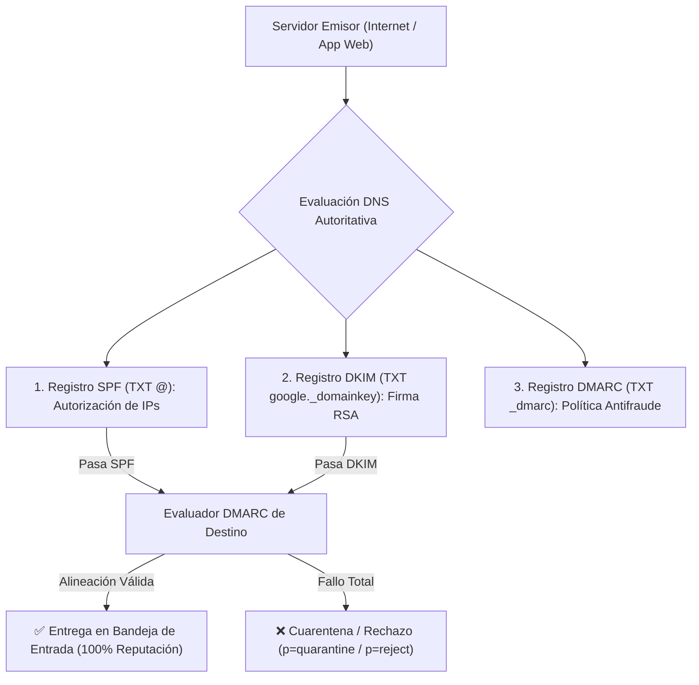

# Compendio Maestro de Arquitectura y Parametrización: Google Workspace Enterprise

**WHO**: Mantenedores de Infraestructura Cloud, Lead Architects de Google Workspace e Ingenieros de Ciberseguridad.  
**WHAT**: Guía técnica exhaustiva y parametrización de nivel empresarial para Google Workspace Admin Console (`admin.google.com`), resolución DNS autoritativa, seguridad criptográfica de correo y gobierno de identidades.  
**CUMPLIMIENTO**: ISO/IEC 27001:2022 (ISMS), ISO 9001:2015 (SGC), ISO/IEC 42001:2023 (AIMS) y NIST CSF 2.0.  

---

## 1. Topología de Dominios e Identidad (IAM)

### A. Tipos de Dominio en Google Workspace

1. **Dominio Principal (*Primary Domain*)**:
   - El dominio raíz del tenant (ej. `genesislegal.co`).
   - Define el espacio de nombres principal de las cuentas de usuario y la cuenta del Administrador Supremo (*Super Admin*).
2. **Dominio del Alias del Usuario (*Domain Alias*)**:
   - Vinculación transparente a nivel de tenant (ej. `gscg.com.co` como alias de `genesislegal.co`).
   - **Regla de Mapeo**: Todo usuario `usuario@dominio_principal` recibe automáticamente el alias `usuario@dominio_alias` con el **mismo prefijo exacto**.
   - **Requisito Obligatorio**: Requiere verificación de propiedad en la consola (registro TXT de verificación `google-site-verification`) y activación de Gmail para responder en los servidores Google SMTP (`gsmtp`).
3. **Dominio Secundario (*Secondary Domain*)**:
   - Permite crear cuentas de usuario independientes con su propio sufijo de dominio (requiere asignación manual de licencias).

### B. Jerarquía de Unidades Organizacionales (UOs)

Las directivas de seguridad, acceso a aplicaciones y restricciones de compartición deben aplicarse de forma descendente mediante UOs:

- `/ORGANIZACION_RAIZ`
  - `01_Direccion_Ejecutiva`: Políticas de alta seguridad, llaves físicas FIDO2.
  - `02_Administracion_y_Finanzas`: Restricción estricta de compartición externa de Drive.
  - `03_Comercial_y_Licitaciones`: Permisos de envío externo amplios y grupos de atención.
  - `04_Area_Tecnica_Forense`: Bloqueo total de descarga e impresión en Shared Drives.
  - `05_Servicios_Operativos`: 2FA por aplicación móvil.

---

## 2. Ciberseguridad de Correo y Entregabilidad (La Tríada Dorada)



### A. Registro SPF (Sender Policy Framework)

- **Sintaxis Estándar**:

  ```text
  v=spf1 include:_spf.google.com ip4:185.181.252.110 ip4:34.174.121.243 ~all
  ```

- **Directrices Críticas**:
  - Máximo 10 búsquedas DNS (*DNS Lookups*).
  - Incluir explícitamente las direcciones IPv4 públicas de servidores de aplicaciones web o hostings locales que emitan correos o formularios en nombre del dominio corporativo.

### B. Registro DKIM (DomainKeys Identified Mail)

- **Selector**: `google._domainkey`

- **Longitud de Clave**: RSA 2048-bit (Estándar de alta seguridad).
- **Comportamiento en Alias de Dominio**: El alias hereda la clave del dominio principal. Se debe publicar el mismo registro TXT `google._domainkey` en la zona DNS del dominio alias.

### C. Registro DMARC (Domain-based Message Authentication)

- **Sintaxis Recomendada**:

  ```text
  v=DMARC1; p=quarantine; adkim=r; aspf=r; rua=mailto:dmarc_rua@dominio.com;
  ```

- **Políticas**:
  - `p=none`: Monitoreo pasivo.
  - `p=quarantine`: Envío a carpeta de correo no deseado/cuarentena ante fallos de alineación.
  - `p=reject`: Rechazo total en la conexión SMTP.

---

## 3. Enrutamiento de Correo y Prevención de Rebotes

### A. Enrutamiento Predeterminado (*Default Routing / Catch-All*)

- **Propósito**: Capturar correos dirigidos a direcciones antiguas, no reconocidas o con prefijos desalineados en dominios alias.

- **Configuración en Consola (`Gmail > Enrutamiento predeterminado`)**:
  1. *Destinatarios*: Todos los destinatarios (`.*@dominio_alias`).
  2. *Acción*: Modificar mensaje ➔ Cambiar destinatario del sobre ➔ Reemplazar por `administracion@dominio_principal`.
  3. *Opciones de Ejecución*: **Solo direcciones no reconocidas** (*Unrecognized addresses only*).

### B. Lista de Direcciones IP Permitidas (*Email Allowlist*)

- **Ruta**: `Gmail > Spam, phishing y software malicioso > Lista de correos permitidos`.

- **Mecanismo**: Las IPs registradas omiten las sanciones de spam y las reglas internas de auto-suplantación (*anti-spoofing*), permitiendo que plataformas web de procesos y CRMs envíen notificaciones legítimas.

### C. Configuración en cPanel / Hosting Externo (*Email Routing*)

- **Regla de Oro**: Cuando el sitio web y la base de datos residen en un servidor cPanel pero el correo está en Google Workspace, el **Enrutamiento de Correo (Email Routing)** en cPanel debe cambiarse obligatoriamente a:
  - 🔘 **Remote Mail Exchanger (Intercambiador remoto de correo)**.

- *Consecuencia de omitirlo*: Los correos enviados por la web se entregarán en buzones cPanel locales vacíos y jamás llegarán a Google Workspace.

---

## 4. Almacenamiento y Control de Acceso RBAC en Drive

| Rol en Unidad Compartida | Ver / Leer | Comentar | Editar / Crear | Mover Archivos | Eliminar / Administrar |
| :--- | :---: | :---: | :---: | :---: | :---: |
| **Lector (*Viewer*)** | ✅ | ❌ | ❌ | ❌ | ❌ |
| **Comentarista (*Commenter*)** | ✅ | ✅ | ❌ | ❌ | ❌ |
| **Colaborador (*Contributor*)** | ✅ | ✅ | ✅ | ❌ | ❌ |
| **Gestor de Contenido (*Content Manager*)** | ✅ | ✅ | ✅ | ✅ | ❌ |
| **Administrador (*Manager*)** | ✅ | ✅ | ✅ | ✅ | ✅ |

### Políticas de Seguridad ISO 27001 en Unidades Compartidas

1. **Bloqueo de Compartición Externa**: Desactivada por defecto para UOs confidenciales (Forense, Finanzas, Recursos Humanos).
2. **Restricción de Copia y Descarga**: Activar *"Impedir que los lectores y comentaristas descarguen, impriman o copien archivos"* en carpetas con cadena de custodia o información de clientes.
