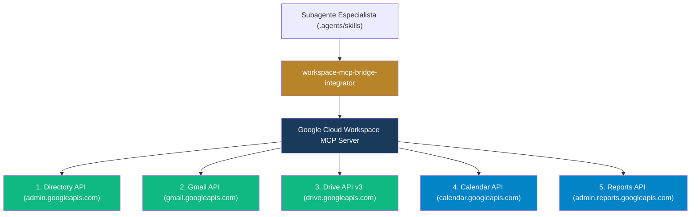

# Matriz de Integración MCP: Google Workspace & Google Cloud API

**WHO**: Agentes Orquestadores, Especialistas en Herramientas MCP y Desarrolladores de Integraciones Cloud.  
**WHAT**: Especificación de contratos de herramientas, desacoplamiento no invasivo y matriz de herramientas MCP para Google Workspace a través de Google Cloud.  
**POLÍTICA**: Zero-Overlap (Cero solapamiento entre agentes; delimitación estricta de ámbitos OAuth y permisos de API).  

---

## 1. Arquitectura de Conexión MCP (Model Context Protocol)

El servidor MCP de Google Workspace expone endpoints tipados hacia las APIs de Google Cloud bajo credenciales de cuenta de servicio o delegación de dominio (*Domain-Wide Delegation*):

---

## 2. Matriz de Herramientas MCP por Subagente (Zero-Overlap)

| Subagente Responsable | Herramientas MCP Autorizadas | Ámbitos OAuth (Scopes) | Operaciones Permitidas |
| :--- | :--- | :--- | :--- |
| **`workspace-governance-iam-specialist`** | `mcp_workspace_users_list` `mcp_workspace_user_create` `mcp_workspace_user_update` `mcp_workspace_orgunits_list` | `admin.directory.user` `admin.directory.orgunit` | Aprovisionamiento, gestión de UOs, suspensión y asignación de licencias. |
| **`workspace-gmail-routing-specialist`** | `mcp_workspace_gmail_send` `mcp_workspace_gmail_aliases_list` `mcp_workspace_gmail_filter_create` | `gmail.settings.basic` `gmail.send` | Creación de alias, verificación de enrutamiento y filtros de correo. |
| **`workspace-drive-storage-specialist`** | `mcp_workspace_drives_list` `mcp_workspace_drive_create` `mcp_workspace_permissions_create` `mcp_workspace_file_metadata` | `drive` `drive.file` `drive.metadata` | Creación de Shared Drives, asignación de roles RBAC y auditoría de permisos. |
| **`workspace-calendar-assistant-agent`** | `mcp_workspace_calendar_events_list` `mcp_workspace_calendar_event_create` `mcp_workspace_acl_update` | `calendar` `calendar.events` | Gestión de eventos, recursos de salas y permisos de visualización. |
| **`workspace-audit-compliance-analyst`** | `mcp_workspace_reports_activities_list` `mcp_workspace_email_log_search` `mcp_workspace_token_audit` | `admin.reports.audit.readonly` | Extracción de logs forenses, Email Log Search y análisis de accesos OAuth. |
| **`workspace-security-dlp-architect`** | `mcp_workspace_2fa_enforcement_status` `mcp_workspace_tokens_revoke` `mcp_workspace_device_list` | `admin.directory.device.chromeos` `admin.directory.user.security` | Auditoría de 2FA, revocación de tokens sospechosos y control de dispositivos. |

---

## 3. Protocolo de Ejecución Segura (Guardrails)

1. **Principio de Mínimo Privilegio**: Ningún subagente puede invocar herramientas fuera de su matriz asignada.
2. **Confirmación Previa para Modificaciones Destructivas**: Operaciones como `user_delete`, `drive_delete` o `token_revoke_all` requieren confirmación explícita del Lead Architect / HITL (*Human-in-the-Loop*).
3. **Idempotencia**: Toda mutación en la API debe ser idempotente para evitar duplicación de cuentas o permisos durante reintentos.
