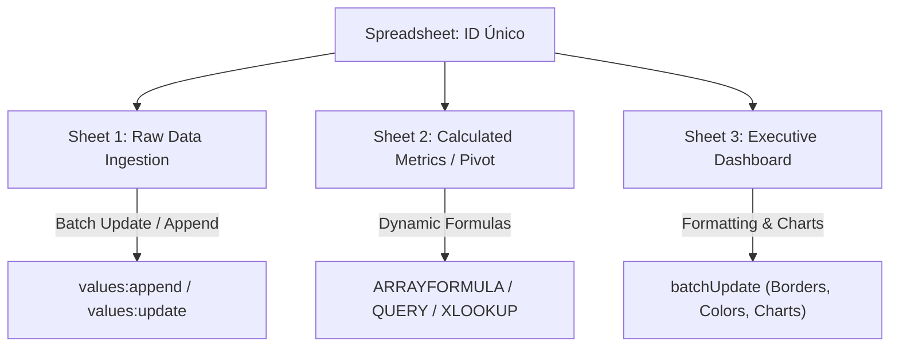

# Google Sheets API v4: Arquitectura de Datos, Fórmulas y Automatización

**Propósito:** Guía maestra de ingeniería para el modelado de datos, estructuración financiera/operativa, sincronización bidireccional de bases de datos y cálculo matricial en Google Sheets mediante la API v4.  
**Cumplimiento Normativo:** ISO 25010 (Integridad de Datos y Rendimiento), ISO 27001 (Control de Acceso y DLP), WCAG 2.1 AA (Accesibilidad en Hojas de Cálculo).

---

## 1. Topología de Endpoints y Operaciones Clave

La API v4 de Google Sheets estructura los datos jerárquicamente en **Spreadsheet** ➔ **Sheet (Tab)** ➔ **Grid / Cell Data**:

### Operaciones REST Principales:
1. **`GET /v4/spreadsheets/{id}/values/{range}`:** Lectura matricial optimizada en memoria.
2. **`PUT /v4/spreadsheets/{id}/values/{range}?valueInputOption=USER_ENTERED`:** Escritura con parseo automático de fechas, monedas y fórmulas (`=SUM(...)`, `=QUERY(...)`).
3. **`POST /v4/spreadsheets/{id}/values/{range}:append`:** Inserción concurrente de registros (logs, telemetría, respuestas de formularios) sin sobrescritura de encabezados.
4. **`POST /v4/spreadsheets/{id}:batchUpdate`:** Modificaciones atómicas de estructura (añadir pestañas, aplicar colores condicionales, fijar filas y congelar paneles).

---

## 2. Buenas Prácticas de Ingeniería y Model Armor

1. **Sanitización de Ingesta (Model Armor):**
   - Antes de escribir strings externos generados por usuarios o LLMs en celdas, verificar que no inicien con caracteres de inyección de fórmulas (`=`, `+`, `-`, `@`) no deseados, o sanitizarlos prefijando con comilla simple (`'`).
2. **Optimización de Cuota (Batching):**
   - Agrupar múltiples lecturas o escrituras en llamadas `batchGet` o `batchUpdate` para evitar el error `HTTP 429 Too Many Requests`.
3. **Control de Versiones y Respaldos:**
   - Crear instantáneas periódicas o duplicados en Google Drive antes de transformaciones masivas de celdas.
