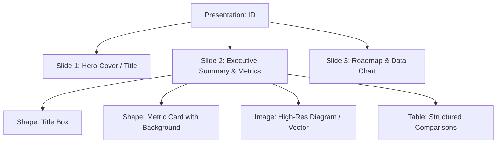

# Google Slides API v1: Automatización de Presentaciones y Pitch Decks

**Propósito:** Guía de arquitectura para la generación desatendida de diapositivas ejecutivas, pitch decks corporativos, inserción de diagramas vectoriales, tablas y formateo tipográfico temático en Google Slides mediante la API v1.

---

## 1. Arquitectura de Objetos y Diapositivas

Las presentaciones en Google Slides operan como árboles jerárquicos de elementos de página (*PageElements*):

### Operaciones REST Principales:
1. **`POST /v1/presentations`:** Creación instantánea de una nueva baraja de diapositivas con título corporativo.
2. **`POST /v1/presentations/{id}:batchUpdate`:** Ejecución de transacciones atómicas:
   - `createSlide`: Inserción de diapositiva con layout predefinido (`TITLE_AND_BODY`, `BLANK`, `SECTION_HEADER`).
   - `createShape`: Creación de rectángulos, contenedores y tarjetas.
   - `insertText`: Inyección de texto estructurado en contenedores.
   - `updateTextStyle`: Aplicación de tipografías (Inter, Roboto, Oswald), pesos y colores HEX.
   - `createImage`: Incrustación de gráficos o renders generados por otros ecosistemas.

---

## 2. Flujo de Trabajo Agéntico para Presentaciones Ejecutivas

1. **Definición del Guion de Diapositivas:** El agente diseña el flujo narrativo (Problema ➔ Solución ➔ Métricas ➔ Roadmap).
2. **Generación del Lote de Peticiones (`requests`):** Se construye el JSON `batchUpdate` con todas las diapositivas y formas en una sola llamada de red.
3. **Control de Estilo Visual:** Aplicación rigurosa de paletas oscuras o corporativas según `DESIGN.md` y ratios de contraste WCAG 2.1 AA.
