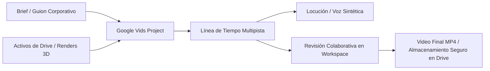

# Google Vids & Media Assets: Producción de Video Corporativo en Workspace

**Propósito:** Guía de integración para la orquestación, creación de proyectos y ensamblado de videos en **Google Vids** y almacenamiento de activos multimedia en Google Drive, conectando los pipelines de `open-montage-ecosystem` y `multimedia-data-ecosystem`.

---

## 1. El Rol de Google Vids en el Ecosistema Workspace

Google Vids es la herramienta nativa de creación y narración en video para empresas de Google Workspace:

### Integraciones Clave:
1. **Gestión de Proyectos Vids en Drive:** Los archivos con MIME type `application/vnd.google-apps.vid` se gestionan y versionan de forma unificada en Google Drive.
2. **Puente con OpenMontage:** Exportación e importación de listas de decisiones (`edit_decisions.json`) y guiones técnicos (`script.json`).
3. **Distribución y Permisos:** Control estricto de acceso corporativo (roles de visualizador, comentarista y editor delegado).
