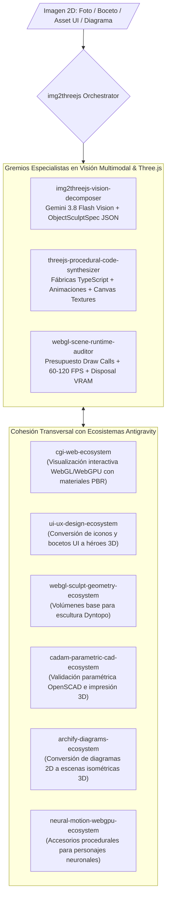

# img2threejs & Procedural 3D WebGL Ecosystem — Universal Antigravity Architecture

**Autoría Oficial:** Antigravity AI & img2threejs Framework (`img2threejs/img2threejs`)  
**WHAT:** Ecosistema Agéntico de **Conversión de Imágenes 2D a Código Three.js Procedural Puro (Code-Only 3D Models)** impulsado por visión multimodal con **Gemini 3.8 Flash**: deconstrucción volumétrica de imágenes (fotografías, bocetos, conceptos, capturas de UI) a especificaciones estructuradas `ObjectSculptSpec`, compilación a fábricas TypeScript/ESNext reutilizables, texturizado procedural en Canvas2D y bucles de animación a 60–120 FPS sin mallas binarias externas (`.glb`/`.gltf`).  
**División Corporativa:** `03_creative_production_and_3d` (Creative Suite, 3D Engineering & Digital Media).  
**Cumplimiento Normativo:** ISO 25010 (Eficiencia de Rendimiento y Mantenibilidad de Software), W3C WebGL 2.0 / WebGPU Standard, ISO/IEC 42001 (AIMS).

---

## 1. Topología del Ecosistema Agéntico (Graphify Map)

---

## 2. Catálogo de Subagentes Especialistas (Neo-CRISPE v2.0)

| Subagente | Responsabilidad Principal | Herramientas & Ámbitos |
| :--- | :--- | :--- |
| **[`img2threejs-vision-decomposer`](file:///c:/Users/Nomack/Documents/workspace/agents/antigravity/dev/prompt-generator/agents-factory/img2threejs-ecosystem/.agents/skills/img2threejs-vision-decomposer/SKILL.md)** | Deconstrucción visual multimodal con Gemini 3.8 Flash, segmentación de partes volumétricas y generación de `ObjectSculptSpec`. | `gemini.vision` `spatial.decomposer` |
| **[`threejs-procedural-code-synthesizer`](file:///c:/Users/Nomack/Documents/workspace/agents/antigravity/dev/prompt-generator/agents-factory/img2threejs-ecosystem/.agents/skills/threejs-procedural-code-synthesizer/SKILL.md)** | Compilación a código TypeScript puro, instanciación de primitivas, texturas procedimentales y loops de animación en `.update()`. | `threejs.factory` `canvas.texture` |
| **[`webgl-scene-runtime-auditor`](file:///c:/Users/Nomack/Documents/workspace/agents/antigravity/dev/prompt-generator/agents-factory/img2threejs-ecosystem/.agents/skills/webgl-scene-runtime-auditor/SKILL.md)** | Telemetría en tiempo de ejecución, verificación de presupuestos ($<15\text{k}$ triángulos, $<35$ draw calls) y liberación de VRAM (`.dispose()`). | `webgl.profiler` `memory.auditor` |

---

## 3. Matriz de Cohesión Transversal Soberana (Zero-Overlap Policy)

1. **`cgi-web-ecosystem`:** Provee el entorno de renderizado PBR y tipografía sin reflow (Pretext); `img2threejs` genera los modelos tridimensionales en código puro para poblar la escena.
2. **`ui-ux-design-ecosystem`:** Suministra bocetos 2D y guías de estilos; `img2threejs` los materializa en componentes 3D interactivos de alta fidelidad.
3. **`cadam-parametric-cad-ecosystem`:** Provee el modelado CAD para impresión 3D mediante OpenSCAD; `img2threejs` atiende el modelado visual en Three.js orientado a la web.
4. **`archify-diagrams-ecosystem`:** Compila diagramas técnicos 2D; `img2threejs` permite proyectar elementos arquitectónicos en 3D isométrico interactivo.

---

## 4. Base de Conocimiento Especializada (`knowledge/`)

- [`img2threejs_core_architecture_mastery.md`](file:///c:/Users/Nomack/Documents/workspace/agents/antigravity/dev/prompt-generator/agents-factory/img2threejs-ecosystem/knowledge/img2threejs_core_architecture_mastery.md) ➔ Especificación del esquema `ObjectSculptSpec` y arquitectura de fábricas TypeScript.
- [`gemini_multimodal_vision_to_3d_mastery.md`](file:///c:/Users/Nomack/Documents/workspace/agents/antigravity/dev/prompt-generator/agents-factory/img2threejs-ecosystem/knowledge/gemini_multimodal_vision_to_3d_mastery.md) ➔ Inferencia multimodal con Gemini 3.8 Flash, razonamiento espacial y deducción PBR.
- [`threejs_procedural_modeling_and_animation_mastery.md`](file:///c:/Users/Nomack/Documents/workspace/agents/antigravity/dev/prompt-generator/agents-factory/img2threejs-ecosystem/knowledge/threejs_procedural_modeling_and_animation_mastery.md) ➔ Modelado procedural avanzado, texturas en Canvas2D y bucles de animación a 60–120 FPS.
