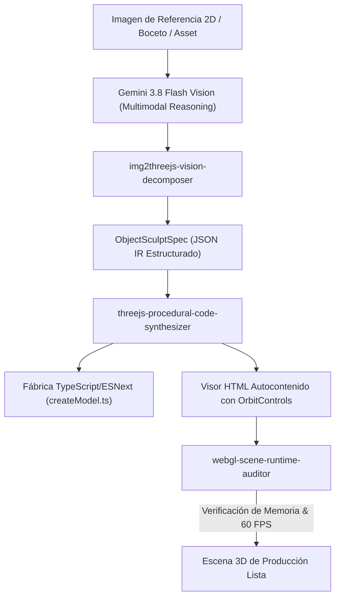

# img2threejs Core Architecture & ObjectSculptSpec Mastery

**Propósito:** Especificación técnica del pipeline procedural `img2threejs`, estructura del esquema `ObjectSculptSpec` en formato JSON IR, fábricas TypeScript modulares y patrones de construcción geométrica sin binarios externos.  
**Cumplimiento Normativo:** ISO 25010, W3C WebGL 2.0 / WebGPU Standard.

---

## 1. Pipeline de Síntesis: De Imagen 2D a Código Three.js



---

## 2. Especificación Canónica de `ObjectSculptSpec` (JSON Schema)

```json
{
  "$schema": "https://json-schema.org/draft/2020-12/schema",
  "title": "ObjectSculptSpec",
  "type": "object",
  "required": ["modelName", "rootDimensions", "parts", "materials", "animations"],
  "properties": {
    "modelName": { "type": "string", "example": "CyberDrone" },
    "description": { "type": "string" },
    "rootDimensions": {
      "type": "object",
      "properties": {
        "width": { "type": "number" },
        "height": { "type": "number" },
        "depth": { "type": "number" }
      }
    },
    "materials": {
      "type": "object",
      "additionalProperties": {
        "type": "object",
        "properties": {
          "type": { "type": "string", "enum": ["Standard", "Physical", "Toon", "Basic"] },
          "color": { "type": "string", "example": "#ffd231" },
          "roughness": { "type": "number", "minimum": 0, "maximum": 1 },
          "metalness": { "type": "number", "minimum": 0, "maximum": 1 },
          "clearcoat": { "type": "number" },
          "transmission": { "type": "number" },
          "emissive": { "type": "string" },
          "emissiveIntensity": { "type": "number" }
        }
      }
    },
    "parts": {
      "type": "array",
      "items": {
        "type": "object",
        "required": ["id", "name", "geometry", "materialRef", "transform"],
        "properties": {
          "id": { "type": "string" },
          "name": { "type": "string" },
          "parent": { "type": "string" },
          "geometry": {
            "type": "object",
            "required": ["type", "params"],
            "properties": {
              "type": { "type": "string", "enum": ["Box", "Cylinder", "Sphere", "Cone", "Torus", "Extrude", "Lathe", "CustomBuffer"] },
              "params": { "type": "array" }
            }
          },
          "materialRef": { "type": "string" },
          "transform": {
            "type": "object",
            "properties": {
              "position": { "type": "array", "items": { "type": "number" } },
              "rotation": { "type": "array", "items": { "type": "number" } },
              "scale": { "type": "array", "items": { "type": "number" } }
            }
          }
        }
      }
    },
    "animations": {
      "type": "array",
      "items": {
        "type": "object",
        "properties": {
          "targetPartId": { "type": "string" },
          "type": { "type": "string", "enum": ["rotateY", "rotateX", "rotateZ", "bobbingY", "pulseScale", "pendulum"] },
          "speed": { "type": "number" },
          "amplitude": { "type": "number" }
        }
      }
    }
  }
}
```

---

## 3. Patrón de Fábrica TypeScript Procedural (`createProceduralModel`)

Cada modelo generado exporta una interfaz consistente:

```typescript
import * as THREE from 'three';

export interface ModelInstance extends THREE.Group {
  update: (delta: number, elapsed: number) => void;
  dispose: () => void;
}

export function createProceduralModel(options?: { color?: string }): ModelInstance {
  const root = new THREE.Group() as ModelInstance;
  
  // Construcción de jerarquías y primitivas
  // ...
  
  root.update = (delta: number, elapsed: number) => {
    // Animaciones procedurales continuas
  };
  
  root.dispose = () => {
    // Liberación estricta de geometrías y materiales
  };
  
  return root;
}
```
