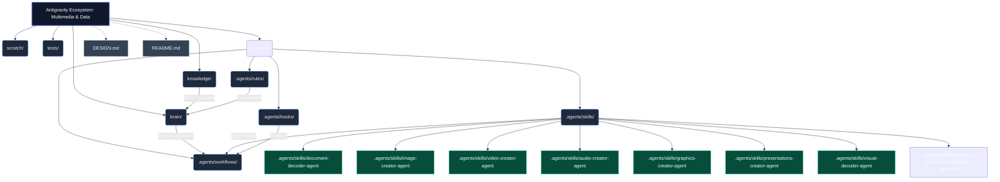

# Multimedia & Data Ecosystem: Antigravity Architecture

**WHO**: Maintained by the Antigravity Core Team and Data Science units.
**WHAT**: A highly-scalable, production-ready framework for multi-agent ecosystems processing multimedia and raw data.
**WHEN**: Deployed for continuous enterprise-grade agentic tasks requiring precise RAG grounding, data visualization, and autonomous generation workflows.
**WHERE**: Housed within the `multimedia-data-ecosystem/` root domain.
**WHY**: To eliminate "token bloat", ensuring LLMs operate under strict technical and structural constraints using the Neo-CRISPE semantic architecture.

## Architectural Topology (Graphify Map)

> [!IMPORTANT]
> As an Agent, always traverse this Graphify map first to understand the context and requirements of the ecosystem before execution.

## Immutable Design & Spatial Reasoning (DwT) vs Creatividad

A diferencia de los ecosistemas de auditoría, aquí **se fomenta explícitamente la creatividad temática** (lluvias de ideas, diseño de marketing, campañas). El Top-P y la Temperatura operan en niveles fluidos para evitar cuellos de botella conceptuales.

Sin embargo, para plasmar esa creatividad, todos los subagentes utilizan el paradigma **Drawing-with-Thought (DwT)**. Es decir, la *idea* es libre, pero su *ejecución técnica* computa coordenadas espaciales, proporciones estéticas y colores hexadecimales sin alucinar, devolviendo los resultados en `kebab-case` Markdown y objetos JSON estrictos.
