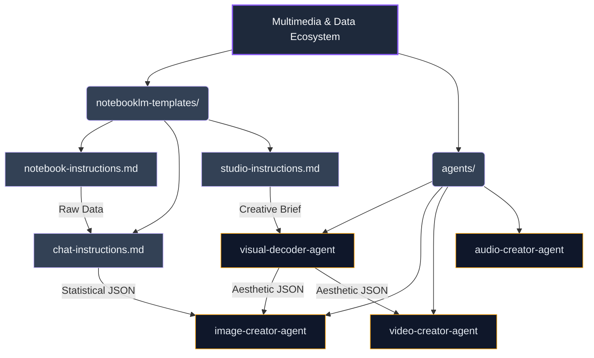

# Multimedia & Data Ecosystem: Topologic Architecture & RAG Index

**WHO**: Maintained by the Data Science and Creative Arts units. Designed for advanced socio-political researchers and multimedia directors.
**WHAT**: This ecosystem governs the end-to-end pipeline from rigorous data triangulation (via NotebookLM) to generative art, graphic design, and audiovisual creation (via specialized Gemini agents).
**WHEN**: Triggered when raw sociopolitical, economic, and historical datasets must be abstracted and transformed into high-fidelity visual or audiovisual formats.
**WHERE**: Operates across the `multimedia-data-ecosystem/` bridging NotebookLM source-grounding with Antigravity/Gemini generative engines.
**WHY**: To eliminate AI hallucinations in political/historical context by grounding generation strictly in verified data, while maintaining absolute aesthetic control through strict JSON-driven prompt engineering (Nano Banana 2 / Omni).

## Vector Search Indexing Rules
> [!IMPORTANT]
> This ecosystem enforces the Separation of Visualization Content principle. RAG engines must identify data extraction rules from `notebooklm-templates/` and delegate formatting/aesthetic reasoning to the `agents/` specialized JSON outputs.

## Architectural Topology (Graphify Map)

## Immutable Design & Spatial Reasoning (DwT)
All agents in this ecosystem are programmed with the **Drawing-with-Thought (DwT)** paradigm. They must compute spatial coordinates and maintain strict adherence to aesthetic variables without deviating. 
Outputs are exclusively in `kebab-case` Markdown and strictly formatted JSON arrays/objects to prevent hallucinated visual features.
