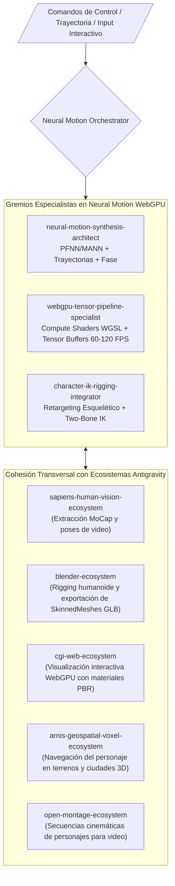

# Neural Motion WebGPU & AI4Animation Ecosystem — Universal Antigravity Architecture

**Autoría Oficial:** Antigravity AI & AI4Animation WebGPU Framework (`sweriko/ai4anim-webgpu` & Starke Brothers)  
**WHAT:** Ecosistema Agéntico de Síntesis de Movimiento y Animación Neuronal en Tiempo Real sobre **WebGPU & Three.js**: inferencia de redes neuronales profundas (PFNN, MANN, Neural Motion Matching) mediante Compute Shaders en WGSL, retargeting esquelético humanoide, control interactivo de marcha/carrera y cinemática inversa (Two-Bone IK) a 60–120 FPS sin clips de animación precalculados.  
**División Corporativa:** `03_creative_production_and_3d` (Creative Suite, 3D Engineering & Digital Media).  
**Cumplimiento Normativo:** W3C WebGPU Standard, ISO 25010 (Eficiencia y Rendimiento de Software), ISO/IEC 42001 (AIMS).

---

## 1. Topología del Ecosistema Agéntico (Graphify Map)

---

## 2. Catálogo de Subagentes Especialistas (Neo-CRISPE v2.0)

| Subagente | Responsabilidad Principal | Herramientas & Ámbitos |
| :--- | :--- | :--- |
| **[`neural-motion-synthesis-architect`](file:///c:/Users/Nomack/Documents/workspace/agents/antigravity/dev/prompt-generator/agents-factory/neural-motion-webgpu-ecosystem/.agents/skills/neural-motion-synthesis-architect/SKILL.md)** | Parametrización de modelos PFNN/MANN, estimación de trayectoria futura, modulación de variable de fase y control de locomoción. | `ai4anim.synthesis` `trajectory.planner` |
| **[`webgpu-tensor-pipeline-specialist`](file:///c:/Users/Nomack/Documents/workspace/agents/antigravity/dev/prompt-generator/agents-factory/neural-motion-webgpu-ecosystem/.agents/skills/webgpu-tensor-pipeline-specialist/SKILL.md)** | Ejecución de Compute Shaders en WGSL para multiplicación de matrices densas de la red, gestión de búferes GPU y benchmarking a 60–120 FPS. | `webgpu.compute` `wgsl.pipeline` |
| **[`character-ik-rigging-integrator`](file:///c:/Users/Nomack/Documents/workspace/agents/antigravity/dev/prompt-generator/agents-factory/neural-motion-webgpu-ecosystem/.agents/skills/character-ik-rigging-integrator/SKILL.md)** | Retargeting de cuaterniones a jerarquías esqueléticas estándar (Mixamo, VRM, SMPL-X) y solucionador analítico Two-Bone IK para bloqueo de pies. | `three.skeleton` `two_bone.ik` |

---

## 3. Matriz de Cohesión Transversal Soberana (Zero-Overlap Policy)

1. **`sapiens-human-vision-ecosystem`:** Extrae poses 3D y secuencias MoCap desde video monocular; entrega los datos crudos para entrenar o calibrar la red de animación neuronal.
2. **`blender-ecosystem`:** Provee personajes humanoides 3D riggeados y con pesos de piel (*skinning*) calibrados en formato GLTF/GLB.
3. **`cgi-web-ecosystem`:** Alberga la escena 3D WebGL/WebGPU donde el personaje animado interactúa con iluminación fotorrealista y sombreadores PBR.
4. **`arnis-geospatial-voxel-ecosystem`:** Provee el terreno geoespacial para que el personaje camine, suba pendientes y supere desniveles con adaptación Two-Bone IK.
5. **`open-montage-ecosystem`:** Captura actuaciones del personaje neuronal para producir tomas cinemáticas de video.

---

## 4. Base de Conocimiento Especializada (`knowledge/`)

- [`ai4animation_neural_motion_mastery.md`](file:///c:/Users/Nomack/Documents/workspace/agents/antigravity/dev/prompt-generator/agents-factory/neural-motion-webgpu-ecosystem/knowledge/ai4animation_neural_motion_mastery.md) ➔ Fundamentos de PFNN, MANN y Neural Motion Matching.
- [`webgpu_compute_neural_inference_mastery.md`](file:///c:/Users/Nomack/Documents/workspace/agents/antigravity/dev/prompt-generator/agents-factory/neural-motion-webgpu-ecosystem/knowledge/webgpu_compute_neural_inference_mastery.md) ➔ Sombreadores de cómputo WGSL y arquitectura de tensores en GPU.
- [`humanoid_skeleton_and_ik_retargeting_mastery.md`](file:///c:/Users/Nomack/Documents/workspace/agents/antigravity/dev/prompt-generator/agents-factory/neural-motion-webgpu-ecosystem/knowledge/humanoid_skeleton_and_ik_retargeting_mastery.md) ➔ Jerarquías esqueléticas humanoides y algoritmo analítico Two-Bone IK.
