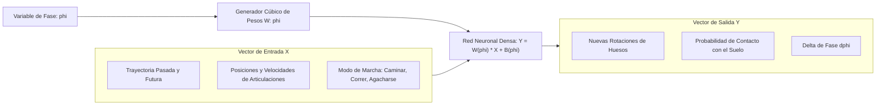

# AI4Animation Neural Motion Mastery: PFNN, MANN & Motion Matching

**Propósito:** Guía de ingeniería sobre las arquitecturas de redes neuronales profundas para síntesis de movimiento humano en tiempo real (Phase-Functioned Neural Networks, Mode-Adaptive Neural Networks y Neural Motion Matching).  
**Cumplimiento Normativo:** ISO/IEC 42001 (Gobernanza de IA), IEEE Transactions on Visualization and Computer Graphics.

---

## 1. Fundamentos de Redes Neuronales con Función de Fase (PFNN)

En la locomoción bípeda, el movimiento es inherentemente cíclico pero no estrictamente periódico. La red **PFNN** condiciona sus pesos $W(\phi)$ a una variable de fase escalar $\phi \in [0, 2\pi)$ que rastrea el ciclo de marcha:

### Componentes Clave del Vector de Entrada:
1. **Trayectoria en el Plano del Suelo:** Posiciones y direcciones del centro de masa en $t-1.0\text{s}$, $t-0.5\text{s}$, $t$, $t+0.5\text{s}$, $t+1.0\text{s}$.
2. **Estado Esquelético Actual:** Posiciones relativas de cada hueso respecto a la raíz ($3\text{D}$), velocidades lineales ($3\text{D}$) y cuaterniones de rotación local ($4\text{D}$).
3. **Comandos de Control:** Vector de velocidad deseada $(v_x, v_z)$, velocidad angular de giro y estilo de movimiento (0: Idle, 1: Walk, 2: Run, 3: Crouch, 4: Jump).

---

## 2. Redes Adaptativas por Modos (MANN) y Transiciones Complejas

Para acciones no estrictamente cíclicas (escalar, sentarse, rodar, interactuar con objetos), **MANN** utiliza una subred de compuertas (*Gating Network*) que calcula dinámicamente la combinación lineal de múltiples redes expertas:

$$W = \sum_{i=1}^{K} \alpha_i(X) \cdot W_i$$

Donde $\alpha_i(X)$ representa el peso de activación del experto $i$ según el contexto ambiental.
