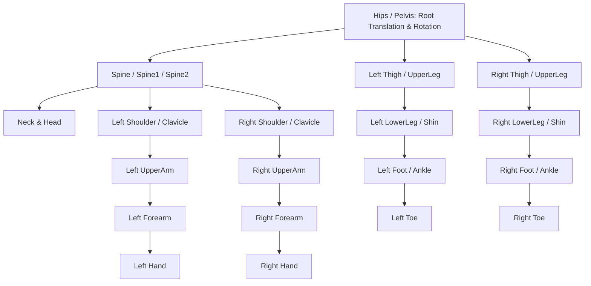

# Humanoid Skeleton Hierarchies, Two-Bone IK & Retargeting

**Propósito:** Guía técnica para el retargeting de rotaciones óseas, resolución analítica de Cinemática Inversa (Two-Bone IK) para bloqueo de pies y acoplamiento con esqueletos humanoides estándar (Mixamo, VRM, SMPL-X).  
**Cumplimiento Normativo:** ISO 25010 (Precisión Cinemática), glTF 2.0 Skinning Specification.

---

## 1. Mapeo de Nomenclatura Esquelética Estándar

| Hueso Canónico | Nomenclatura Mixamo | Nomenclatura VRM | Nomenclatura SMPL-X |
| :--- | :--- | :--- | :--- |
| **Raíz** | `mixamorig:Hips` | `hips` | `pelvis` |
| **Columna** | `mixamorig:Spine1` | `spine` | `spine1` |
| **Muslo Izquierdo** | `mixamorig:LeftUpLeg` | `leftUpperLeg` | `left_hip` |
| **Pierna Izquierda** | `mixamorig:LeftLeg` | `leftLowerLeg` | `left_knee` |
| **Pie Izquierdo** | `mixamorig:LeftFoot` | `leftFoot` | `left_ankle` |

---

## 2. Algoritmo Analítico Two-Bone IK (Bloqueo de Pies)

Dado el muslo $A$, la rodilla $B$ y el tobillo deseado $T$, con longitudes de segmento $l_1 = |B - A|$ y $l_2 = |T - B|$:

1. **Cálculo del Ángulo de la Rodilla ($\theta_{\text{knee}}$):**
   $$\cos(\theta_{\text{knee}}) = \frac{|T - A|^2 - l_1^2 - l_2^2}{2 \cdot l_1 \cdot l_2}$$
2. **Rotación del Muslo:**
   Se rota el vector $A \to B$ para que apunte hacia el objetivo $T$ proyectado con el polo de dirección (*pole vector* que orienta la rodilla hacia el frente).
3. **Fusión de Contacto:**
   Se interpola suavemente la posición del pie entre la pose cinemática pura y el anclaje al suelo según el peso $P_{\text{contact}}$ devuelto por la red neuronal.
