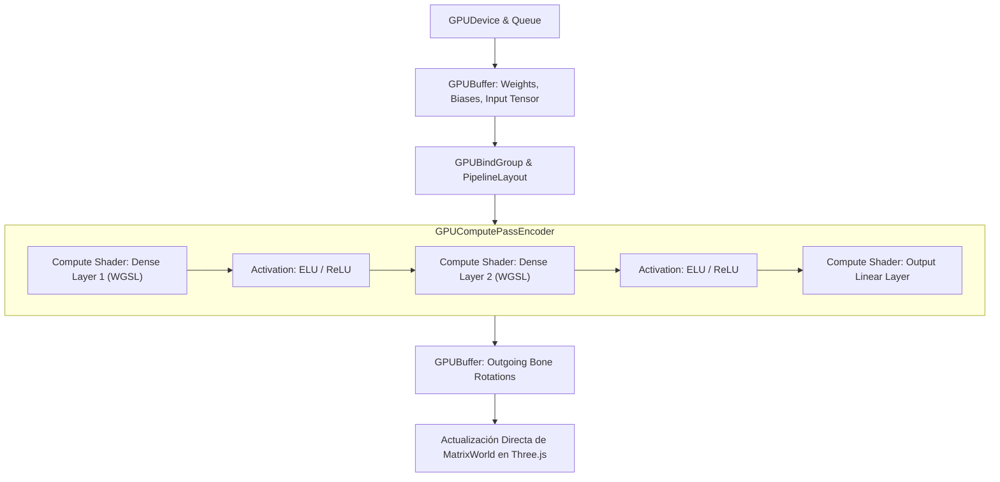

# WebGPU Compute Shaders & Neural Inference in WGSL

**Propósito:** Especificación técnica para la ejecución de capas neuronales densas (Linear / ReLU / ELU / Softmax) en WebGPU mediante sombreadores de cómputo en WebGPU Shading Language (WGSL) a 60–120 FPS.  
**Cumplimiento Normativo:** W3C WebGPU Standard, ISO 25010 (Rendimiento y Eficiencia Energética).

---

## 1. Topología del Pipeline de Cómputo WebGPU



---

## 2. Kernel WGSL para Multiplicación de Matrices Densas

```wgsl
struct LayerParams {
    input_size: u32,
    output_size: u32,
};

@group(0) @binding(0) var<uniform> params: LayerParams;
@group(0) @binding(1) var<storage, read> inputs: array<f32>;
@group(0) @binding(2) var<storage, read> weights: array<f32>;
@group(0) @binding(3) var<storage, read> biases: array<f32>;
@group(0) @binding(4) var<storage, read_write> outputs: array<f32>;

@compute @workgroup_size(64, 1, 1)
fn main(@builtin(global_invocation_id) global_id: vec3<u32>) {
    let out_idx = global_id.x;
    if (out_idx >= params.output_size) {
        return;
    }

    var sum: f32 = biases[out_idx];
    let weight_offset = out_idx * params.input_size;

    for (var i: u32 = 0u; i < params.input_size; i = i + 1u) {
        sum = sum + inputs[i] * weights[weight_offset + i];
    }

    // Activación ELU (Exponential Linear Unit)
    if (sum >= 0.0) {
        outputs[out_idx] = sum;
    } else {
        outputs[out_idx] = exp(sum) - 1.0;
    }
}
```

---

## 3. Carga y Mapeo de Pesos desde Archivo Binario

1. **Estructura del Archivo `.bin`:**
   - Encabezado con dimensiones de cada capa ($N_{\text{in}} \times N_{\text{out}}$).
   - Bloques continuos de valores en punto flotante de 32 bits (`Float32Array`).
2. **Transferencia a GPU:**
   - Creación de `GPUBuffer` con flag `GPUBufferUsage.STORAGE | GPUBufferUsage.COPY_DST`.
   - Inyección en una sola llamada mediante `device.queue.writeBuffer(weightsBuffer, 0, floatArray.buffer)`.
