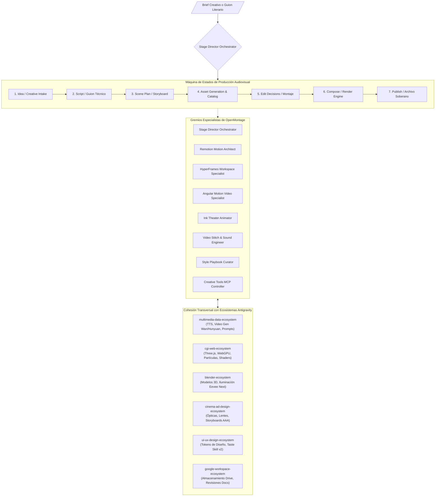

# OpenMontage Ecosystem — AI Video Production & Montage Architecture

**Autoría Oficial:** Antigravity AI & OpenMontage Framework (`Nomackleo/OpenMontage`)  
**WHAT**: Ecosistema Agéntico de Grado Industrial para la creación, dirección escénica, composición, animación y montaje audiovisual automatizado mediante pipelines multicapa, runtimes declarativos (Remotion, HyperFrames, Three.js World, Ink Theater, FFmpeg) y gobernanza presupuestaria de costes.  
**Cumplimiento Normativo:** ISO 9001:2015 (Calidad de Procesos), ISO 25010 (Usabilidad y Rendimiento), ISO 42001 (AIMS - Gobernanza de IA), WCAG 2.1 AA/AAA (Subtitulado y Contraste).

---

## 1. Misión y Topología Arquitectónica (Graphify Map)

El **OpenMontage Ecosystem** opera bajo una arquitectura dirigida por instrucciones (*Instruction-Driven* / *Agent-First*). La inteligencia reside en los directores de etapa y subagentes especialistas, mientras que los scripts de Python proporcionan herramientas tipadas y persistencia canónica de artefactos.

---

## 2. Pipelines de Producción Soportados (12 Manifests)

| Pipeline | Manifiesto YAML | Tipo | Descripción |
| :--- | :--- | :--- | :--- |
| **`talking-head`** | `pipeline_defs/talking-head.yaml` | Footage-based | Edición automatizada de presentador en cámara con cortes de silencio y B-Rolls. |
| **`animated-explainer`** | `pipeline_defs/animated-explainer.yaml` | AI-generated | Video explicativo con gráficos cinéticos, diagramas y narración generada. |
| **`screen-demo`** | `pipeline_defs/screen-demo.yaml` | Screen-recording | Demostración de software con zoom dinámico, cursores animados y subtítulos. |
| **`clip-factory`** | `pipeline_defs/clip-factory.yaml` | Short-form | Extracción por lotes de micro-clips verticales (Reels/TikTok/Shorts). |
| **`podcast-repurpose`** | `pipeline_defs/podcast-repurpose.yaml` | Repurposing | Transcripción, corte de mejores momentos y generación de audiogramas. |
| **`cinematic`** | `pipeline_defs/cinematic.yaml` | High-End Video | Composición cinematográfica con etalonaje de color, LUTs y ritmo dramático. |
| **`animation`** | `pipeline_defs/animation.yaml` | 2D/3D Animation | Flujo de animación completa con fondos procedurales y motion graphics. |
| **`character-animation`** | `pipeline_defs/character-animation.yaml` | Vector Rigged | Animación de personajes vectoriales 2D mediante Ink Theater y SVG rigs. |
| **`hybrid`** | `pipeline_defs/hybrid.yaml` | Multi-Source | Mezcla de metraje real, activos 3D interactivos y gráficos Remotion. |
| **`avatar-spokesperson`** | `pipeline_defs/avatar-spokesperson.yaml` | Avatar Presenter | Vocero sintético con sincronización labial y fondos personalizados. |
| **`localization-dub`** | `pipeline_defs/localization-dub.yaml` | Dubbing/Translation | Doblaje multiidioma, traducción de subtítulos y adaptación cultural. |
| **`documentary-montage`** | `pipeline_defs/documentary-montage.yaml` | Long-form | Montaje documental de archivo, metraje histórico y diseño sonoro envolvente. |

---

## 3. Runtimes de Composición y Motores de Render

1. **Remotion Composer (`remotion-composer/`):** Renderizado programático de video en React/TypeScript con soporte de componentes UI (`TextCard`, `StatCard`, `ProgressBar`, `CalloutBox`, `ComparisonCard`, charts).
2. **HyperFrames Runtime (`tools/video/hyperframes_compose.py`):** Autoría de video basada en DOM/CSS/WebGL con puente directo hacia tokens de diseño y `DESIGN.md`.
3. **Three.js World & Blender World (`tools/graphics/`):** Creación de mundos 3D semánticos, adquisición de catálogo CC0 GLTF/GLB y renderizado Eevee Next.
4. **Ink Theater (`ink-theater/`):** Rigging y animación de personajes vectoriales 2D (librerías de poses, líneas de tiempo de acciones).
5. **FFmpeg Engine (`tools/video/video_stitch.py`):** Montaje sub-segundo, transiciones espaciales, normalización de audio EBU R128 y quemado de subtítulos WhisperX.

---

## 4. Cadena Canónica de Artefactos (Canonical Artifacts)

Todo proyecto audiovisual genera y valida artefactos estrictos contra JSON Schemas en `schemas/artifacts/`:

- `brief.json` ➔ Requerimiento inicial, audiencia, tono y restricciones presupuestarias.
- `script.json` ➔ Guion literario y técnico con marcas de tiempo y voces.
- `scene_plan.json` ➔ Desglose plano por plano con especificaciones de cámara y B-Roll.
- `asset_manifest.json` ➔ Inventario de activos generados (audio, video, 3D, SVG).
- `edit_decisions.json` ➔ Decisiones de montaje, pistas de audio, transiciones y runtime seleccionado.
- `render_report.json` ➔ Telemetría del renderizado, duración, resolución y consumo de costes.
- `publish_log.json` ➔ Registro de distribución, metadatos y enlaces de almacenamiento soberano.

---

## 5. Gremios de Subagentes Especializados (Neo-CRISPE v2.0)

1. [`.agents/skills/stage-director-orchestrator`](file:///c:/Users/Nomack/Documents/workspace/agents/antigravity/dev/prompt-generator/agents-factory/open-montage-ecosystem/.agents/skills/stage-director-orchestrator/SKILL.md) ➔ Dirección general de las 7 etapas y compuertas HITL.
2. [`.agents/skills/remotion-motion-architect`](file:///c:/Users/Nomack/Documents/workspace/agents/antigravity/dev/prompt-generator/agents-factory/open-montage-ecosystem/.agents/skills/remotion-motion-architect/SKILL.md) ➔ Composición y animación en React/TypeScript con Remotion.
3. [`.agents/skills/hyperframes-workspace-specialist`](file:///c:/Users/Nomack/Documents/workspace/agents/antigravity/dev/prompt-generator/agents-factory/open-montage-ecosystem/.agents/skills/hyperframes-workspace-specialist/SKILL.md) ➔ Autoría de video basada en DOM/CSS, Canvas y WebGL.
4. [`.agents/skills/angular-motion-video-specialist`](file:///c:/Users/Nomack/Documents/workspace/agents/antigravity/dev/prompt-generator/agents-factory/open-montage-ecosystem/.agents/skills/angular-motion-video-specialist/SKILL.md) ➔ Animación y video web-first con Angular 19/20, Signals, Analog.js y Web Components.
5. [`.agents/skills/ink-theater-animator`](file:///c:/Users/Nomack/Documents/workspace/agents/antigravity/dev/prompt-generator/agents-factory/open-montage-ecosystem/.agents/skills/ink-theater-animator/SKILL.md) ➔ Rigging vectorial SVG de personajes 2D y bibliotecas de poses.
6. [`.agents/skills/video-stitch-sound-engineer`](file:///c:/Users/Nomack/Documents/workspace/agents/antigravity/dev/prompt-generator/agents-factory/open-montage-ecosystem/.agents/skills/video-stitch-sound-engineer/SKILL.md) ➔ Montaje no lineal FFmpeg, normalización a $-16 \text{ LUFS}$ y subtítulos WhisperX.
7. [`.agents/skills/style-playbook-curator`](file:///c:/Users/Nomack/Documents/workspace/agents/antigravity/dev/prompt-generator/agents-factory/open-montage-ecosystem/.agents/skills/style-playbook-curator/SKILL.md) ➔ Curaduría de playbooks de estilo YAML y catálogo no restringido de estéticas.
8. [`.agents/skills/creative-tools-mcp-controller`](file:///c:/Users/Nomack/Documents/workspace/agents/antigravity/dev/prompt-generator/agents-factory/open-montage-ecosystem/.agents/skills/creative-tools-mcp-controller/SKILL.md) ➔ Automatización de suites de escritorio (Blender, DaVinci Resolve, Inkscape, ImageMagick, OTIO).

---

## 6. Servidores MCP para Herramientas Creativas

- **Blender MCP Server:** [`mcp/blender-mcp/blender_mcp_server.py`](file:///c:/Users/Nomack/Documents/workspace/agents/antigravity/dev/prompt-generator/mcp/blender-mcp/blender_mcp_server.py) (Renderizado headless `bpy`, exportación GLTF/GLB, Eevee Next).
- **DaVinci Resolve MCP Server:** [`mcp/davinci-resolve-mcp/davinci_mcp_server.py`](file:///c:/Users/Nomack/Documents/workspace/agents/antigravity/dev/prompt-generator/mcp/davinci-resolve-mcp/davinci_mcp_server.py) (API de scripting nativa, creación de proyectos y timelines, LUTs).
- **Creative Asset MCP Server:** [`mcp/creative-asset-mcp/creative_asset_mcp_server.py`](file:///c:/Users/Nomack/Documents/workspace/agents/antigravity/dev/prompt-generator/mcp/creative-asset-mcp/creative_asset_mcp_server.py) (Inkscape CLI, ImageMagick, OpenTimelineIO interchange).

