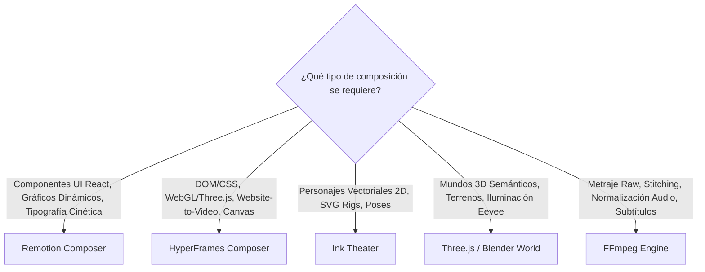

# OpenMontage Architecture Mastery: AI Video Production & Montage

**Referencia Oficial:** Framework OpenMontage (`Nomackleo/OpenMontage`)  
**Propósito:** Guía de referencia técnica para la orquestación agéntica de video, selección de runtimes de composición (Remotion vs. HyperFrames vs. FFmpeg), rigging vectorial 2D en Ink Theater y renderizado de mundos 3D.

---

## 1. El Paradigma de Producción: "Instruction-Driven" (Agent-First)

En OpenMontage, el agente de IA es el director creativo y técnico. No existen orquestadores monolíticos en Python; Python proporciona las herramientas (*BaseTool*), la validación de esquemas y la persistencia de estados.

```
Agent lee Manifiesto de Pipeline (YAML)
  ➔ Consulta Skill de Director de Etapa (Markdown)
  ➔ Ejecuta Herramientas Tipadas (BaseTool)
  ➔ Aplica Meta-Skill de Auto-Revisión (Reviewer)
  ➔ Emite Checkpoint Canónico
  ➔ Presenta al Humano para Aprobación (HITL Gate)
```

---

## 2. Los 5 Runtimes de Composición y Criterio de Selección



### Matriz de Selección de Runtime

| Requerimiento Visual | Runtime Recomendado | Herramienta Clave |
| :--- | :--- | :--- |
| Tarjetas estadísticas animadas, gráficos de barras, comparación SaaS | `remotion` | `tools/video/video_compose.py` + `remotion-composer/` |
| Experiencia 3D interactiva en web, captura de páginas, shaders WebGL | `hyperframes` | `tools/video/hyperframes_compose.py` |
| Animación de personajes estilo cartoon/flat, poses y diálogos | `ink-theater` | `tools/character/character_animation.py` |
| Entornos espaciales 3D generados por IA, assets GLTF/GLB | `threejs_world` / `blender` | `tools/graphics/threejs_world.py` / `blender_world.py` |
| Ensamblaje rápido de clips, recortes de silencio, estéreo EBU R128 | `ffmpeg` | `tools/video/video_stitch.py` |

---

## 3. Playbooks de Estilo y Puente con Tokens de Diseño

Los playbooks en formato YAML (`styles/*.yaml`) definen la identidad del video y se transpilan a variables CSS y tokens de diseño mediante `lib/hyperframes_style_bridge.py`:

```yaml
style_name: "premium-minimalist"
visual_density: 3
motion_intensity: 6
typography:
  headline_font: "Geist, sans-serif"
  body_font: "Inter, sans-serif"
  weight_scale: [400, 500, 700]
palette:
  background: "#08090a"
  surface: "#121417"
  text_primary: "#f8fafc"
  accent_brand: "#38bdf8"
audio:
  ducking_db: -16
  voice_lufs: -16
```

---

## 4. Control Presupuestario y Gobernanza de Costes

El módulo `tools/cost_tracker.py` gobierna el consumo de APIs externas (Runway, Kling, ElevenLabs, Wan, Fal.ai) siguiendo el ciclo de tres fases:

1. **Estimate:** Calcular el coste proyectado en USD antes de generar activos.
2. **Reserve:** Bloquear el presupuesto contra el límite autorizado del proyecto.
3. **Reconcile:** Confirmar el coste real post-generación y actualizar la bitácora de telemetría.
