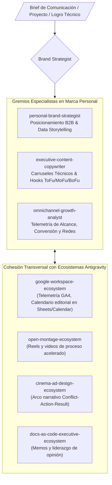

# Personal Brand & Executive Authority Ecosystem — Universal Antigravity Architecture

**Autoría Oficial:** Nomack (Leonel Salcedo) — Nomack Studio (`nomackstudio.com`)  
**WHAT:** Ecosistema Agéntico de Marca Personal, Posicionamiento Estratégico B2B, Growth Marketing, Liderazgo Intelectual (Thought Leadership) y Data Storytelling para Soluciones de Inteligencia Artificial, Desarrollo Fullstack y CGI/3D de Clase Mundial.  
**División Corporativa:** `05_commercial_and_growth` (Commercial, Growth & Executive Brand).  
**Cumplimiento Normativo:** ISO 9001:2015, ISO 42001 (AIMS), ISO 27001 (ISMS), NIST CSF 2.0.

---

## 1. Topología del Ecosistema Agéntico (Graphify Map)

---

## 2. Catálogo de Subagentes Especialistas (Neo-CRISPE v2.0)

| Subagente | Responsabilidad Principal | Herramientas & Ámbitos |
| :--- | :--- | :--- |
| **`personal-brand-strategist`** | Definición de pilares narrativos, posicionamiento de autoridad técnica B2B y transición hacia referente polimático de IA. | `brand.strategy` `authority.engine` |
| **`executive-content-copywriter`** | Redacción de publicaciones de alto impacto, carruseles de anatomía de proyectos y micro-ensayos para LinkedIn/Twitter. | `copywriting.engine` `data.storytelling` |
| **`omnichannel-growth-analyst`** | Análisis de métricas de engagement, optimización de embudos hacia landing pages y telemetría de conversión. | `growth.telemetry` `funnel.optimizer` |

---

## 3. Base de Conocimiento Especializada (`knowledge/`)

- [`corporate_master_document.md`](file:///c:/Users/Nomack/Documents/workspace/agents/antigravity/dev/prompt-generator/agents-factory/personal-brand-ecosystem/corporate_master_document.md) ➔ Documento Corporativo Maestro (BDI) y Plan Estratégico de Growth Marketing.
