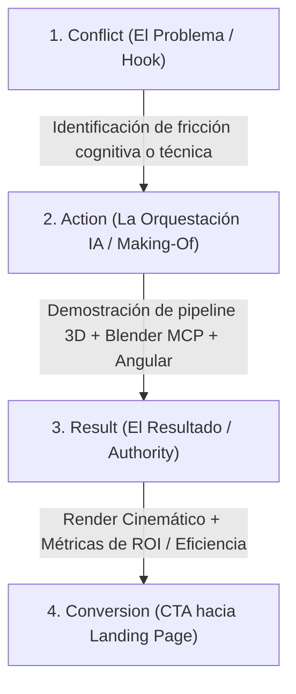
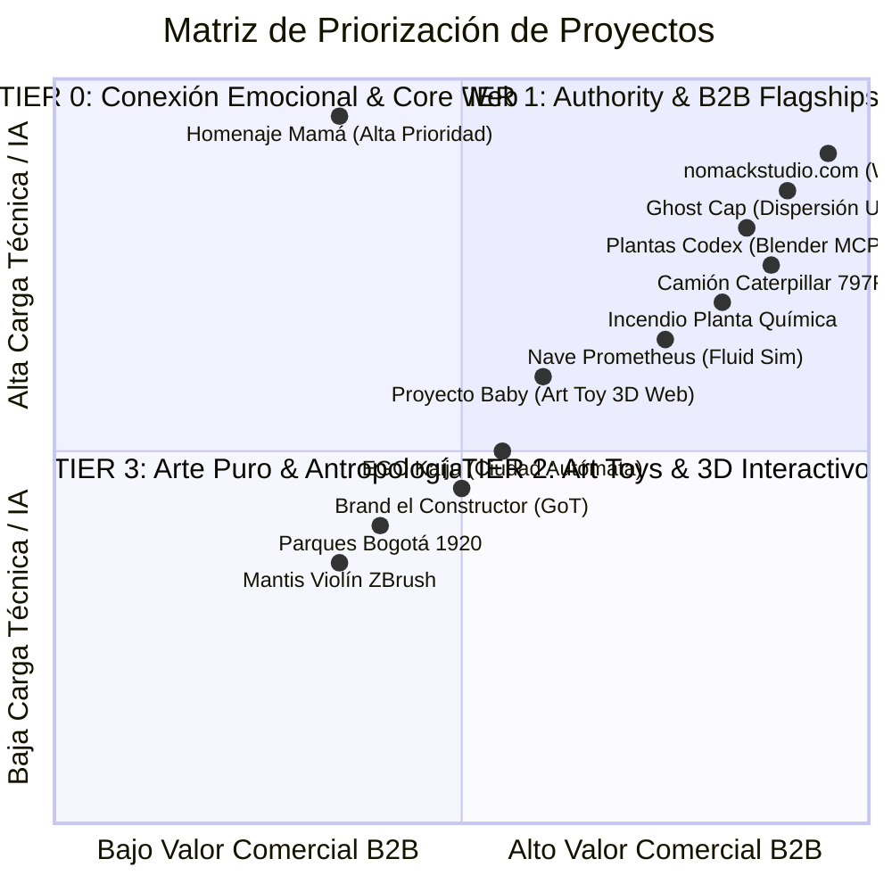

# Documento Corporativo Maestro (BDI) & Plan Estratégico de Growth Marketing

## Ecosistema de Marca Personal: Nomack Studio (`nomackstudio.com`)

**Autor:** Nomack (Leonel Salcedo) — Especialista en Arquitecturas Agénticas de IA, Desarrollador Fullstack & Artista 3D / CGI  
**Versión Documental:** 2.0.0 (Holístico-Estratégico)  
**Cumplimiento Normativo:** ISO 9001:2015, ISO 42001 (AIMS), ISO 27001 (ISMS), NIST CSF 2.0, DORA & Stacking Docs-as-Code (`implicit/`)

---

```xml
<corporate_context>
  <scale>INDIE_STUDIO_SOLO_ORCHESTRATOR</scale>
  <maturity_score>4.8</maturity_score>
  
  <brand_identity>
    - Nombre Comercial: Nomack Studio (`nomackstudio.com`)
    - Propuesta de Valor: "Orquestación de Ecosistemas Agénticos de IA para Automatización Empresarial B2B, Desarrollo Fullstack Neo-Brutalista y CGI/3D de Clase Mundial".
    - Posicionamiento: De "artista que publica imágenes" a "referente técnico polimático que automatiza procesos empresariales y resuelve problemas complejos con IA".
  </brand_identity>

  <compliance_frameworks>
    - NIST CSF 2.0: Gobernanza (GV), Identificación (ID), Protección (PR), Detección (DE), Respuesta (RS), Recuperación (RC).
    - ISO 42001 (AIMS): Trazabilidad de modelos de IA (Blender MCP, Nano Banana 2, Gemini Omni, Google Vids, Seedance 2.0).
    - ISO 27001 (ISMS): Seguridad de la información, protección de assets 3D propietarios y privacidad de leads B2B.
    - DORA: Resiliencia operativa en pipelines de contenido y despliegue continuo en Angular Monorepo.
  </compliance_frameworks>
  
  <bdi_executive_summary>
    Nomack Studio transiciona de un modelo de producción manual disperso a un modelo de orquestación agéntica asistida por IA. El portafolio de 17+ proyectos (3D, CGI, Simulación, Desarrollo Web) se consolidará dentro de un Monorepo Angular desacoplado con arquitectura Neo-Brutalista, respaldado por una estrategia omnicanal de Growth Marketing basada en Data Storytelling y la psicología del comportamiento (Homo Ludens).
  </bdi_executive_summary>
</corporate_context>
```

---

## 1. Plan Estratégico de Growth Marketing & Posicionamiento Holístico

### 1.1 El Arco Narrativo Maestro (Data Storytelling + Homo Ludens)

Toda pieza de contenido publicada en el ecosistema seguirá la estructura de **Conflict -> Action -> Result** enriquecida con metadatos técnicos visibles ("Hidden Data"), guiando al espectador desde la saturación cognitiva (Modo Supervivencia) hacia la autoridad sistémica (Soberanía Delegada).



### 1.2 Estructura de Pilar de Contenidos por Formato

#### A. Reels de "Proceso Acelerado" (ToFu - Alcance Visual Massivo)

* **Objetivo:** Capturar atención inmediata en 15-30 segundos mediante aceleración de flujo.
* **Estructura temporal:**
  * **0-3s (Hook):** El render final cinemático o la anomalía visual con titular de alto impacto (ej: *"Reduje el tiempo de simulación en 40% con Blender MCP"*).
  * **3-20s (Rising Action):** Timelapses acelerados de blocking, retopología, nodos de shaders y prompt engineering con IA.
  * **20-30s (The Reveal):** Render final interactivo desde un ángulo alternativo con anotaciones en pantalla (*"PBR 4K - Octane/Cycles Render"*).

#### B. Carruseles de "Anatomía del Proyecto" (MoFu - Autoridad Técnica & Educación)

* **Objetivo:** Posicionamiento como experto técnico no duplicable. Formato 4:5 (1080x1350px).
* **Estructura de Slides (5-7 diapositivas):**
  * **Slide 1 (Portada):** Render principal con titular tipo *"Anatomía de [Proyecto]: De la esfera inicial al pipeline agéntico"*.
  * **Slide 2 (Wireframe vs Render):** Comparativa deslizante mostrando complejidad topológica.
  * **Slide 3 (Shader Nodes & AI Integration):** Desglose visual de nodos y scripts Python de Blender MCP.
  * **Slide 4 (Esquema de Iluminación & Cámaras):** Configuración de luces de rebote y mapas HDRI.
  * **Slide 5 (Métricas de Eficiencia):** Tiempos comparativos Manual vs IA.
  * **Slide 6 (CTA):** Pregunta de interacción + enlace a la Landing Page inmersiva.

#### C. Stories de "Data & Insights" (Retención & Humanización)

* **Objetivo:** Mostrar la realidad del proceso de creación, feedback en vivo y pruebas de fallos.
* **Contenido:** Encuestas de diseño, renders fallidos ("Bloopers 3D"), estación de trabajo (Setup), avances diarios y detrás de cámaras.

---

## 2. Matriz Omnicanal & Embudo de Conversión (Funnel Architecture)

| Canal | Rol en el Embudo | Formato Principal | Frecuencia | KPI Clave |
| :--- | :--- | :--- | :--- | :--- |
| **Instagram (@nomack_3d)** | Top of Funnel (ToFu) | Reels (9:16) & Carruseles (4:5) | 3x / semana | Compartidos, Guardados, Reach |
| **YouTube (@nomackleo)** | Mid of Funnel (MoFu) | Videos Largos (16:9) & Shorts | 1x / semana | Tiempo de reproducción, Subscripciones |
| **X / Twitter** | Tech Authority | Hilos de Código, Pipelines MCP | 3x / semana | Reposts, Engagement de Devs/Founders |
| **LinkedIn** | B2B Lead Generation | Casos de Estudio Enterprise & ROI | 2x / semana | Leads cualificados, DMs directos |
| **WhatsApp** | Bottom of Funnel (BoFu) | Chatbot de Agendamiento B2B | Continuo | Tasa de cierre de reuniones B2B |

---

## 3. Catálogo Unificado de Proyectos & Roadmap de Priorización

Para maximizar el impacto de la estrategia de marketing y garantizar que la carga de producción sea sostenible, los proyectos se categorizan en 4 Tiers estratégicos:



### 3.1 Tier 0: Alta Prioridad (Legado Emocional & Identidad Principal)

1. **Proyecto Homenaje Madre (Fallecida 12 de Marzo) — [MÁXIMA PRIORIDAD]**
   * *Concepto:* Experiencia web/3D interactiva e inmersiva con carga emocional profunda.
   * *Entregable:* Sección destacada interactiva en `nomackstudio.com` con shaders sutiles y narrativa visual refinada.
2. **Web Principal `nomackstudio.com`**
   * *Concepto:* Monorepo Angular con estética Neo-Brutalista.
   * *Entregable:* Portal central que posiciona a Leonel como Orquestador Agéntico B2B + Desarrollador Fullstack + Artista 3D.
3. **Proyecto Ghost Cap**
   * *Concepto:* Indumentaria y sistemas de dispersión customizados para artistas urbanos.
   * *Entregable:* BRD, Landing Page dedicada de captura de leads B2B y campaña de 3 Reels con enfoque Homo Ludens.

### 3.2 Tier 1: Flagships Técnicos & Demostración de IA Agéntica (B2B Authority)

1. **Plantas Codex (Codex Seraphinianus)**
   * *Esculturas 3D lowpoly (2 plantas con texturas y shaders).*
   * *Pipeline IA:* Animación y composición en Blender vía Blender MCP + refinamiento con Nano Banana 2, Google Vids, Google Flow y Seedance 2.0.
2. **Camión Minero Caterpillar 797F (Digital Twin 2018)**
   * *Simulador minero industrial.*
   * *Pipeline IA:* Rigging y animación asistida por Nano Banana / Gemini Omni en entorno de cantera.
3. **Incendio Planta Química (Simulación Industrial)**
   * *Simulación de fluidos y fuego.*
   * *Pipeline IA:* Renders realistas asistidos por IA mostrando capacidades de Digital Twin industrial.
4. **Nave Prometheus**
   * *Simulación de fluidos (polvo al despegar/aterrizar).*
   * *Pipeline IA:* Optimización de rigging con Blender MCP y posprocesado cinemático.

### 3.3 Tier 2: Art Toys, Co-Creaciones & Experiencias 3D Interactivas

1. **Proyecto Baby (Criatura Art Toy con Miguel Fandiño)**
   * *Art Toy impreso en 3D con making-of completo.*
   * *Entregable:* Landing Page 3D interactiva en WebGL/Three.js + animaciones.
2. **EGO Kaiju (Ciudad Autómata con Miguel Fandiño)**
   * *Personaje pintado e impreso en 3D.*
   * *Entregable:* Poses y contenido corto asistido por IA.
3. **Brand el Constructor (Game of Thrones)**
    * *Caballero Celtic Wolf en lowpoly.*
    * *Entregable:* Poses para impresión 3D + animación IA.
4. **SteamMan (Steampunk MegaMan)**
    * *Art Toy en posa A.*
    * *Entregable:* Poses dinámicas y animación de proceso.
5. **Criatura Araña/Garrapata (Sociedad Moderna)**
    * *Monstruo conceptual lowpoly con ciudad en la cabeza.*
    * *Entregable:* Making-of completo (retopología, UVs, 3D painting) + crítica social visual.
6. **God (Visualización AAA)**
    * *Modelo AAA lowpoly.*
    * *Entregable:* Showreel de renderizado de alta fidelidad.
7. **Triceratopo (Concepto Gustavo Ramírez Cruz)**
    * *Shaders avanzados.*
    * *Entregable:* Animación automatizada mediante Blender MCP.
8. **HellBoy Bootleg Art Toy**
    * *Impresión 3D.*

### 3.4 Tier 3: Investigaciones Antropológicas & Proyectos de Arte Puro

1. **Parques Bogotá 1920 (CrilaRegina Ana María)**
    * *Reconstrucción antropológica en 3D de parques infantiles históricos.*
    * *Enfoque:* Análisis del desarrollo cognitivo y la valentía en los niños mediante la interacción con estructuras de riesgo.
2. **Mantis Violín (2019)**
    * *Escultura ZBrush hiperesculpida.*
    * *Entregable:* Renderizado fotorrealista asistido por IA.
3. **Art Toy Cartoon (Amigo)**
    * *Finalización 100% manual en ZBrush/Blender.*
4. **Animación Marca Personal (Estilo Hackers 1995)**
    * *Homenaje visual a la película Hackers.*
5. **Portafolio Web Legacy (Social Proof Fullstack en Repositorio)**:
    * `teatrova.com.co`
    * `superastro`
    * `lln_clarity_depth`

---

## 4. Arquitectura Web Monorepo & Landing Pages Growth Hacking

```text
                                  +---------------------------------------+
                                  |    nomackstudio.com (Angular Core)    |
                                  |     Estética: Neo-Brutalista          |
                                  +---------------------------------------+
                                                      |
         +--------------------+-----------------------+-----------------------+--------------------+
         |                    |                       |                       |                    |
         v                    v                       v                       v                    v
+------------------+ +------------------+   +------------------+   +------------------+  +------------------+
| /homenaje-mama   | | /ghost-cap       |   | /baby-arttoy     |   | /codex-plants    |  | /digital-twins   |
| (Interactive 3D) | | (B2B Lead Cap)   |   | (Interactive 3D) |   | (AI Workflow)    |  | (Industrial CGI) |
+------------------+ +------------------+   +------------------+   +------------------+  +------------------+
         |                    |                       |                       |                    |
         +--------------------+-----------------------+-----------------------+--------------------+
                                                      |
                                                      v
                                  +---------------------------------------+
                                  | Headless WordPress API (GraphQL/REST) |
                                  +---------------------------------------+
```

### 4.1 Especificaciones Técnicas del Monorepo (Angular 18+)

* **Estilo Visual:** Neo-Brutalist (Bordes definidos de 2px-4px negros, sombreados duros sin desenfoque `4px 4px 0px #000`, paleta de alto contraste, fuentes sans-serif técnicas tipo Inter / Fira Code).
* **Renderizado 3D Interactivo:** Integración de Canvas WebGL con Three.js / `@angular-three` cargando archivos GLTF/GLB optimizados (< 5MB por escena).
* **Headless Integration:** Consumo de WordPress Headless para gestión fluida de entradas de blog, casos de estudio y metadatos de proyectos.

---

## 5. Cumplimiento Normativo & Estándares de Calidad (`implicit/`)

### 5.1 ISO 9001:2015 (Gestión de Calidad en Contenidos y Producción)

* **Control de Cambios:** Todo asset 3D y código de landing page debe registrarse bajo versionado semántico en Git.

* **Validación de Salida:** Cada pieza multimedia debe cumplir con la lista de verificación de calidad (relación de aspecto 9:16 / 4:5, zonas seguras de texto, audio normalizado).

### 5.2 ISO 42001 (AIMS - Sistema de Gestión de Inteligencia Artificial)

* **Trazabilidad de Modelos:** Registro documental de qué motor de IA generó cada asset (ej. Blender MCP v0.4, Nano Banana 2, Gemini Omni).

* **Supervisión Humana (HITL):** Ningún contenido se publicará ni ningún código se desplegará sin la aprobación explícita del humano (Leonel Salcedo).

### 5.3 ISO 27001 (ISMS - Seguridad de la Información)

* **Protección de Datos:** Cero almacenamiento de API keys o credenciales en repositorios públicos.

* **Privacidad de Leads:** Los datos capturados en las landing pages (formularios B2B) se cifrarán y procesarán conforme al GDPR / Ley de Protección de Datos.

### 5.4 NIST CSF 2.0 & DORA (Resiliencia Operativa)

* **Sandboxing:** Todo desarrollo de código se ejecuta dentro de límites aislados.

* **Recuperación Ante Desastres (MTTR < 60s):** Copias de seguridad automáticas del Monorepo y base de datos de contenidos.

---

## 6. Próximos Pasos Iterativos

```xml
<next_action_plan>
  <step_1>Aprobación formal del presente Documento Corporativo Maestro y Plan de Growth Marketing.</step_1>
  <step_2>Inicio del desarrollo del Proyecto Homenaje Madre (Tier 0 - Máxima Prioridad).</step_2>
  <step_3>Construcción del Monorepo Angular Neo-Brutalista para nomackstudio.com.</step_3>
  <step_4>Despliegue iterativo de Landing Pages y Campañas de Reels por Proyecto (empezando con Ghost Cap).</step_4>
</next_action_plan>
```
